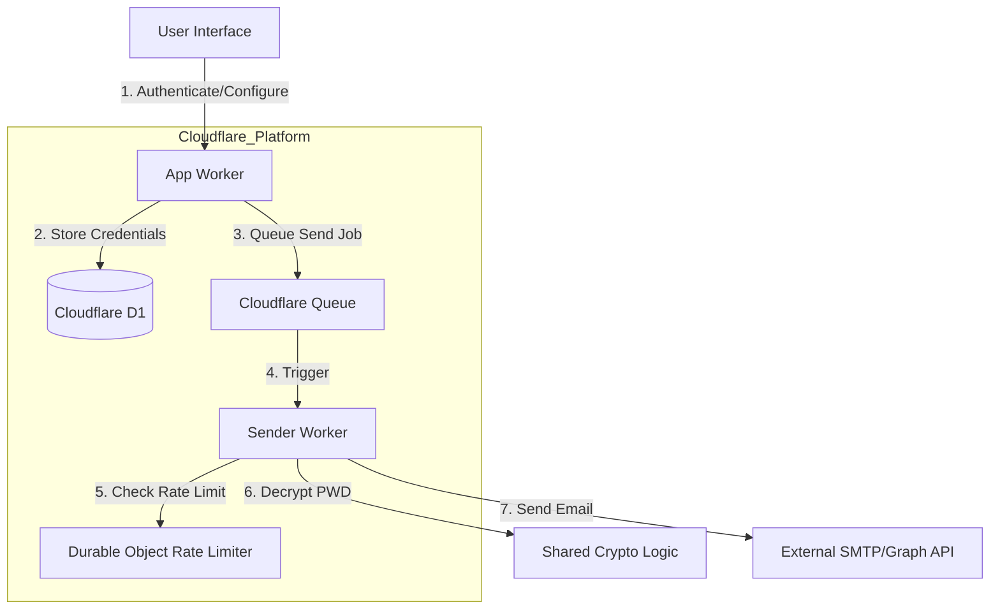
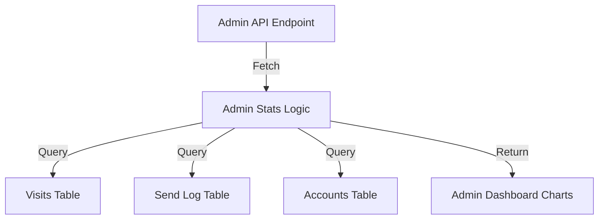

<details>
<summary>Relevant source files</summary>

The following files were used as context for generating this wiki page:

- [README.md](README.md)
- [AGENTS.md](AGENTS.md)
- [app/public/app.js](app/public/app.js)
- [infra/setup.sh](infra/setup.sh)
- [app/src/admin-stats.ts](app/src/admin-stats.ts)
- [SECURITY.md](SECURITY.md)
</details>

# Introduction & Project Overview

Politiker-webapp is an open-source web tool designed to empower citizens to contact their elected representatives directly using their own email accounts (Gmail, Outlook, iCloud, Yahoo, or generic SMTP). The platform acts as a facilitator, providing a database of approximately 17,000 politicians across various levels of government—including the EU Parliament, Swedish Riksdag, Government, Regions, Municipalities, and the Church of Sweden—without acting as the sender itself.

The system is built on a serverless architecture using Cloudflare Workers and focuses on privacy and user agency. It features a three-step wizard for recipient selection, letter composition (optionally aided by AI), and a review process. It also includes automated campaign functionality for news-driven civic engagement and an administrative interface for system monitoring and data management.

Sources: [README.md:3-9](README.md#L3-L9), [AGENTS.md:3-7](AGENTS.md#L3-L7), [app/public/app.js:1012-1015](app/public/app.js#L1012-L1015)

## System Architecture

The project follows a modular, worker-based architecture deployed on the Cloudflare ecosystem. It leverages Cloudflare D1 for relational storage, KV for session management, and Queues for asynchronous email dispatching.

### Component Overview

| Component | Description |
| :--- | :--- |
| **App Worker** | Handles the static frontend and the primary API (Auth, Mail Credentials, Recipient Selection, Admin). |
| **Sender Worker** | A Queue consumer responsible for the actual SMTP/Graph email transmission. |
| **Campaign Worker** | An autonomous, cron-driven worker that researches news and generates/sends civic letters. |
| **Shared Code** | Contains shared logic for encryption, SMTP clients, TOTP, and data types. |
| **Infrastructure** | Shell scripts and SQL schemas for provisioning Cloudflare resources. |

Sources: [AGENTS.md:21-26](AGENTS.md#L21-L26), [README.md:66-72](README.md#L66-L72), [infra/setup.sh:3-9](infra/setup.sh#L3-L9)

### High-Level Data Flow

The following diagram illustrates the interaction between the user, the core Workers, and the underlying Cloudflare infrastructure during the process of sending a letter.



Sources: [AGENTS.md:12-16](AGENTS.md#L12-L16), [README.md:66-72](README.md#L66-L72), [sender/package.json](sender/package.json)

## Core Features & Functionality

### 1. User Authentication and Security
The system supports multiple authentication methods, including traditional email/password and OAuth (Google, GitHub, Microsoft). Security is prioritized through the use of PBKDF2 hashing for passwords (limited to 100,000 iterations due to Worker runtimes) and AES-GCM encryption for stored SMTP credentials. 2FA via TOTP is also supported.

Sources: [README.md:18-20](README.md#L18-L20), [SECURITY.md:15-18](SECURITY.md#L15-L18), [AGENTS.md:29-33](AGENTS.md#L29-L33)

### 2. Recipient Selection Wizard
A 3-step wizard guides users through selecting recipients based on geographic area, political party, and specific roles (e.g., "Chairman").
- **Step 1 (Recipients):** Users filter by levels (EU, Riksdag, etc.) and specific regions.
- **Step 2 (Compose):** Users write their letter or generate a draft using an AI feature that researches current topics via web search.
- **Step 3 (Review):** A final summary displaying recipient counts and a preview of the message.

Sources: [README.md:23-31](README.md#L23-L31), [app/public/app.js:933-945](app/public/app.js#L933-L945), [app/public/components/step-review.js:7-14](app/public/components/step-review.js#L7-L14)

### 3. Email Dispatch and Rate Limiting
To prevent users' email accounts from being flagged as spam, the system implements a "Token Bucket" rate limiter using Cloudflare Durable Objects. This ensures that the sending rate stays within a hardcoded safety ceiling (typically 10% below known provider limits).

Sources: [README.md:32-34](README.md#L32-L34), [AGENTS.md:34-35](AGENTS.md#L34-L35), [app/public/app.js:218-228](app/public/app.js#L218-L228)

## Technical Stack & Development

### Frameworks and Runtimes
- **Backend:** Cloudflare Workers (TypeScript)
- **Frontend:** Vanilla HTML/JavaScript/CSS (no heavy frameworks)
- **Database:** Cloudflare D1 (SQLite)
- **Storage:** Cloudflare KV (Sessions), R2 (Attachments)
- **Monitoring:** Sentry integration for error tracking and source map support.

Sources: [AGENTS.md:12-16](AGENTS.md#L12-L16), [README.md:104-106](README.md#L104-L106), [app/package.json:17-25](app/package.json#L17-L25)

### Deployment and Provisioning
The project includes a comprehensive `setup.sh` script that automates the provisioning of all Cloudflare resources.

```bash
# Example Deployment Command
bash infra/setup.sh
```

Sources: [infra/setup.sh:1-15](infra/setup.sh#L1-L15), [README.md:75-80](README.md#L75-L80)

## Administrative Monitoring
The Admin Panel provides real-time insights into system health and usage. It tracks visitor statistics, unique visitor counts by country (using ISO codes and flag emojis), and email sending trends.



Sources: [app/src/admin-stats.ts:12-25](app/src/admin-stats.ts#L12-L25), [app/public/app.js:827-840](app/public/app.js#L827-L840)

### Admin Stats Data Points
| Metric | Description | Source File |
| :--- | :--- | :--- |
| `totalAccounts` | Total registered users | `admin-stats.ts:13` |
| `totalSent` | Total successful email transmissions | `admin-stats.ts:15` |
| `totalVisitors` | Unique visitor hashes in `visits` table | `admin-stats.ts:25` |
| `visitorCountries` | Breakdown of visitors by geographic location | `admin-stats.ts:27` |

Sources: [app/src/admin-stats.ts:12-40](app/src/admin-stats.ts#L12-L40)

## Conclusion
Politiker-webapp provides a robust, serverless solution for civic communication. By combining a large-scale database of political contacts with user-controlled email delivery and AI assistance, it lowers the barrier for citizens to engage with their representatives while maintaining strict security and rate-limiting protocols to protect user accounts.

Sources: [README.md:3-9](README.md#L3-L9), [AGENTS.md:3-7](AGENTS.md#L3-L7)
