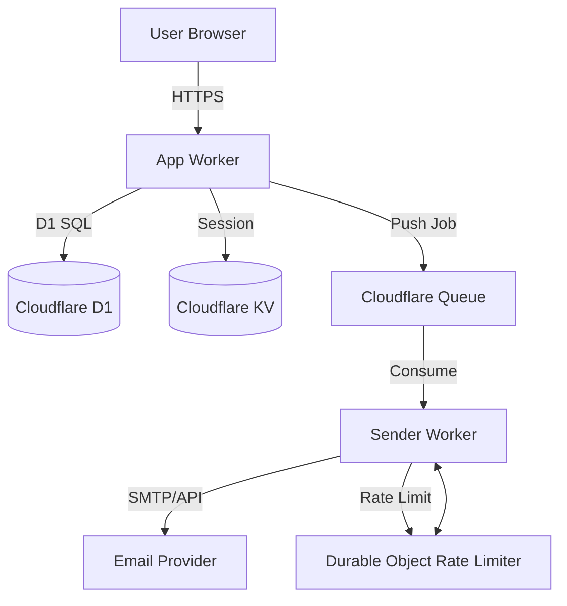
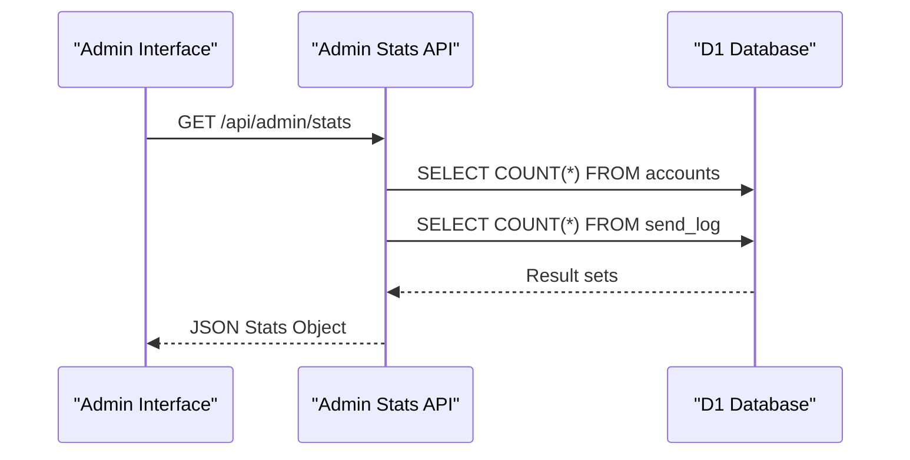

<details>
<summary>Relevant source files</summary>

The following files were used as context for generating this wiki page:

- [README.md](README.md)
- [AGENTS.md](AGENTS.md)
- [app/public/app.js](app/public/app.js)
- [infra/setup.sh](infra/setup.sh)
- [app/src/admin-stats.ts](app/src/admin-stats.ts)
- [TODO.md](TODO.md)
- [SECURITY.md](SECURITY.md)
</details>

# Introduction & Project Overview

Politiker-webapp is a free web-based tool designed to empower citizens to contact their elected officials in Sweden and the EU. Unlike platforms that act as intermediaries, this application allows users to link their personal email accounts (via Gmail, Outlook, iCloud, or generic SMTP) to send personalized messages. This ensures that the user, not the platform, remains the sender, facilitating direct communication between citizens and politicians.
Sources: [README.md:3-8](README.md#L3-L8), [AGENTS.md:3-7](AGENTS.md#L3-L7)

The project is built on the Cloudflare Workers ecosystem, utilizing a serverless architecture for its frontend, API, and background mail-sending processes. It supports a wide range of political levels, including the EU Parliament, Swedish Riksdag, Government, Regions, Municipalities, and the Church of Sweden.
Sources: [README.md:10-18](README.md#L10-L18), [AGENTS.md:9-12](AGENTS.md#L9-L12)

## System Architecture

The project is divided into several specialized Workers and shared modules that handle authentication, mail delivery, and automated campaigns.

### Project Structure
The repository is organized into four primary directories:
- **app/**: The main Worker containing the static vanilla HTML/JS frontend and the API for authentication, recipient selection, and letter composition.
- **sender/**: A Queue consumer Worker responsible for the actual SMTP/Graph mail transmission and rate limiting.
- **campaign/**: An autonomous cron-driven Worker that monitors news and generates AI-driven letters.
- **shared/**: Common logic shared across Workers, including encryption, SMTP clients, and TOTP handling.
Sources: [AGENTS.md:21-26](AGENTS.md#L21-L26), [README.md:73-77](README.md#L73-L77)

### High-Level Data Flow
This diagram illustrates the relationship between the user interface, the main API, the queue system, and the external mail providers.



A Durable Object in the `sender` Worker implements a token bucket algorithm to ensure mailings do not exceed provider-specific daily limits.
Sources: [README.md:37-40](README.md#L37-L40), [AGENTS.md:11-12](AGENTS.md#L11-L12), [sender/package.json](sender/package.json)

## Technical Stack & Infrastructure

The project utilizes modern serverless technologies to maintain low overhead and high scalability.

| Component | Technology | Description |
| :--- | :--- | :--- |
| **Runtime** | Cloudflare Workers | Serverless platform for hosting the app and background jobs. |
| **Language** | TypeScript | Type-safe development across all components. |
| **Database** | Cloudflare D1 | SQLite-based relational database for user and politician data. |
| **Storage** | Cloudflare KV / R2 | KV for session management; R2 for email attachments. |
| **Messaging** | Cloudflare Queues | Asynchronous processing of mail sending jobs. |
| **Authentication** | Web Crypto / OAuth | PBKDF2 hashing and social login (Google, GitHub, Microsoft). |
Sources: [AGENTS.md:9-12](AGENTS.md#L9-L12), [README.md:79-84](README.md#L79-L84), [app/package.json](app/package.json)

### Provisioning and Deployment
Infrastructure is managed via `infra/setup.sh`, which automates the creation of Cloudflare resources and deployment of secrets.

```bash
# Core deployment commands
wrangler d1 create politiker_webapp
wrangler kv namespace create politiker_webapp_sessions
wrangler queues create politiker-send-jobs
wrangler r2 bucket create politiker-webapp-attachments
```

Sources: [infra/setup.sh:84-110](infra/setup.sh#L84-L110)

## Key Features

### Recipient Wizard & Filtering
The application features a 3-step wizard (Recipients → Letter → Review) for crafting messages. It includes advanced filtering capabilities:
- **Geographic/Institutional Levels**: EU, Riksdag, Government, Regions, and Municipalities.
- **Search & Exclude**: Users can search for specific names or exclude entire political parties.
- **Role Normalization**: Positions like "Chairman" or "Member" are grouped to ensure consistent filtering despite spelling variations.
Sources: [README.md:27-32](README.md#L27-L32), [app/public/app.js:284-300](app/public/app.js#L284-L300)

### Mail Security & Rate Limiting
- **Encryption**: SMTP passwords are encrypted using AES-GCM before storage in D1; the `MAIL_CRED_KEY` is stored as a Wrangler secret.
- **Token Bucket Rate Limiting**: A dedicated Durable Object manages rate limits per mail account to prevent provider blocking.
- **Password Safety**: Passwords are hashed with PBKDF2 (max 100,000 iterations due to Worker limits).
Sources: [SECURITY.md:12-16](SECURITY.md#L12-L16), [AGENTS.md:30-35](AGENTS.md#L30-L35), [README.md:37-40](README.md#L37-L40)

### Administrative Tools & Monitoring
The system includes an admin panel for monitoring platform health and usage.

| Metric | Source | Description |
| :--- | :--- | :--- |
| `totalAccounts` | `accounts` table | Total registered users. |
| `totalSent` | `send_log` table | Count of successfully delivered emails. |
| `totalVisitors` | `visits` table | Unique visitor count based on `visitor_hash`. |
| `visitorCountries` | `visits` table | Distribution of users by country code. |
Sources: [app/src/admin-stats.ts:13-33](app/src/admin-stats.ts#L13-L33)



Sources: [app/src/admin-stats.ts:10-50](app/src/admin-stats.ts#L10-L50), [app/public/app.js:1000-1015](app/public/app.js#L1000-L1015)

## Security Policy

Security is a core priority, focusing on credential isolation and confidential vulnerability reporting.
- **Vulnerability Reporting**: Security issues should be reported via GitHub's private reporting feature rather than public issues.
- **Credential Safety**: Credentials must never be committed to the repository.
- **Isolation**: All database queries are filtered by `account_id` to ensure user data isolation.
Sources: [SECURITY.md:1-10](SECURITY.md#L1-L10), [AGENTS.md:36-38](AGENTS.md#L36-L38)

## Project Status & Roadmap

The project is live at `politiker.denied.se`. Current development focus areas include:
- **Testing Expansion**: Improving CI coverage for authentication and mail flows.
- **Refactoring**: Breaking down the large `app.js` file into domain-specific modules.
- **Localization**: Lazy-loading translations to improve initial load performance.
Sources: [TODO.md:3-25](TODO.md#L3-L25), [README.md:130-135](README.md#L130-L135)

The application currently supports 18 languages and provides a robust framework for autonomous civic engagement through its integrated AI drafting and automated campaign workers.
Sources: [README.md:41-43](README.md#L41-L43), [README.md:52-60](README.md#L52-L60)
