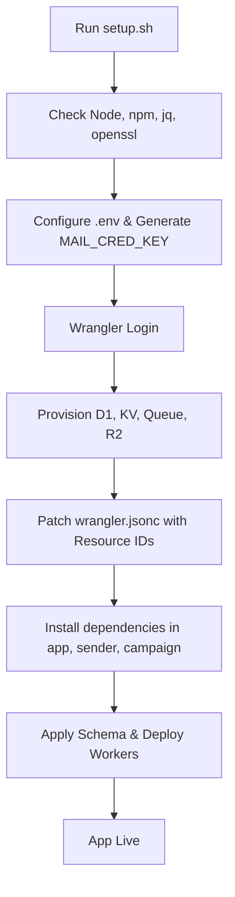

<details>
<summary>Relevant source files</summary>

The following files were used as context for generating this wiki page:

- [README.md](README.md)
- [infra/setup.sh](infra/setup.sh)
- [AGENTS.md](AGENTS.md)
- [CLAUDE.md](CLAUDE.md)
- [app/package.json](app/package.json)
- [SECURITY.md](SECURITY.md)
</details>

# Getting Started & Setup

This page provides the technical documentation for setting up the `politiker-webapp` project. The application is a web tool designed for citizens to contact elected officials using their own email accounts. It leverages a modern serverless stack hosted on Cloudflare, utilizing Workers, D1 (SQLite), KV (Key-Value storage), and Queues for asynchronous email processing.

Sources: [README.md:1-12](README.md#L1-L12), [AGENTS.md:3-9](AGENTS.md#L3-L9)

## Project Architecture Overview

The system is partitioned into several specialized Cloudflare Workers and shared modules to ensure isolation and scalability. The primary components include:

*  **app/**: The main Worker serving the static frontend and the API for authentication, mail credentials, and recipient selection.
*  **sender/**: A Queue consumer Worker responsible for the actual SMTP/Graph email transmission.
*  **campaign/**: An autonomous Worker for scheduled news aggregation and AI-generated letter campaigns.
*  **shared/**: Shared logic for encryption, SMTP clients, TOTP, and common types.
*  **infra/**: Tooling for Cloudflare resource provisioning and database schema management.

Sources: [README.md:95-104](README.md#L95-L104), [AGENTS.md:27-33](AGENTS.md#L27-L33)

### System Workflow
The following diagram illustrates the deployment and resource provisioning flow initiated by the setup script.



The diagram shows the 8-step idempotent process used to provision Cloudflare resources and deploy the application code.
Sources: [infra/setup.sh:32-155](infra/setup.sh#L32-L155)

## Environment Requirements

To deploy or develop for the project, the following environment prerequisites must be met:

| Requirement | Version/Notes |
| :--- | :--- |
| **Node.js** | 18+ |
| **npm** | Included with Node |
| **Wrangler CLI** | 4.111.0 (for dev/deploy) |
| **Cloudflare Account** | Required for resource hosting |
| **Operating System** | Linux/Ubuntu recommended for bounce-processor |

Sources: [README.md:110-115](README.md#L110-L115), [app/package.json:16-20](app/package.json#L16-L20), [infra/setup.sh:16-20](infra/setup.sh#L16-L20)

## Automated Deployment

The entire stack can be provisioned and deployed using a single command through the `infra/setup.sh` script. This script handles resource creation in the user's Cloudflare account and updates configuration files with the resulting IDs.

```bash
git clone https://github.com/blixten85/politiker-webapp.git
cd politiker-webapp
bash infra/setup.sh
```

Sources: [README.md:117-121](README.md#L117-L121), [infra/setup.sh:1-10](infra/setup.sh#L1-L10)

### Secret Management
Secrets must be configured via `wrangler secret put` or the `.env` file created during the first run of the setup script.

*  **MAIL_CRED_KEY**: An AES key for encrypting SMTP passwords. It **must** be identical in both the `app` and `sender` Workers.
*  **SYSTEM_SMTP_PASSWORD**: Password for the system account used for verification and notification emails.
*  **GITHUB_FEEDBACK_TOKEN**: A Personal Access Token with `Issues:Write` permissions for error reporting.

Sources: [AGENTS.md:36-40](AGENTS.md#L36-L40), [README.md:126-133](README.md#L126-L133), [SECURITY.md:12-16](SECURITY.md#L12-L16)

## Local Development

For local development, developers must install dependencies for each Worker and configure local variables.

```bash
# Setup App Worker
cd app
npm install
cp .dev.vars.example .dev.vars

# Setup Sender Worker
cd ../sender
npm install

# Start development server
npx wrangler dev --remote
```

Sources: [AGENTS.md:16-25](AGENTS.md#L16-L25), [CLAUDE.md:16-25](CLAUDE.md#L16-L25)

### Development Conventions
*  **Authentication**: Password hashing uses PBKDF2 with a maximum of 100,000 iterations due to Cloudflare Worker runtime limits.
*  **Socket Usage**: `socket.startTls()` requires calling `.releaseLock()` on writer/reader before the call to avoid upgrade errors.
*  **Data Isolation**: All database queries must filter by `account_id` to ensure user data isolation.

Sources: [AGENTS.md:41-48](AGENTS.md#L41-L48), [CLAUDE.md:41-48](CLAUDE.md#L41-L48)

## Database Initialization

The D1 database is created empty. To populate it with political contact data, SQL must be imported from the `politiker-kontakter` repository.

```bash
wrangler d1 execute politiker_webapp --remote --yes \
  --file ../politiker-kontakter/data/politiker.sql
```

Sources: [README.md:150-155](README.md#L150-L155), [infra/setup.sh:111-125](infra/setup.sh#L111-L125)

## Conclusion

The `politiker-webapp` setup is designed for rapid deployment using Cloudflare's serverless ecosystem. By utilizing the automated `setup.sh` script, developers can provision complex infrastructure including databases, key-value stores, and message queues in a single workflow. Ensuring consistency in secrets like the `MAIL_CRED_KEY` and adhering to the runtime-specific limitations of Cloudflare Workers are critical for a successful installation and operation of the platform.

Sources: [README.md:117-121](README.md#L117-L121), [AGENTS.md:36-42](AGENTS.md#L36-L42)
