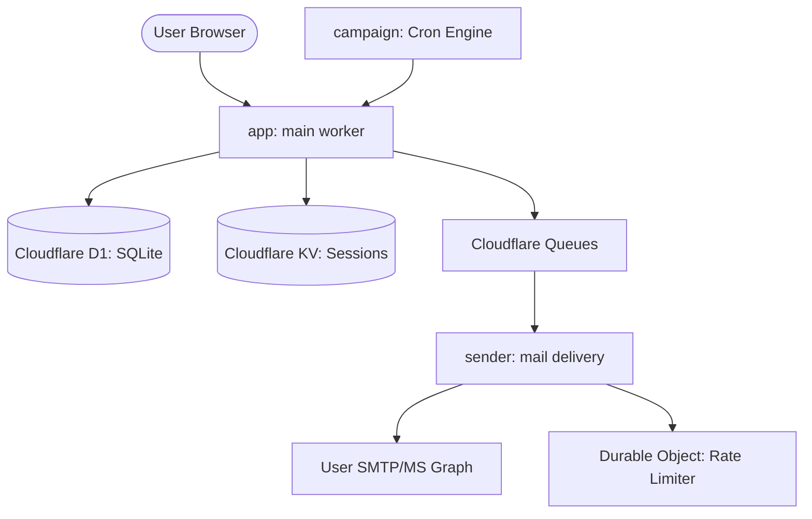

<details>
<summary>Relevant source files</summary>

The following files were used as context for generating this wiki page:

- [README.md](README.md)
- [infra/setup.sh](infra/setup.sh)
- [CLAUDE.md](CLAUDE.md)
- [AGENTS.md](AGENTS.md)
- [app/package.json](app/package.json)
- [TODO.md](TODO.md)
</details>

# Getting Started & Local Development

Politiker-webapp is a technical platform designed to empower citizens to contact their elected officials (at municipal, regional, national, and EU levels) directly using their own email accounts. The system is built on a modern, serverless architecture utilizing Cloudflare Workers and associated services.

This guide provides the necessary steps to set up the development environment, understand the core architecture, and deploy the application. The project is structured into several distinct modules: the main application (`app/`), the asynchronous mail sender (`sender/`), a shared library (`shared/`), and an autonomous campaign engine (`campaign/`).

Sources: [README.md:1-8](README.md#L1-L8), [AGENTS.md:1-6](AGENTS.md#L1-L6), [CLAUDE.md:1-6](CLAUDE.md#L1-L6)

## Architecture Overview

The application follows a micro-worker architecture. The `app` worker serves the frontend and handles user-facing API logic, while the `sender` worker consumes a queue to perform actual SMTP or Microsoft Graph mail deliveries. Data is persisted in Cloudflare D1 (SQLite-compatible) and KV (Key-Value) stores.



*The diagram above illustrates the interaction between the primary workers and Cloudflare storage/messaging services.*

Sources: [AGENTS.md:27-33](AGENTS.md#L27-L33), [README.md:95-102](README.md#L95-L102), [TODO.md:68-71](TODO.md#L68-L71)

## Prerequisites & Environment Setup

Before starting development, ensure the following requirements are met:
- **Node.js**: Version 18+ is required.
- **Wrangler CLI**: The project uses `npx wrangler` for development and deployment.
- **Cloudflare Account**: Necessary for D1, KV, and Queue resources.

### Initial Configuration
The project uses an automated setup script to provision resources.

1.  **Clone and Setup**:

```bash
    git clone https://github.com/blixten85/politiker-webapp.git
    cd politiker-webapp
    bash infra/setup.sh
    ```

2.  **Environment Variables**: The first run of `setup.sh` creates a credentials file at `~/.claude/credentials.env`. You must populate this file with essential secrets.

Sources: [infra/setup.sh:1-68](infra/setup.sh#L1-L68), [README.md:104-123](README.md#L104-L123)

### Required Secrets and Variables

| Variable | Description | Source |
| :--- | :--- | :--- |
| `MAIL_CRED_KEY` | AES-GCM key for encrypting SMTP passwords. | [AGENTS.md:36-37](AGENTS.md#L36-L37) |
| `SYSTEM_SMTP_PASSWORD` | SMTP password for verification/notification emails. | [infra/setup.sh:65](infra/setup.sh#L65) |
| `GITHUB_FEEDBACK_TOKEN` | Token for creating GitHub issues from feedback. | [README.md:118](README.md#L118) |
| `ANTHROPIC_API_KEY` | Required for AI letter generation and campaign worker. | [README.md:120](README.md#L120) |
| `OAUTH_*_CLIENT_SECRET` | Secrets for Google, GitHub, and Microsoft social login. | [infra/setup.sh:71-73](infra/setup.sh#L71-L73) |

## Local Development Workflow

Developers can run the `app` and `sender` workers locally while connecting to remote Cloudflare resources.

### Development Commands

```bash
# Setup main app
cd app && npm install && cp .dev.vars.example .dev.vars

# Setup sender worker
cd ../sender && npm install

# Run locally against remote resources
npx wrangler dev --remote

# Perform type checking
npx tsc --noEmit
```

Sources: [AGENTS.md:18-24](AGENTS.md#L18-L24), [CLAUDE.md:18-24](CLAUDE.md#L18-L24), [app/package.json:6-12](app/package.json#L6-L12)

### Security Conventions
- **Encryption**: SMTP passwords are encrypted using `MAIL_CRED_KEY`. This key must be identical across `app` and `sender` modules.
- **Hashing**: User passwords are hashed using PBKDF2 with exactly 100,000 iterations (the limit for Cloudflare Workers runtime).
- **Isolation**: All database queries must filter by `account_id` to ensure strict user data isolation.

Sources: [AGENTS.md:36-45](AGENTS.md#L36-L45), [CLAUDE.md:36-45](CLAUDE.md#L36-L45)

## Deployment

Deployment is handled via the `infra/setup.sh` script or directly through Wrangler. The project supports **Cloudflare Workers Builds** for automatic deployments from GitHub.

### Automated Deployment Steps
The `infra/setup.sh` script performs the following idempotent actions:
1.  Logs in to Cloudflare via `wrangler login`.
2.  Creates D1 Database, KV Namespace, Queue, and R2 Bucket.
3.  Patches `wrangler.jsonc` files with the newly created resource IDs.
4.  Applies the database schema via `infra/schema.sql`.
5.  Deploys all three workers (`app`, `sender`, `campaign`).

Sources: [infra/setup.sh:125-207](infra/setup.sh#L125-L207), [README.md:125-139](README.md#L125-L139)

### Database Initialization
The database is initially empty. Politician contact data must be imported from the companion repository `politiker-kontakter`:

```bash
wrangler d1 execute politiker_webapp --remote --yes \
  --file ../politiker-kontakter/data/politiker.sql
```

Sources: [README.md:143-148](README.md#L143-L148)

## Project Summary

The Politiker-webapp project offers a robust foundation for civic engagement tools. By utilizing Cloudflare Workers, the system achieves high scalability with minimal overhead. Developers should focus on maintaining the isolation of user credentials and adhering to the micro-worker boundaries between the web frontend and the asynchronous mail delivery system.

Sources: [AGENTS.md:66-79](AGENTS.md#L66-L79), [TODO.md:68-72](TODO.md#L68-L72)
