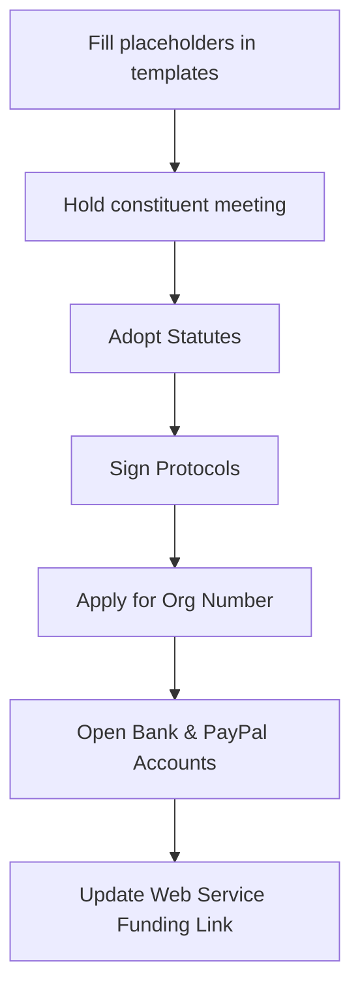
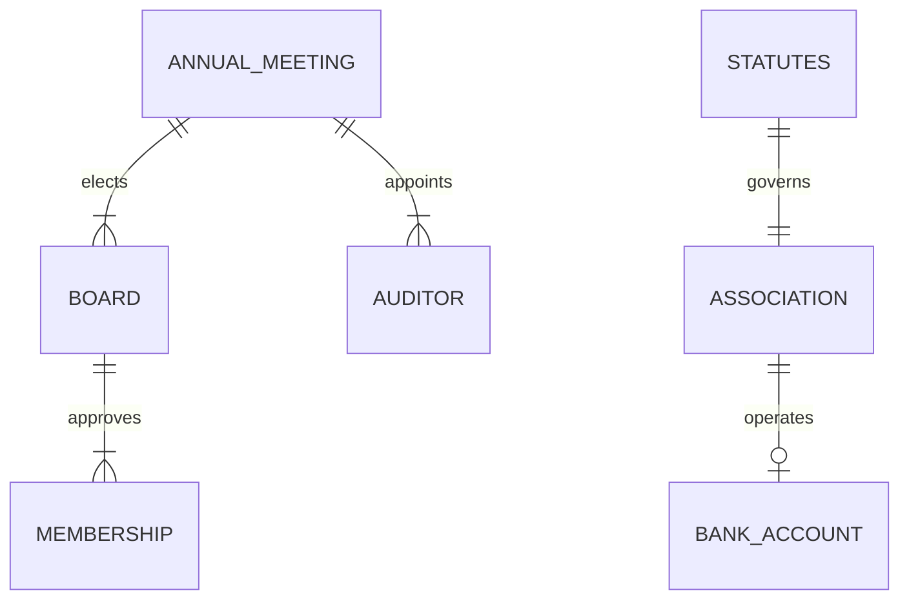

Relevant source files

The following files were used as context for generating this wiki page:

- [forening/README.md](forening/README.md)
- [forening/stadgar.md](forening/stadgar.md)
- [forening/arsmote-mall.md](forening/arsmote-mall.md)
- [forening/konstituerande-mote-protokoll.md](forening/konstituerande-mote-protokoll.md)
- [app/public/index.html](app/public/index.html)
- [README.md](README.md)

# Non-profit Association Guidelines

The purpose of these guidelines is to provide a structured framework for establishing and maintaining a non-profit association (*ideell förening*) to oversee the "Politikerkontakt" web service. These guidelines ensure the association operates as a non-partisan, non-religious entity dedicated to facilitating public communication with elected representatives in Sweden. Sources: [forening/README.md:3-5](forening/README.md#L3-L5), [forening/stadgar.md:6-12](forening/stadgar.md#L6-L12)

The guidelines cover the legal formation of the entity, the adoption of statutes, and the administrative requirements for ongoing operations, including annual meetings and financial transparency. This association serves as the formal organizational backbone for the project's funding and public outreach. Sources: [forening/README.md:1-26](forening/README.md#L1-L26), [README.md:52-54](README.md#L52-L54)

## Association Formation and Legal Status

The formation of the association requires a minimum of 2-3 founding members to serve as the initial board. The process involves documenting the intent to form the association, adopting statutes, and applying for an organization number from the Swedish Tax Agency (*Skatteverket*). Sources: [forening/README.md:9-10](forening/README.md#L9-L10), [forening/README.md:16-21](forening/README.md#L16-L21)

### Formation Process Flow
The following diagram illustrates the sequence of steps required to establish the legal entity.

Sources: [forening/README.md:7-30](forening/README.md#L7-L30)

### Constituent Meeting Requirements
The constituent meeting is the formal start of the association. Key decisions made during this meeting include:
*  Official name and purpose of the association.
*  Election of the Board (Chairman and members).
*  Selection of the fiscal year (typically calendar year).
*  Determination of membership fees.
*  Authorization for signing on behalf of the association (*firmateckning*).

Sources: [forening/konstituerande-mote-protokoll.md:12-46](forening/konstituerande-mote-protokoll.md#L12-L46)

## Statutes and Governance

The statutes (*stadgar*) define the rules for the association's internal operations and its legal obligations. The association is defined as a non-profit, "allmännyttig" (publicly beneficial) entity. Sources: [forening/stadgar.md:6-12](forening/stadgar.md#L6-L12)

### Key Governance Roles and Structures

| Component | Description | Requirement |
| :--- | :--- | :--- |
| **Board** | Manages the association's affairs between annual meetings. | 3 to 7 members, elected for 1 year. |
| **Annual Meeting** | The highest decision-making body of the association. | Held once per year before April 30. |
| **Auditor** | Responsible for reviewing accounts (optional for smaller associations). | No authorized auditor required for this size. |
| **Membership** | Open to anyone sharing the association's purpose. | Board approves membership; non-discriminatory. |

Sources: [forening/stadgar.md:17-48](forening/stadgar.md#L17-L48)

### Governance Relationship Diagram
This diagram shows the relationship between members, the board, and the governing statutes.

Sources: [forening/stadgar.md:14-48](forening/stadgar.md#L14-L48), [forening/konstituerande-mote-protokoll.md:31-46](forening/konstituerande-mote-protokoll.md#L31-L46)

## Annual Operations and Financials

To maintain legal status and transparency, the association must hold an annual meeting once per year with at least two weeks' notice. Sources: [forening/stadgar.md:35-37](forening/stadgar.md#L35-L37)

### Annual Meeting Agenda
The meeting must address specific statutory points to ensure accountability:
1.  Approval of the activity report (*verksamhetsberättelse*).
2.  Financial accounting for the previous year (Income vs. Expenses).
3.  Decision on discharge of liability (*ansvarsfrihet*) for the board.
4.  Election of a new board.
5.  Setting the membership fee for the upcoming year.

Sources: [forening/arsmote-mall.md:1-41](forening/arsmote-mall.md#L1-L41)

### Financial Obligations
As an "allmännyttig" association, specific rules apply to financial management:
*  **Purpose Fulfillment:** Funds must be used to drive and develop the Politikerkontakt service. Sources: [forening/stadgar.md:6-12](forening/stadgar.md#L6-L12)
*  **Dissolution:** In the event of dissolution, assets must be donated to another non-profit or foundation with similar purposes, never returned to individual members. Sources: [forening/stadgar.md:57-64](forening/stadgar.md#L57-L64)
*  **Funding Integration:** Once the association is formed and has a PayPal business account, the project's funding configuration in `app/public/index.html` must be updated from private addresses to the association's address. Sources: [forening/README.md:27-30](forening/README.md#L27-L30), [app/public/index.html:265-296](app/public/index.html#L265-L296)

## Conclusion
The establishment of a non-profit association provides the project with a formal legal personality, enabling transparent financial management of donations and ensuring the long-term sustainability of the service. By adhering to these guidelines, the project maintains its status as a public utility tool for democratic communication. Sources: [forening/README.md:3-5](forening/README.md#L3-L5), [forening/stadgar.md:6-12](forening/stadgar.md#L6-L12), [README.md:52-54](README.md#L52-L54)
