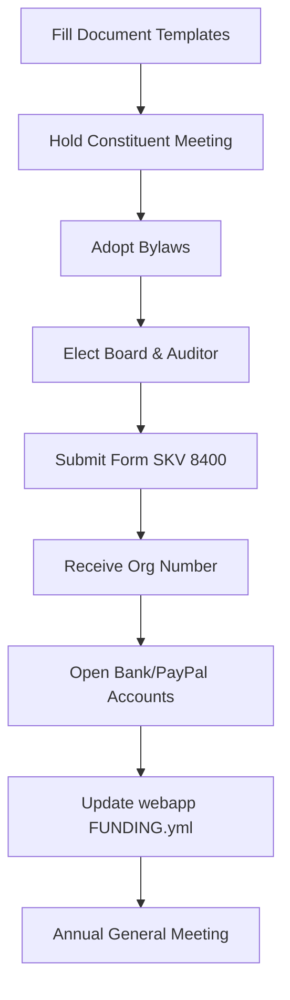
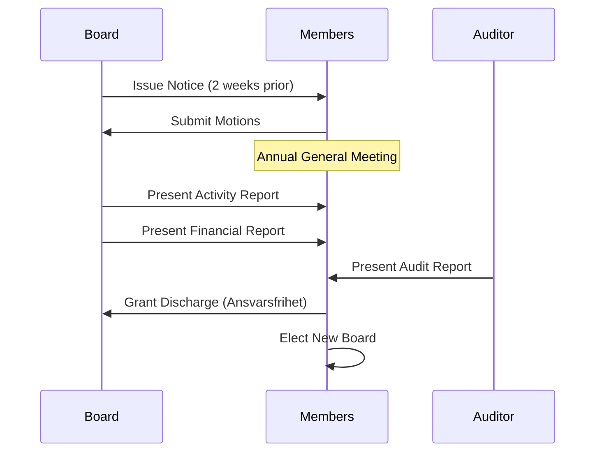

Relevant source files

The following files were used as context for generating this wiki page:

- [forening/README.md](forening/README.md)
- [forening/stadgar.md](forening/stadgar.md)
- [forening/arsmote-mall.md](forening/arsmote-mall.md)
- [forening/konstituerande-mote-protokoll.md](forening/konstituerande-mote-protokoll.md)
- [README.md](README.md)

# Non-profit Association Guidelines

Non-profit Association Guidelines define the formal requirements and practical steps for establishing and maintaining a legal entity to manage the **politiker-webapp** project. The association serves as a non-profit, public-interest organization (allmännyttig förening) dedicated to facilitating communication between the public and their elected representatives in municipalities, regions, and the national parliament.

The guidelines ensure that the project transitions from a private initiative to a structured organization capable of holding bank accounts, managing PayPal business services, and complying with tax regulations (specifically Chapter 7 of the Swedish Income Tax Act).

Sources: [forening/README.md:1-5](forening/README.md#L1-L5), [forening/stadgar.md:6-10](forening/stadgar.md#L6-L10), [README.md:1-5](README.md#L1-L5)

## 1. Association Formation Process

The formation process involves three primary legal artifacts: the foundation meeting minutes (konstituerande möte), the bylaws (stadgar), and the registration with tax authorities.

### 1.1 Practical Steps to Formation
The project provides a structured workflow for founding the association:
1.  **Preparation**: Filling placeholders in template documents with names, locations, and dates. A minimum of 2-3 founders/board members is required.
2.  **Constituent Meeting**: A meeting (physical or digital) to adopt bylaws and elect the board.
3.  **Registration**: Applying for an organization number (organisationsnummer) via Swedish Tax Agency form SKV 8400.
4.  **Financial Infrastructure**: Opening a bank account and a corporate PayPal account using the organization number.

Sources: [forening/README.md:7-22](forening/README.md#L7-L22)

### 1.2 Formation Flowchart
The following diagram illustrates the sequence of operations required to establish the legal entity and link it to the web service.

Sources: [forening/README.md:7-30](forening/README.md#L7-L30), [forening/konstituerande-mote-protokoll.md:7-36](forening/konstituerande-mote-protokoll.md#L7-L36)

## 2. Bylaws and Governance Structure

The association's governance is governed by formal bylaws (stadgar) that ensure political and religious neutrality and maintain public-interest status.

### 2.1 Organizational Purpose and Membership
The association is defined as a non-profit, non-partisan, and non-religious entity. Membership is open to anyone who shares the association's goals, and membership cannot be refused without objective grounds to satisfy the "openness criterion" (öppenhetskriteriet).

Sources: [forening/stadgar.md:6-16](forening/stadgar.md#L6-L16)

### 2.2 Board Composition and Duties
The board is responsible for the association's affairs between annual meetings.

| Role | Responsibility | Requirement |
| :--- | :--- | :--- |
| **Chairman** | Leading board activities and meetings. | 1 person |
| **Board Members** | Managing association affairs. | 3 to 7 members |
| **Auditor** | Reviewing financial records. | Optional/Decided by meeting |
| **Signatory** | Representing the association to banks/PayPal. | Decided at meeting |

Sources: [forening/stadgar.md:21-25](forening/stadgar.md#L21-L25), [forening/konstituerande-mote-protokoll.md:21-36](forening/konstituerande-mote-protokoll.md#L21-L36)

### 2.3 Annual General Meeting (AGM)
The AGM must be held by April 30th each year. It is the highest decision-making body and handles activities such as board discharge (ansvarsfrihet) and financial reporting.

Sources: [forening/stadgar.md:27-37](forening/stadgar.md#L27-L37), [forening/arsmote-mall.md:7-35](forening/arsmote-mall.md#L7-L35)

## 3. Financial and Tax Compliance

To maintain tax-exempt status as a public-interest entity, specific criteria regarding the use of funds and dissolution must be met.

### 3.1 Public Interest Criteria
- **Fiscal Year**: Follows the calendar year (January 1 – December 31).
- **Membership Fees**: Determined by the AGM; the association may choose to charge no fees.
- **Dissolution Policy**: Upon dissolution, assets must be donated to other non-profit organizations with similar goals. Assets may never return to individual members, satisfying the "completion criterion" (fullföljdskriteriet) under 7 kap. inkomstskattelagen.

Sources: [forening/stadgar.md:39-50](forening/stadgar.md#L39-L50), [forening/konstituerande-mote-protokoll.md:38-42](forening/konstituerande-mote-protokoll.md#L38-L42)

### 3.2 Integration with the Web Service
Once the association is formed, the technical configuration of the `politiker-webapp` must be updated to direct funds to the association's accounts rather than private ones.

| Component | File Path | Change Required |
| :--- | :--- | :--- |
| **Donation Link** | `app/public/index.html` | Update PayPal ID/Address |
| **Funding Meta** | `.github/FUNDING.yml` | Update business recipient |

Sources: [forening/README.md:24-28](forening/README.md#L24-L28)

## 4. Documentation Templates

The association relies on standardized Markdown templates for record-keeping.

### 4.1 Constituent Meeting Protocol
Key sections that must be documented during the first meeting include:
- Decision to form the association (§ 3).
- Adoption of bylaws (§ 4).
- Establishment of the fiscal year (§ 7).
- Appointment of authorized signatories for bank and PayPal access (§ 9).

Sources: [forening/konstituerande-mote-protokoll.md:12-36](forening/konstituerande-mote-protokoll.md#L12-L36)

### 4.2 Annual Meeting Checklist
The `arsmote-mall.md` serves as a checklist for recurring governance, requiring a summary of the year's web service activities (e.g., users, letters sent) and a financial summary (donations vs. expenses like domain and Cloudflare costs).

Sources: [forening/arsmote-mall.md:12-25](forening/arsmote-mall.md#L12-L25)

The establishment of this association provides a legal framework for the long-term sustainability and transparent financial management of the politikerkontakt service. By following these guidelines, the project ensures compliance with Swedish non-profit regulations while maintaining its mission of facilitating democratic outreach.
