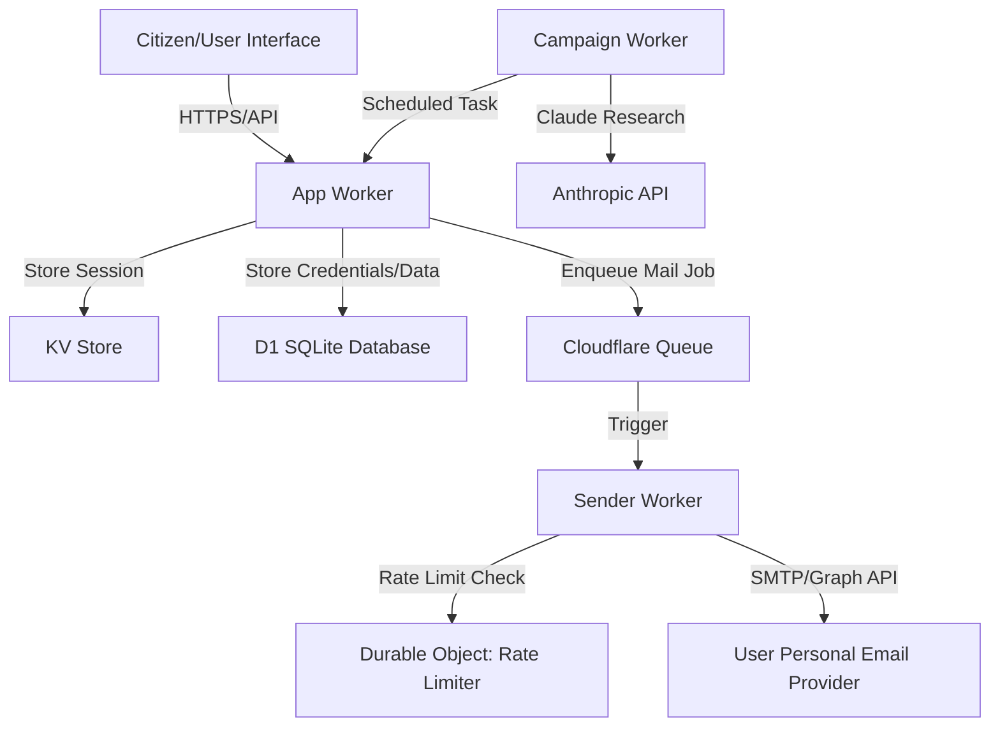
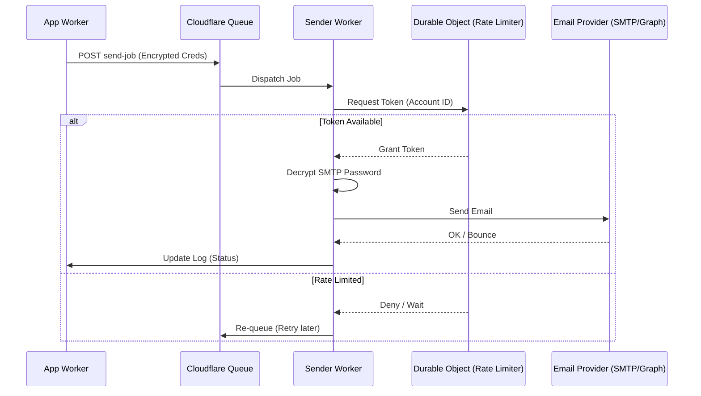

<details>
<summary>Relevant source files</summary>
The following files were used as context for generating this wiki page:

- [README.md](README.md)
- [AGENTS.md](AGENTS.md)
- [app/public/app.js](app/public/app.js)
- [infra/setup.sh](infra/setup.sh)
- [app/src/admin-stats.ts](app/src/admin-stats.ts)
- [CLAUDE.md](CLAUDE.md)
</details>

# System Architecture Overview

The `politiker-webapp` is a specialized platform designed to empower citizens to contact their elected representatives (at local, regional, national, and EU levels) using their own personal email accounts. By utilizing the user's personal email credentials rather than a centralized platform sender, the system ensures that responses are directed back to the individual citizen, maintaining a direct line of communication between the constituent and the representative.

The architecture is built on the Cloudflare ecosystem, leveraging a serverless, event-driven model to handle authentication, data management, and asynchronous message dispatching. The project is structured as a collection of decoupled Workers, shared libraries, and infrastructure scripts, ensuring scalability and security through features like AES-GCM encryption for credentials and Durable Objects for rate limiting.

Sources: [README.md:1-12](README.md#L1-L12), [AGENTS.md:5-15](AGENTS.md#L5-L15), [CLAUDE.md:5-15](CLAUDE.md#L5-L15)

## Core Components and Project Structure

The system is partitioned into four primary directories, each representing a distinct functional domain within the architecture.

| Component | Description | Technologies |
| :--- | :--- | :--- |
| **App Worker** (`app/`) | The main entry point. Serves the vanilla HTML/JS frontend and handles the API for authentication, recipient selection, and letter drafting. | TypeScript, Cloudflare Workers, KV, D1 |
| **Sender Worker** (`sender/`) | An asynchronous queue consumer responsible for the actual delivery of emails via SMTP or Microsoft Graph API. | Cloudflare Queues, `cloudflare:sockets`, Durable Objects |
| **Campaign Worker** (`campaign/`) | An autonomous service that performs daily news research using AI and sends relevant citizen letters to politicians. | Cloudflare Workers (Cron Triggers), Anthropic Claude API |
| **Shared** (`shared/`) | Common utilities used across all workers, including encryption, SMTP client logic, and TOTP handling. | TypeScript, Web Crypto API |

Sources: [README.md:65-75](README.md#L65-L75), [AGENTS.md:20-25](AGENTS.md#L20-L25), [CLAUDE.md:20-25](CLAUDE.md#L20-L25)

### High-Level System Flow

The following diagram illustrates the interaction between the user, the core workers, and the supporting Cloudflare infrastructure.



The App Worker manages state and UI, while the Sender Worker handles delivery asynchronously to ensure the UI remains responsive.
Sources: [README.md:40-60](README.md#L40-L60), [AGENTS.md:10-15](AGENTS.md#L10-L15), [CLAUDE.md:10-15](CLAUDE.md#L10-L15)

## Data Management and Storage

The system utilizes three distinct Cloudflare storage products to manage different types of data:

*  **Cloudflare D1 (SQLite):** Acts as the relational database for persistent storage. It holds user accounts, politician contact data (imported from external SQL sources), send logs, and public letters. All queries are filtered by `account_id` to ensure strict isolation between users.
*  **Cloudflare KV:** Used for managing user sessions and temporary state.
*  **Cloudflare R2:** Stores attachments for letters (PDF, txt, docx) before they are dispatched.

Sources: [AGENTS.md:10-15](AGENTS.md#L10-L15), [AGENTS.md:35-40](AGENTS.md#L35-L40), [infra/setup.sh:105-135](infra/setup.sh#L105-L135)

### Administrative Monitoring and Statistics

The system includes a robust admin panel that aggregates data from D1 to provide insights into platform usage. Key metrics include total accounts, letter volume, and visitor geography via IP-to-country resolution.

```typescript
// Example of data aggregation for the admin panel
// Path: app/src/admin-stats.ts
export async function getAdminStats(env: Env): Promise<AdminStats> {
  const totals = await env.DB.prepare(
    `SELECT
       (SELECT COUNT(*) FROM accounts) as totalAccounts,
       (SELECT COUNT(*) FROM letters) as totalLetters,
       (SELECT COUNT(*) FROM send_log WHERE status = 'ok') as totalSent,
       (SELECT COUNT(*) FROM send_log WHERE status = 'bounce') as totalBounced`,
  ).first();
  // ... country and visitor hash logic ...
}
```

Sources: [app/src/admin-stats.ts:15-30](app/src/admin-stats.ts#L15-L30)

## Security and Authentication Architecture

Security is centralized around the Web Crypto API and strict credential handling. 

### Identity Management
Users can authenticate via email/password or social OAuth providers (Google, GitHub, Microsoft). Password security is handled using PBKDF2 hashing with a maximum of 100,000 iterations, a constraint imposed by the Cloudflare Workers runtime. Multi-factor authentication is supported through TOTP (Time-based One-Time Password).

### Credential Protection
User email credentials (SMTP passwords) are never stored in plain text. They are encrypted using **AES-GCM** before being saved in the D1 database. The encryption key (`MAIL_CRED_KEY`) is stored as a Cloudflare Worker Secret and must be identical across both the `app` and `sender` workers to allow the sender to decrypt the credentials for SMTP authentication.

Sources: [AGENTS.md:30-40](AGENTS.md#L30-L40), [SECURITY.md:15-25](SECURITY.md#L15-L25), [CLAUDE.md:30-40](CLAUDE.md#L30-L40)

## Message Dispatch and Rate Limiting

A critical architectural feature is the protection of user email accounts from being flagged as spam by providers like Gmail or Outlook.

### The Sender Queue
When a user clicks "Send", the App Worker does not send the email directly. Instead, it creates a job in a Cloudflare Queue. This prevents timeout issues in the frontend and allows for retry logic if a mail provider is temporarily unavailable.

### Durable Object Rate Limiting
To ensure compliance with provider limits, the system implements a "Token Bucket" rate limiter using **Durable Objects**. Each mail connection has its own Durable Object instance, ensuring that parallel send jobs for the same account are globally throttled. Users can configure a `userCapPct` (e.g., 50% or 75%) to further limit the sending rate below the provider's known maximum ceiling.

Sources: [README.md:40-45](README.md#L40-L45), [README.md:75-80](README.md#L75-L80), [app/public/app.js:255-270](app/public/app.js#L255-L270)



Sources: [README.md:40-45](README.md#L40-L45), [AGENTS.md:10-15](AGENTS.md#L10-L15), [app/public/app.js:520-560](app/public/app.js#L520-L560)

## Infrastructure and Deployment

Deployment is managed via a comprehensive setup script (`infra/setup.sh`) that automates the provisioning of Cloudflare resources and the application of SQL schemas.

| Environment Variable | Function |
| :--- | :--- |
| `MAIL_CRED_KEY` | AES-256 key for credential encryption/decryption. |
| `SYSTEM_SMTP_PASSWORD` | Credentials for the system's own notification/verification emails. |
| `GITHUB_FEEDBACK_TOKEN` | Token for automatically creating GitHub issues from client-side errors. |
| `ANTHROPIC_API_KEY` | Required for the Campaign Worker's AI research and drafting. |

The system uses `wrangler` for development and deployment. The infrastructure supports a `bounce-processor` written in Python, which runs as a systemd service to monitor for bounced emails in Gmail accounts and update the D1 database accordingly.

Sources: [README.md:85-110](README.md#L85-L110), [infra/setup.sh:10-50](infra/setup.sh#L10-L50), [CLAUDE.md:15-20](CLAUDE.md#L15-L20)

## Summary

The `politiker-webapp` architecture is a robust, serverless implementation focused on user privacy and direct democratic participation. By offloading heavy tasks like mail delivery and AI research to asynchronous workers and utilizing advanced Cloudflare features like Durable Objects for rate limiting and D1 for relational data, the system maintains high performance and security while remaining easy to deploy via a single infrastructure script.

Sources: [README.md:130-150](README.md#L130-L150), [AGENTS.md:1-5](AGENTS.md#L1-L5)
