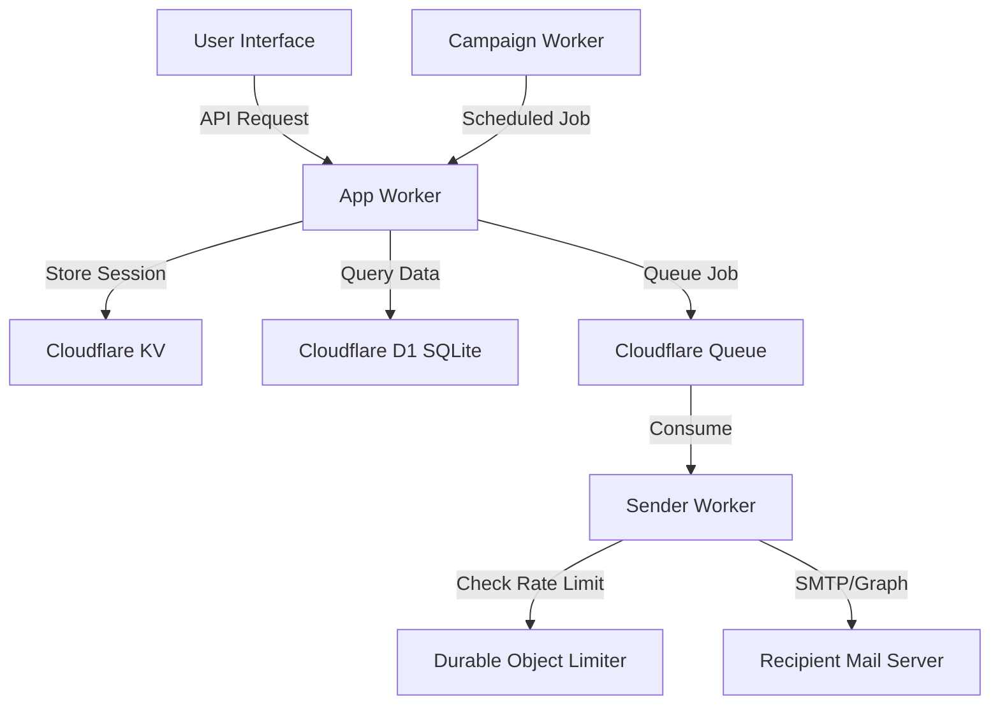
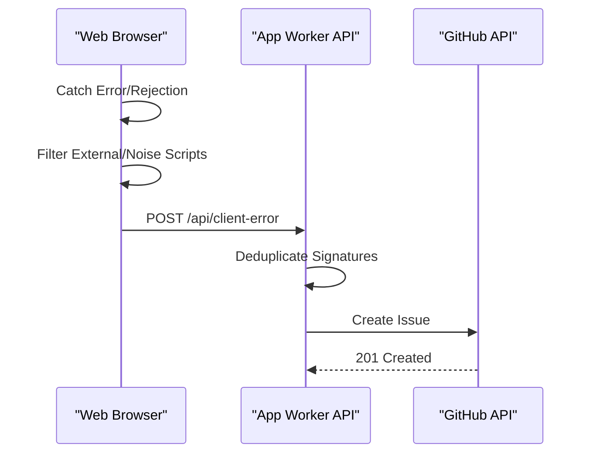

Relevant source files

The following files were used as context for generating this wiki page:

- [README.md](README.md)
- [AGENTS.md](AGENTS.md)
- [CLAUDE.md](CLAUDE.md)
- [app/public/app.js](app/public/app.js)
- [infra/setup.sh](infra/setup.sh)
- [app/src/admin-stats.ts](app/src/admin-stats.ts)
- [SECURITY.md](SECURITY.md)

# System Architecture Overview

The **politiker-webapp** is a specialized web tool designed to enable citizens to contact elected officials (EU, national, regional, and local) using their own email accounts. The system acts as an intermediary for recipient discovery and message preparation without becoming the sender of the emails.

The architecture is built on the Cloudflare ecosystem, utilizing TypeScript and Vanilla JS for a lightweight, performant frontend and a serverless backend.

Sources: [README.md:1-10](README.md#L1-L10), [AGENTS.md:6-10](AGENTS.md#L6-L10)

## Core Components

The project is structured into four primary modules, each serving a distinct purpose in the email delivery and management lifecycle.

### Component Breakdown

| Module | Description | Key Technologies |
| :--- | :--- | :--- |
| **app/** | Main Worker: Hosts the static frontend and provides APIs for authentication, recipient selection, and admin functions. | Cloudflare Workers, D1, KV, Vanilla JS |
| **sender/** | Queue Consumer: Handles the actual SMTP/Graph transmission and manages rate limiting via Durable Objects. | Cloudflare Workers, Queues, Durable Objects |
| **campaign/** | Autonomous Worker: A cron-driven agent that researches news and generates automated letters using AI. | Cloudflare Workers (Cron Triggers), Claude API |
| **shared/** | Common Code: Shared logic for encryption, SMTP clients, TOTP, and data types. | TypeScript |

Sources: [README.md:73-82](README.md#L73-L82), [AGENTS.md:21-26](AGENTS.md#L21-L26), [CLAUDE.md:21-26](CLAUDE.md#L21-L26)

## Data and Flow Architecture

The system utilizes a decoupled request-response flow for sending emails. When a user submits a letter, the `app/` worker validates the request and places a job into a Cloudflare Queue. The `sender/` worker then consumes this queue to perform the actual delivery.

### High-Level System Flow

The `sender/` worker uses a **Token Bucket** algorithm implemented in a Durable Object to ensure that mail delivery respects the rate limits of individual mail providers (Gmail, Outlook, etc.).

Sources: [README.md:43-47](README.md#L43-L47), [AGENTS.md:10-12](AGENTS.md#L10-L12), [app/public/app.js:527-564](app/public/app.js#L527-L564)

## Authentication and Security

The system implements a robust security model focused on account isolation and credential protection.

*  **Encryption:** User SMTP passwords are encrypted using **AES-GCM** with a master key (`MAIL_CRED_KEY`) before storage in the D1 database.
*  **Authentication:** Supports traditional email/password login (hashed via **PBKDF2**, max 100,000 iterations), OAuth (Google, GitHub, Microsoft), and TOTP 2FA.
*  **Isolation:** All database queries are filtered by `account_id` to ensure strict tenant isolation, except for administrative routes.
*  **Infrastructure:** Infrastructure is managed via scripts in the `infra/` directory, which provision D1, KV, R2, and Queues using the Wrangler CLI.

Sources: [SECURITY.md:12-18](SECURITY.md#L12-L18), [AGENTS.md:28-36](AGENTS.md#L28-L36), [infra/setup.sh:86-120](infra/setup.sh#L86-L120)

## Administrative and Monitoring Systems

The administrative interface provides oversight through statistics, feedback management, and user control.

### Admin Data Model

| Metric | Source | Purpose |
| :--- | :--- | :--- |
| **TimeSeries** | `send_log`, `visits` | Tracks visitors and sent emails across various time granularities (minute to year). |
| **Leaderboard** | `send_log` | Identifies the top 50 most active accounts. |
| **Visitor Map** | `visits` | Aggregates unique visitors by ISO country code. |

Sources: [app/src/admin-stats.ts:7-25](app/src/admin-stats.ts#L7-L25), [app/public/app.js:833-870](app/public/app.js#L833-L870)

### Error Reporting Flow

The application includes an automated client-side error reporter that bypasses standard logging to create actionable GitHub issues.

Sources: [app/public/app.js:46-76](app/public/app.js#L46-L76), [TODO.md:28-30](TODO.md#L28-L30)

## Infrastructure Provisioning

The system is designed for easy replication using a single setup script. The `infra/setup.sh` script automates the creation of all Cloudflare resources and patches configuration files with the resulting resource IDs.

*  **D1 SQLite:** Stores account data, letter history, and politician contact information.
*  **KV:** Manages session storage.
*  **R2:** Stores letter attachments (PDF, docx, etc.).
*  **Queues:** Manages asynchronous email delivery tasks.

Sources: [infra/setup.sh:10-40](infra/setup.sh#L10-L40), [README.md:85-115](README.md#L85-L115)

## Conclusion

The architecture of **politiker-webapp** leverages Cloudflare's serverless platform to provide a scalable and secure environment for medborgarkontakt (citizen contact). By separating the frontend/API, background sending, and autonomous research into distinct workers, the system ensures reliability and respects third-party email provider constraints.
