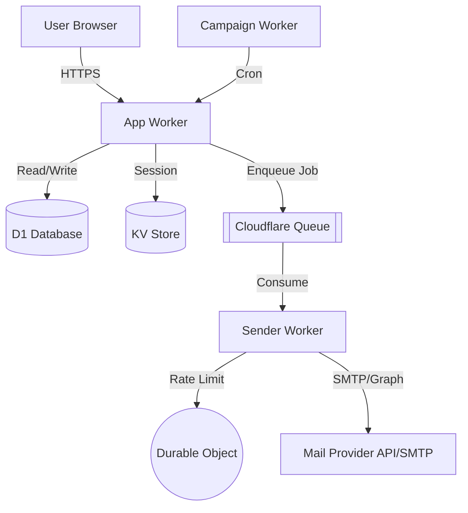
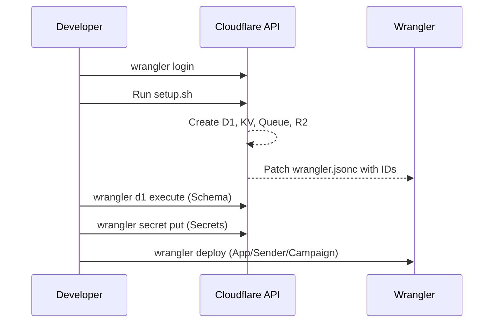

Relevant source files

The following files were used as context for generating this wiki page:

- [README.md](README.md)
- [AGENTS.md](AGENTS.md)
- [app/package.json](app/package.json)
- [sender/package.json](sender/package.json)
- [campaign/package.json](campaign/package.json)
- [infra/setup.sh](infra/setup.sh)
- [infra/schema.sql](infra/schema.sql)
- [app/public/app.js](app/public/app.js)

# Cloudflare Workers Ecosystem

The Cloudflare Workers Ecosystem within the `politiker-webapp` project provides a serverless architecture designed to handle citizen-to-politician communications. It leverages multiple specialized Workers, distributed storage, and asynchronous messaging to enable users to send personalized emails to elected officials via their own mail accounts (Gmail, Outlook, iCloud, etc.) without the platform acting as the sender.

Sources: [README.md:1-12](README.md#L1-L12), [AGENTS.md:1-12](AGENTS.md#L1-L12)

This ecosystem is composed of three primary Workers—`app`, `sender`, and `campaign`—supported by Cloudflare-native services such as D1 for relational data, KV for session management, Queues for asynchronous job processing, and Durable Objects for localized rate limiting.

Sources: [README.md:52-60](README.md#L52-L60), [AGENTS.md:14-17](AGENTS.md#L14-L17)

## Core Architecture and Component Roles

The system is split into distinct functional units to separate concerns between user interaction, heavy processing, and automated advocacy.

### Worker Responsibilities

| Worker | Purpose | Primary Technologies |
| :--- | :--- | :--- |
| **App Worker** (`app/`) | Serves the vanilla HTML/JS frontend and provides the REST API for authentication, politician searching, and draft composition. | D1, KV, Turnstile |
| **Sender Worker** (`sender/`) | Acts as a Queue consumer to perform actual SMTP/Graph email delivery. | `cloudflare:sockets`, Durable Objects |
| **Campaign Worker** (`campaign/`) | An autonomous, cron-driven agent that researches news and sends automated civic letters. | Cron Triggers, Claude API |

Sources: [README.md:52-60](README.md#L52-L60), [AGENTS.md:21-26](AGENTS.md#L21-L26), [infra/setup.sh:160-184](infra/setup.sh#L160-L184)

### Data Flow and Interaction
The following diagram illustrates how a user request flows through the ecosystem to result in a sent email.

The App Worker handles the frontend and API, while the Sender Worker processes background tasks from the Queue, using Durable Objects to ensure mail provider rate limits are respected.
Sources: [README.md:52-60](README.md#L52-L60), [AGENTS.md:14-17](AGENTS.md#L14-L17)

## Infrastructure and Storage Services

The project utilizes the full suite of Cloudflare developer tools to maintain a stateful application in a stateless environment.

### Database Schema (D1)
Relational data is stored in Cloudflare D1. The schema manages users, politician contact details, and the state of mail delivery jobs.

| Table | Key Fields | Description |
| :--- | :--- | :--- |
| `accounts` | `id`, `email`, `password_hash`, `totp_secret` | Stores user credentials and security settings. |
| `politicians` | `id`, `name`, `email`, `area_type`, `party` | Directory of elected officials and contact info. |
| `mail_credentials`| `account_id`, `provider`, `encrypted_password` | Encrypted SMTP/OAuth credentials. |
| `send_jobs` | `id`, `letter_id`, `status`, `sent_count` | Tracks the progress of a bulk mailing operation. |

Sources: [infra/schema.sql:3-113](infra/schema.sql#L3-L113)

### Specialized Storage Usage
*  **KV (Key-Value):** Specifically used for session management to provide fast access to user login states across the global edge.
*  **R2 (Object Storage):** Used for storing email attachments (PDF, docx, etc.) that exceed database size limits.
*  **Durable Objects:** Implements a "token bucket" rate-limiter per mail connection. This ensures that even if multiple parallel sends occur, they collectively stay under the provider's threshold.

Sources: [README.md:31-33](README.md#L31-L33), [AGENTS.md:14-17](AGENTS.md#L14-L17), [infra/setup.sh:111-125](infra/setup.sh#L111-L125)

## Security and Authentication

The ecosystem implements multiple layers of security to protect sensitive SMTP credentials and user accounts.

### Credential Protection
User SMTP passwords are never stored in plain text. They are encrypted using **AES-GCM** before being saved to the D1 database. The encryption key, `MAIL_CRED_KEY`, is managed as a Cloudflare Worker Secret and is never committed to the repository.
Sources: [AGENTS.md:30-31](AGENTS.md#L30-L31), [SECURITY.md:13-16](SECURITY.md#L13-L16)

### Authentication Mechanisms
1.  **Local Auth:** Passwords hashed with **PBKDF2** (limited to 100,000 iterations due to Worker runtime constraints).
2.  **Social Auth:** Integration with Google, GitHub, and Microsoft via OAuth.
3.  **Two-Factor (2FA):** Support for TOTP-based 2FA.
4.  **API Keys:** Programmatic access via `Authorization: Bearer <key>` tokens stored as hashes.

Sources: [app/public/app.js:145-180](app/public/app.js#L145-L180), [infra/schema.sql:3-15](infra/schema.sql#L3-L15), [AGENTS.md:32-33](AGENTS.md#L32-L33)

## Deployment and Automation

The project utilizes `wrangler` for deployment and a custom shell script for idempotent infrastructure provisioning.

### Setup Process
The `infra/setup.sh` script automates the creation of all Cloudflare resources.

The setup process ensures that resource IDs are correctly mapped between the Cloudflare account and the local configuration files.
Sources: [infra/setup.sh:91-184](infra/setup.sh#L91-L184)

### Autonomous Campaign System
The `campaign` worker operates independently of user input:
*  **Trigger:** Cron-driven (scheduled for 05–09 UTC daily).
*  **Intelligence:** Uses Claude (Anthropic API) to filter relevant news from sources like SVT and Riksdagen.
*  **Action:** Generates personalized letters and sends them via a dedicated Gmail account.
*  **Maintenance:** Includes a "bounce-sweep" to clear invalid politician emails every 90 days.

Sources: [README.md:43-50](README.md#L43-L50), [campaign/package.json:1-25](campaign/package.json#L1-L25)

## Monitoring and Error Handling

The ecosystem integrates with Sentry for real-time error tracking across all three Workers.

*  **Sentry Integration:** Uses `@sentry/cloudflare` to wrap worker exports.
*  **Source Maps:** Uploaded via a `postdeploy` hook in `package.json` to ensure stack traces map back to TypeScript code.
*  **Healthchecks:** A Python-based healthcheck (`infra/healthcheck.py`) runs locally to verify D1 connectivity, worker existence, and stuck send jobs.
*  **Client Error Reporting:** Unexpected JavaScript errors in the frontend are captured and sent to `/api/client-error`, which automatically creates GitHub issues.

Sources: [README.md:88-112](README.md#L88-L112), [app/package.json:6-14](app/package.json#L6-L14), [app/public/app.js:46-64](app/public/app.js#L46-L64), [infra/healthcheck.py:46-95](infra/healthcheck.py#L46-L95)

## Conclusion
The Cloudflare Workers Ecosystem for `politiker-webapp` is a robust, modular architecture that maximizes the capabilities of the Cloudflare edge. By separating the user interface, the mailing engine, and automated campaigns into distinct Workers, the system achieves high scalability while maintaining strict rate limits and security protocols for user-provided mail credentials.
