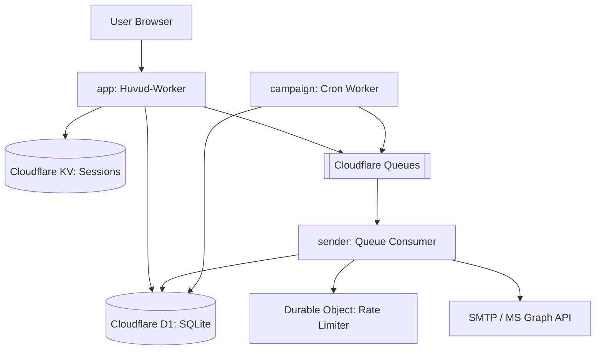
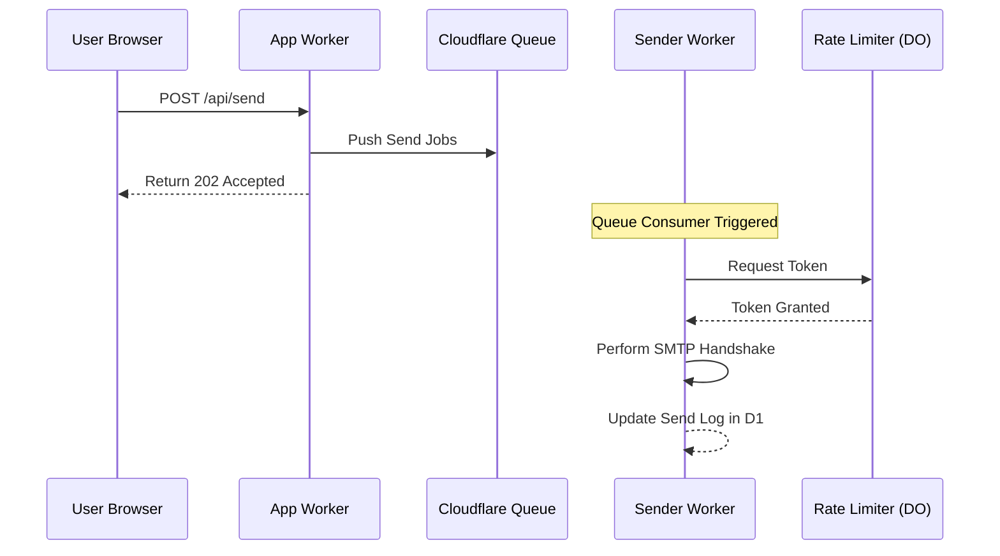

<details>
<summary>Relevant source files</summary>

The following files were used as context for generating this wiki page:

- [README.md](README.md)
- [AGENTS.md](AGENTS.md)
- [app/public/app.js](app/public/app.js)
- [infra/setup.sh](infra/setup.sh)
- [infra/schema.sql](infra/schema.sql)
- [infra/healthcheck.py](infra/healthcheck.py)
</details>

# Cloudflare Workers Ecosystem

The Cloudflare Workers Ecosystem within the `politiker-webapp` project provides a serverless architecture designed to handle citizen-to-politician communication at scale. It leverages a distributed suite of Cloudflare services including Workers, D1 (SQL database), KV (Key-Value storage), Queues, and R2 (Object storage) to manage user accounts, politicial contact databases, and asynchronous email delivery.

Sources: [README.md:95-101](README.md#L95-L101), [AGENTS.md:12-16](AGENTS.md#L12-L16)

## Architecture Overview

The system is partitioned into three primary specialized Workers that interact with shared storage and messaging infrastructure. This decoupling allows for independent scaling and failure isolation between the user-facing web application, the background mail processing, and the autonomous campaign logic.



The diagram shows the interaction between the primary Workers and the Cloudflare infrastructure components.
Sources: [README.md:103-111](README.md#L103-L111), [AGENTS.md:18-23](AGENTS.md#L18-L23)

### Core Components

| Component | Technology | Role |
| :--- | :--- | :--- |
| **App Worker** | Cloudflare Workers | Serves the vanilla HTML/JS frontend and provides the REST API for auth, settings, and letter creation. |
| **Sender Worker** | Cloudflare Workers | Consumes messages from the Queue to perform actual SMTP or Microsoft Graph API transmissions. |
| **Campaign Worker** | Cloudflare Workers | Executes daily cron jobs to fetch news, research topics via AI, and generate automated letters. |
| **D1 Database** | Cloudflare D1 | Stores relational data including user accounts, politician contacts, and send logs. |
| **Durable Objects** | Cloudflare DO | Implements a "token bucket" rate limiter per mail connection to prevent provider blocking. |

Sources: [README.md:38-41](README.md#L38-L41), [README.md:103-111](README.md#L103-L111), [AGENTS.md:12-16](AGENTS.md#L12-L16)

## Data Persistence and Schema

The ecosystem utilizes Cloudflare D1 as its primary relational engine. The schema is designed to isolate user accounts while providing centralized management of politicians and audit logs of sent messages.

### Database Entities
The following table summarizes the primary tables used within the D1 database.

| Table | Purpose |
| :--- | :--- |
| `accounts` | Stores user credentials, 2FA status, and daily send caps. |
| `politicians` | A central repository of ~17,000 politicians including EU, Riksdag, and local municipalities. |
| `mail_credentials` | Stores encrypted SMTP or OAuth (MS Graph) credentials for user-specific mail accounts. |
| `send_jobs` | Tracks the progress and status of a batch of emails. |
| `send_log` | Detailed record of individual email attempts (status: ok/bounce). |

Sources: [infra/schema.sql:3-113](infra/schema.sql#L3-L113), [README.md:46-51](README.md#L46-L51)

### Infrastructure Provisioning
Resources are provisioned via the `infra/setup.sh` script, which automates the creation of D1, KV, Queues, and R2 buckets, then patches `wrangler.jsonc` files with the resulting resource IDs.

```bash
# Provisioning D1 Database via setup.sh
DB_ID="$($WR d1 list --json | jq -r ".[] | select(.name==\"$DB_NAME\") | .id")"
if [ -z "$DB_ID" ]; then
  $WR d1 create "$DB_NAME"
fi
```

Sources: [infra/setup.sh:82-90](infra/setup.sh#L82-L90)

## Asynchronous Communication Flow

The system handles email delivery asynchronously to manage rate limits imposed by various email providers (Gmail, Outlook, etc.).



The sequence shows how the App Worker offloads transmission tasks to the Queue for processing by the Sender Worker.
Sources: [README.md:38-41](README.md#L38-L41), [AGENTS.md:12-16](AGENTS.md#L12-L16), [app/public/app.js:527-560](app/public/app.js#L527-L560)

## Security and Operational Integrity

Security is maintained through strict isolation and encryption. User SMTP passwords are encrypted using AES-GCM before storage in D1, with the `MAIL_CRED_KEY` managed as a Cloudflare Worker Secret.

*  **Credential Isolation**: Secrets are never hardcoded and are injected via `wrangler secret put`.
*  **Rate Limiting**: Durable Objects implement a token bucket to ensure that parallel sends against the same account do not exceed provider limits.
*  **Health Checks**: A Python-based monitoring script (`infra/healthcheck.py`) performs daily checks on D1 availability, stuck send jobs, and Cloudflare Access bypass policies.

Sources: [AGENTS.md:27-31](AGENTS.md#L27-L31), [SECURITY.md:16-19](SECURITY.md#L16-L19), [infra/healthcheck.py:53-83](infra/healthcheck.py#L53-L83)

## Conclusion
The Cloudflare Workers Ecosystem enables `politiker-webapp` to function as a distributed, scalable platform for civic engagement. By leveraging serverless Workers for logic and D1/Queue for state management, the system maintains a low overhead while providing robust features like autonomous AI-driven campaigns and shared rate-limiting across distributed nodes.
