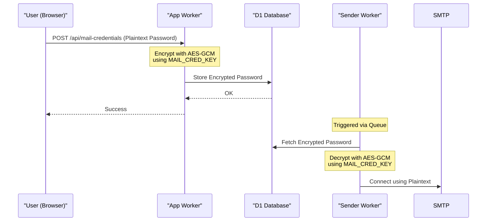

<details>
<summary>Relevant source files</summary>

The following files were used as context for generating this wiki page:

- [shared/crypto.ts](shared/crypto.ts)
- [SECURITY.md](SECURITY.md)
- [AGENTS.md](AGENTS.md)
- [CLAUDE.md](CLAUDE.md)
- [README.md](README.md)
- [infra/setup.sh](infra/setup.sh)
- [app/public/app.js](app/public/app.js)
</details>

# Security Architecture & Cryptography

The Security Architecture of the `politiker-webapp` project is designed to provide robust protection for user credentials and sensitive SMTP data within a serverless Cloudflare Workers environment. The system prioritizes data isolation between accounts and utilizes the native Web Crypto API to perform cryptographic operations without external dependencies.

Key security pillars include the use of environment-specific secrets for data encryption, password hashing using industry-standard algorithms adapted for runtime constraints, and multi-factor authentication (TOTP).

Sources: [SECURITY.md:14-18](SECURITY.md#L14-L18), [AGENTS.md:27-31](AGENTS.md#L27-L31), [shared/crypto.ts:1-3](shared/crypto.ts#L1-L3)

## Cryptographic Implementation

The project centralizes its cryptographic logic in a shared module, utilizing the Web Crypto API. This ensures compatibility with the Cloudflare Workers runtime and provides high-performance, secure primitives for hashing and encryption.

### Password Hashing (PBKDF2)
User account passwords are never stored in plaintext. They are hashed using the PBKDF2 (Password-Based Key Derivation Function 2) algorithm with SHA-256. Due to specific runtime limitations in Cloudflare Workers, the iteration count is capped at 100,000.

- **Iterations**: 100,000 (Maximum allowed by Workers runtime).
- **Salt**: 16 bytes of cryptographically secure random values.
- **Verification**: Uses `timingSafeEqual` to prevent timing attacks during password comparisons.

Sources: [shared/crypto.ts:6-25](shared/crypto.ts#L6-L25), [AGENTS.md:28-29](AGENTS.md#L28-L29), [CLAUDE.md:28-29](CLAUDE.md#L28-L29)

### SMTP Credential Encryption (AES-GCM)
Because the application allows users to link their own SMTP accounts, sensitive mail passwords must be stored securely. These are encrypted using AES-256-GCM before being persisted to the D1 database.

- **Algorithm**: AES-GCM (Galois/Counter Mode).
- **Key Management**: Uses a 32-byte key defined by the `MAIL_CRED_KEY` environment secret.
- **Initialization Vector (IV)**: 12 bytes generated per encryption operation.
- **Storage Format**: The IV is prepended to the ciphertext and stored as a Base64 encoded string.

Sources: [shared/crypto.ts:40-62](shared/crypto.ts#L40-L62), [SECURITY.md:15](SECURITY.md#L15), [AGENTS.md:27](AGENTS.md#L27)

### API Key Generation
API keys are high-entropy tokens generated using cryptographically secure random values. They are prefixed with `pwapi_` and hashed using SHA-256 for verification.

Sources: [shared/crypto.ts:110-120](shared/crypto.ts#L110-L120)

## Authentication & Authorization

The platform supports multiple authentication vectors, including traditional email/password, social OAuth providers (Google, GitHub, Microsoft), and programmatic API access.

### Multi-Factor Authentication (TOTP)
Users can enable Time-based One-Time Passwords (TOTP) for increased security.
- **Setup**: Generates a secret and an `otpauth` URI for authenticator apps.
- **Verification**: Required during login and sensitive operations (like account deletion) if enabled.

Sources: [app/public/app.js:633-667](app/public/app.js#L633-L667), [README.md:33](README.md#L33)

### Data Isolation
A core architectural constraint is account isolation. All database queries for user-specific data must filter by `account_id` to prevent cross-account data leakage. Administrative access is restricted to accounts with the `is_admin = 1` flag.

Sources: [AGENTS.md:31](AGENTS.md#L31), [CLAUDE.md:31](CLAUDE.md#L31)

### Data Flow for SMTP Credentials
The following diagram illustrates the secure flow of SMTP passwords from the client to storage and subsequent use in the sender module.



The diagram shows that the plaintext SMTP password only exists in memory during the encryption/decryption phase and is never stored in the database or committed to version control.
Sources: [shared/crypto.ts:40-62](shared/crypto.ts#L40-L62), [AGENTS.md:17-27](AGENTS.md#L17-L27), [infra/setup.sh:110-120](infra/setup.sh#L110-L120)

## Secret Management

The application relies heavily on Cloudflare Worker Secrets to maintain security boundaries. These secrets are never hardcoded and are set via the `wrangler secret put` command.

| Secret Name | Purpose | Scope |
| :--- | :--- | :--- |
| `MAIL_CRED_KEY` | AES-256 key for encrypting/decrypting SMTP passwords. | `app`, `sender` |
| `SYSTEM_SMTP_PASSWORD` | Password for the system's own notification/verification email account. | `app` |
| `GITHUB_FEEDBACK_TOKEN` | Token for creating GitHub issues from feedback. | `app`, `campaign` |
| `OAUTH_*_CLIENT_SECRET` | Secrets for Google, GitHub, and Microsoft OAuth integration. | `app` |

Sources: [AGENTS.md:27](AGENTS.md#L27), [README.md:104-114](README.md#L104-L114), [infra/setup.sh:105-132](infra/setup.sh#L105-L132)

## Secure Communication

Communication with external mail servers is secured using TLS.
- **SMTP TLS**: The custom SMTP client uses `cloudflare:sockets` and initiates TLS via `socket.startTls()`.
- **Constraint**: The system requires calling `.releaseLock()` on the stream reader/writer before performing the TLS upgrade to prevent runtime errors.

Sources: [AGENTS.md:30](AGENTS.md#L30), [CLAUDE.md:30](CLAUDE.md#L30), [README.md:143-145](README.md#L143-L145)

## Security Configuration

The project utilizes Infrastructure as Code (IoC) scripts to ensure consistent security settings across environments.

```bash
# Example from setup.sh showing secret provisioning
put_secret app MAIL_CRED_KEY "$MAIL_CRED_KEY"
put_secret app SYSTEM_SMTP_PASSWORD "$SYSTEM_SMTP_PASSWORD"
put_secret app GITHUB_FEEDBACK_TOKEN "$GITHUB_FEEDBACK_TOKEN"
```

Sources: [infra/setup.sh:116-118](infra/setup.sh#L116-L118)

## Conclusion

The security architecture of `politiker-webapp` is built on the principle of defense-in-depth, leveraging Cloudflare's platform security features alongside custom cryptographic implementations. By using PBKDF2 for passwords, AES-GCM for SMTP credentials, and enforcing strict account isolation, the system ensures that user data remains protected even in a multi-tenant environment. The reliance on environment secrets ensures that sensitive cryptographic keys are never exposed in the source code.

Sources: [SECURITY.md:14-18](SECURITY.md#L14-L18), [shared/crypto.ts:1-5](shared/crypto.ts#L1-L5)
