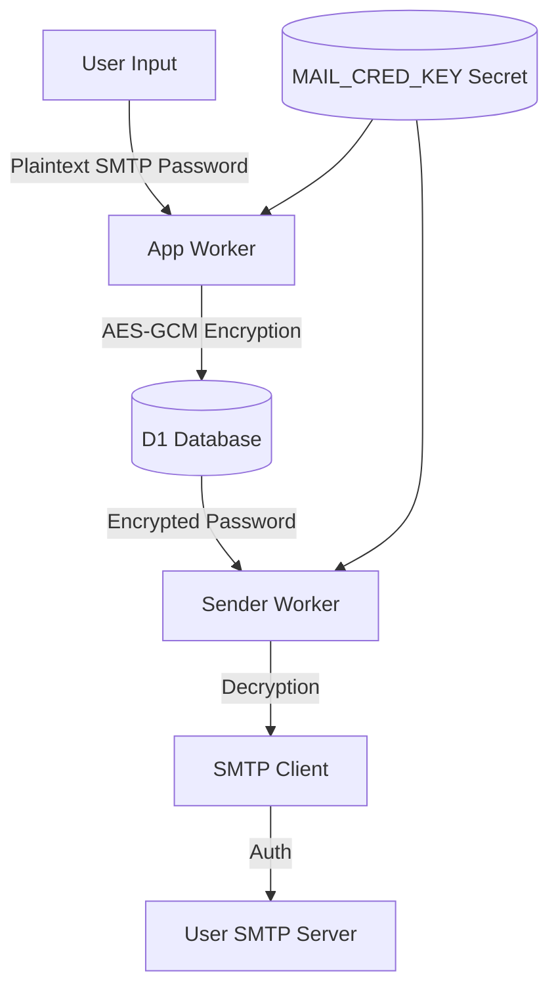

Relevant source files

The following files were used as context for generating this wiki page:

- [SECURITY.md](SECURITY.md)
- [AGENTS.md](AGENTS.md)
- [README.md](README.md)
- [app/public/app.js](app/public/app.js)
- [infra/setup.sh](infra/setup.sh)
- [app/public/index.html](app/public/index.html)

# Security & Data Protection

The **Security & Data Protection** framework of the politiker-webapp project is designed to protect user credentials and personal data while facilitating direct communication between citizens and elected officials. The system leverages Cloudflare Workers' environment for secure execution, employing strong encryption for third-party service credentials and robust hashing for account security.

The architecture ensures that sensitive information, such as SMTP passwords and TOTP secrets, is never exposed in the source code or logs. Data isolation is maintained at the database level, ensuring that users can only access their own data, except for administrative functions which are protected by specific authorization checks.

Sources: [SECURITY.md](SECURITY.md), [AGENTS.md:52-56](AGENTS.md#L52-L56), [README.md:148-151](README.md#L148-L151)

## Authentication & Identity Management

Account security is built on a multi-layered approach including secure password hashing, Two-Factor Authentication (TOTP), and OAuth integration.

### Password Security
User passwords are never stored in plain text. The system uses the **PBKDF2** (Password-Based Key Derivation Function 2) algorithm via the Web Crypto API. Due to Cloudflare Workers' runtime limitations, the iteration count is capped at 100,000.
Sources: [SECURITY.md:18](SECURITY.md#L18), [AGENTS.md:48](AGENTS.md#L48), [CLAUDE.md:46](CLAUDE.md#L46)

### Two-Factor Authentication (TOTP)
Users can enhance account security by enabling TOTP. The implementation includes:
- Generation of a secret key and a corresponding `otpauth` URI.
- Manual secret entry or QR code scanning (facilitated by the UI).
- A confirmation step requiring a 6-digit code from the authenticator app to finalize activation.
Sources: [app/public/app.js:522-545](app/public/app.js#L522-L545), [app/public/index.html:198-213](app/public/index.html#L198-L213)

### OAuth Integration
The application supports passwordless login and account linking via major providers:
- **Google**, **GitHub**, and **Microsoft**.
- Users can link multiple OAuth identities to a single account after registration.
- State and callback flows are managed via dedicated API endpoints (e.g., `/api/oauth/google/start`).
Sources: [README.md:14-15](README.md#L14-L15), [app/public/app.js:560-591](app/public/app.js#L560-L591), [app/public/index.html:103-125](app/public/index.html#L103-L125)

## Data Encryption & Secret Management

Sensitive user data, specifically SMTP credentials for sending emails, is protected using high-grade encryption.

### SMTP Credential Encryption
User SMTP passwords are encrypted using **AES-GCM** before being stored in the Cloudflare D1 database. The encryption key, `MAIL_CRED_KEY`, is a 32-byte (256-bit) key generated during infrastructure setup.
Sources: [SECURITY.md:17](SECURITY.md#L17), [AGENTS.md:47](AGENTS.md#L47), [infra/setup.sh:65](infra/setup.sh#L65)

### Secret Handling
The system strictly enforces that secrets are never committed to the repository:
- `MAIL_CRED_KEY` must be identical across the `app` and `sender` Workers for successful decryption during the mailing process.
- Secrets are managed using `wrangler secret put`.
- The `infra/setup.sh` script automates the provisioning of these secrets into the Cloudflare environment.
Sources: [AGENTS.md:47](AGENTS.md#L47), [infra/setup.sh:163-176](infra/setup.sh#L163-L176), [CLAUDE.md:45](CLAUDE.md#L45)

### Encryption Flow Diagram

The following diagram illustrates the flow of SMTP credential encryption and usage:

This diagram shows how the shared `MAIL_CRED_KEY` allows the `app` worker to secure data that only the `sender` worker can later use.
Sources: [AGENTS.md:47](AGENTS.md#L47), [shared/crypto.ts](shared/crypto.ts), [infra/setup.sh:173-183](infra/setup.sh#L173-L183)

## Application Security Measures

The project employs several mechanisms to protect against common web vulnerabilities and abuse.

### Rate Limiting & Safety Ceilings
To prevent user email accounts from being flagged or blocked by providers (Gmail, Outlook, etc.), the system implements:
- **Durable Object Rate Limiting**: A token bucket algorithm per mail connection.
- **Safety Ceilings**: A hardcoded cap set at 10% below the provider's known daily limit.
- **User-Defined Limits**: Users can manually lower their daily cap (e.g., to 25%, 50%, or 75% of the safety ceiling).
Sources: [README.md:43-46](README.md#L43-L46), [app/public/app.js:235-245](app/public/app.js#L235-L245)

### Input Validation & Bot Protection
- **Cloudflare Turnstile**: Used on signup, password reset, and newsletter subscription forms to prevent automated bot attacks.
- **HTML Escaping**: Data displayed in the UI (like AI-generated drafts or public letters) is escaped to prevent Cross-Site Scripting (XSS).
- **Size Limits**: File attachments are restricted to a maximum of 10 MB.
Sources: [app/public/app.js:93-96, 429](app/public/app.js#L93-L96), [app/public/index.html:135, 155, 175](app/public/index.html#L135)

### Administrative Security
- **Path Protection**: Admin routes (e.g., `/api/admin/*`) require the `is_admin = 1` flag in the database.
- **Cloudflare Access**: The `/admin` path is additionally protected by Cloudflare Access (Zero Trust), requiring a bypass policy or authorized session.
- **Data Isolation**: All standard database queries are filtered by `account_id` to prevent cross-tenant data access.
Sources: [AGENTS.md:52-54](AGENTS.md#L52-L54), [README.md:154-157](README.md#L154-L157), [app/public/app.js:690-694](app/public/app.js#L690-L694)

## Security Configuration Summary

| Feature | Implementation | Source Citation |
| :--- | :--- | :--- |
| **User Password Hashing** | PBKDF2 (max 100k iterations) | [SECURITY.md:18](SECURITY.md#L18), [AGENTS.md:48](AGENTS.md#L48) |
| **Credential Encryption** | AES-GCM (256-bit) | [SECURITY.md:17](SECURITY.md#L17), [CLAUDE.md:45](CLAUDE.md#L45) |
| **Secret Provisioning** | `wrangler secret put` | [AGENTS.md:47](AGENTS.md#L47), [infra/setup.sh:163](infra/setup.sh#L163) |
| **Bot Protection** | Cloudflare Turnstile | [app/public/index.html:135, 175](app/public/index.html#L135) |
| **Admin Authorization** | `is_admin` flag + Cloudflare Access | [AGENTS.md:54](AGENTS.md#L54), [README.md:154](README.md#L154) |
| **Data Isolation** | Mandatory `account_id` filtering | [AGENTS.md:52](AGENTS.md#L52), [CLAUDE.md:50](CLAUDE.md#L50) |

## Error Reporting & Vulnerability Disclosure

Security maintenance involves both automated monitoring and private disclosure channels.

### Vulnerability Reporting
Discovered vulnerabilities should be reported confidentially via **GitHub's private reporting feature**. Public issues for security flaws are strictly forbidden. The policy promises a response within 48 hours.
Sources: [SECURITY.md:7-13](SECURITY.md#L7-L13)

### Automated Client Error Reporting
Unexpected JavaScript errors are captured and reported to a `/api/client-error` endpoint.
- **Deduplication**: Errors are fingerprinted to prevent spamming.
- **Filtering**: Errors from browser extensions or masked URLs are excluded to ensure reports are relevant to the application code.
- **Privacy**: The request body (which might contain passwords) is never logged in these reports.
Sources: [app/public/app.js:46-85](app/public/app.js#L46-L85)

The security architecture of politiker-webapp ensures that while the tool provides powerful communication capabilities, the user's primary credentials and access tokens remain encrypted and isolated, adhering to the principle of least privilege within the Cloudflare Workers ecosystem.
