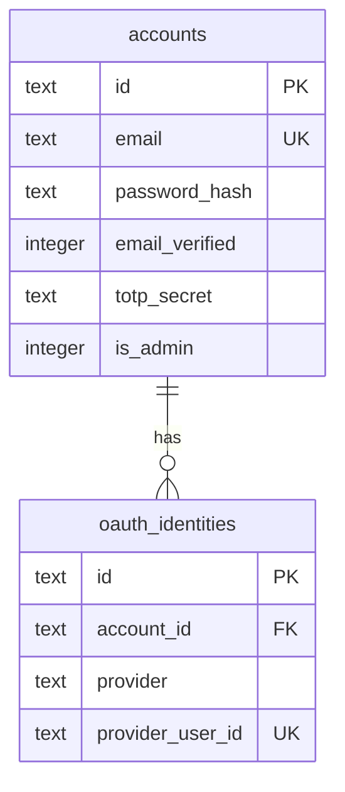
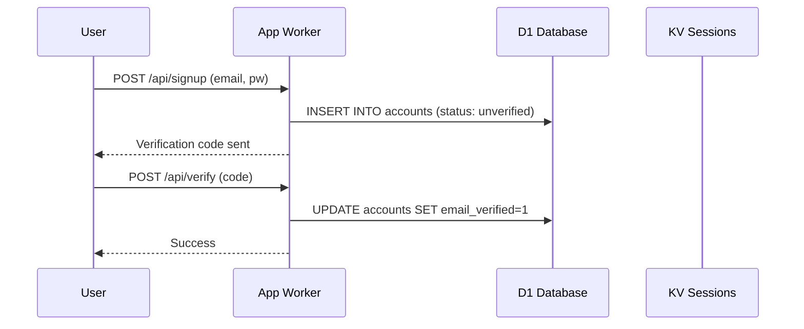
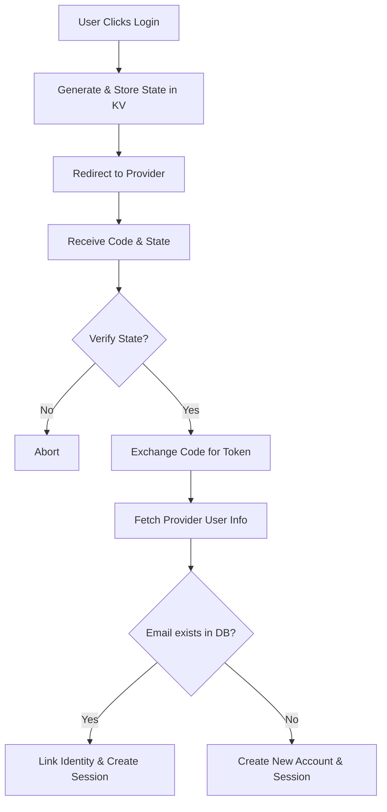

Relevant source files

The following files were used as context for generating this wiki page:

- [app/src/auth.ts](app/src/auth.ts)
- [app/src/oauth.ts](app/src/oauth.ts)
- [app/src/index.ts](app/src/index.ts)
- [infra/schema.sql](infra/schema.sql)
- [app/public/app.js](app/public/app.js)
- [README.md](README.md)

# Authentication & OAuth

Authentication and OAuth in the `politiker-webapp` project provide a secure, multi-layered identity management system. It allows users to create accounts using traditional email/password credentials or via social login providers such as Google, GitHub, and Microsoft. The system is designed to support high-security features like Time-based One-Time Passwords (TOTP) for Two-Factor Authentication (2FA), email verification, and secure password resets.

The architecture leverages Cloudflare Workers for logic execution, using Cloudflare KV for session management and Cloudflare D1 (SQLite) for persistent storage of account data and OAuth identities. Authentication is primarily handled through a stateless-like session cookie mechanism where a unique token is stored in KV and mapped to an account ID.

Sources: [app/src/index.ts:1-50](app/src/index.ts#L1-L50), [app/src/auth.ts:1-20](app/src/auth.ts#L1-L20), [README.md:15-25](README.md#L15-L25)

## Account and Identity Architecture

The system distinguishes between local `accounts` and external `oauth_identities`. An account can have multiple linked OAuth identities, allowing a single user to log in via different providers.

### Data Model

The core identity data is stored in two primary tables:

| Table | Description |
| :--- | :--- |
| `accounts` | Stores core user data including email, hashed passwords, verification status, and TOTP secrets. |
| `oauth_identities` | Maps external provider IDs (Google, GitHub, etc.) to a specific internal `account_id`. |

Sources: [infra/schema.sql:3-40](infra/schema.sql#L3-L40)

Diagram shows the relationship between local accounts and external OAuth providers.
Sources: [infra/schema.sql:3-40](infra/schema.sql#L3-L40)

## Local Authentication Flow

Local authentication involves account creation, email verification, and login. Passwords are secured using PBKDF2 hashing with salt, though the Workers runtime limits hashing to 100,000 iterations.

### Signup and Verification
1.  **Signup:** User provides email and password. A verification code is generated and sent via SMTP.
2.  **Verification:** User submits the 6-digit code to activate the account.

Diagram illustrates the local registration and verification process.
Sources: [app/src/auth.ts:25-80](app/src/auth.ts#L25-L80), [app/public/app.js:100-130](app/public/app.js#L100-L130)

### Login and Session Management
The login process validates credentials and, if successful, generates a session token.

*  **Session Token:** A random ID generated upon login, stored in KV with a 30-day expiration.
*  **Cookie:** The token is returned to the client in a `session` cookie (HttpOnly, Secure, Lax).
*  **TOTP:** If enabled, the system returns a `TOTP_REQUIRED` error, prompting the user for a 2FA code.

Sources: [app/src/auth.ts:85-135](app/src/auth.ts#L85-L135), [app/src/index.ts:35-45](app/src/index.ts#L35-L45)

## OAuth Integration

The application supports social login and account linking via Google, GitHub, and Microsoft.

### OAuth 2.0 Flow
The system implements a standard OAuth 2.0 Authorization Code flow:
1.  **Start:** The user is redirected to the provider's authorization URL with a unique `state` token stored in KV for CSRF protection.
2.  **Callback:** The provider redirects back with a `code`. The server exchanges this code for an access token and user info.
3.  **Identity Mapping:** If the email matches an existing account, the identity is linked; otherwise, a new account is created.

Flow diagram of the OAuth authentication process.
Sources: [app/src/oauth.ts:1-100](app/src/oauth.ts#L1-L100), [app/src/index.ts:340-380](app/src/index.ts#L340-L380)

### Account Linking
Users can link additional providers to their existing account while logged in. The `oauth-link` endpoints ensure that the external identity is associated with the current `accountId` found in the session.

Sources: [app/src/oauth.ts:110-150](app/src/oauth.ts#L110-L150), [app/src/index.ts:415-450](app/src/index.ts#L415-L450)

## Security Features

### Two-Factor Authentication (TOTP)
Users can activate TOTP-based 2FA. The server generates a secret, provides it as a URI/string, and requires a successful confirmation code before enabling it on the account.
Sources: [app/src/auth.ts:160-200](app/src/auth.ts#L160-L200), [app/public/app.js:520-560](app/public/app.js#L520-L560)

### API Keys
For programmatic access, the system supports personal API keys. These act as a `Bearer` token in the `Authorization` header. Only the hash of the key is stored in the database.
Sources: [app/src/api-keys.ts](app/src/api-keys.ts), [app/src/index.ts:500-510](app/src/index.ts#L500-L510), [infra/schema.sql:140-150](infra/schema.sql#L140-L150)

### Rate Limiting and Protection
*  **Turnstile:** Cloudflare Turnstile is used on signup, password reset, and newsletter forms to prevent bot abuse.
*  **PBKDF2:** Passwords are never stored in cleartext.
*  **OAuth State:** KV-backed state tokens prevent CSRF in OAuth flows.

Sources: [app/src/index.ts:515-530](app/src/index.ts#L515-L530), [README.md:120-130](README.md#L120-L130), [AGENTS.md:35-40](AGENTS.md#L35-L40)

## API Endpoints Summary

| Endpoint | Method | Description |
| :--- | :--- | :--- |
| `/api/signup` | POST | Creates a new account (local). |
| `/api/verify` | POST | Verifies account via 6-digit code. |
| `/api/login` | POST | Authenticates user and sets session cookie. |
| `/api/oauth/:provider/start` | GET | Initiates OAuth flow. |
| `/api/totp/setup` | POST | Generates secret for 2FA activation. |
| `/api/delete-account` | POST | Permanently removes user account and data. |

Sources: [app/src/index.ts:150-250](app/src/index.ts#L150-L250)

## Conclusion
The Authentication & OAuth system provides a flexible yet secure framework for user identity. By combining standard local credentials with social OAuth providers and enhancing security through TOTP and API keys, the application ensures that citizen communication with politicians remains both accessible and protected. The use of Cloudflare's edge infrastructure ensures that session validation and authentication logic are handled with minimal latency.

Sources: [README.md:15-30](README.md#L15-L30), [app/src/index.ts:550-600](app/src/index.ts#L550-L600)
