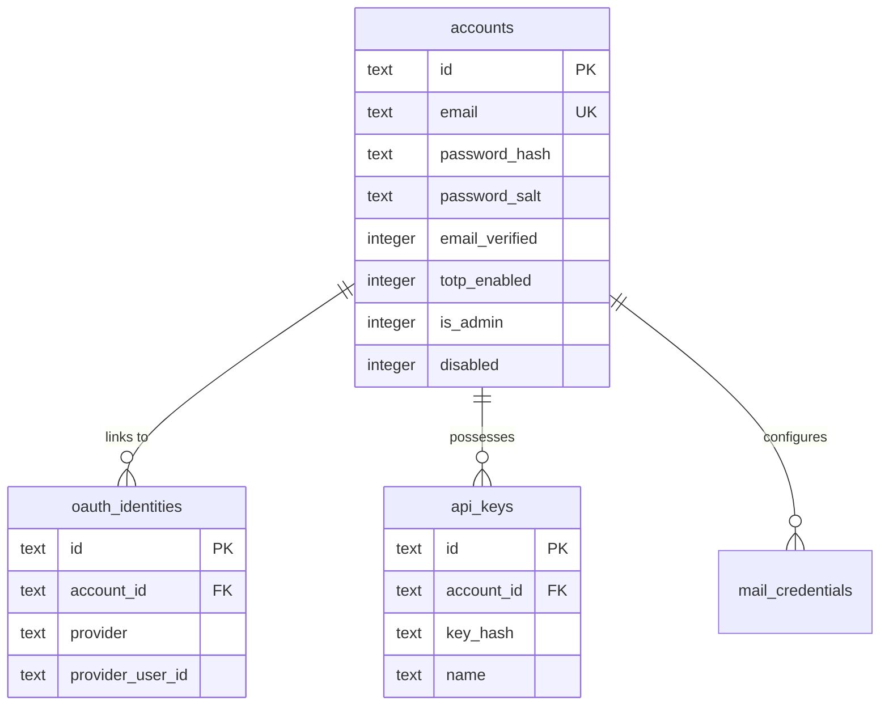
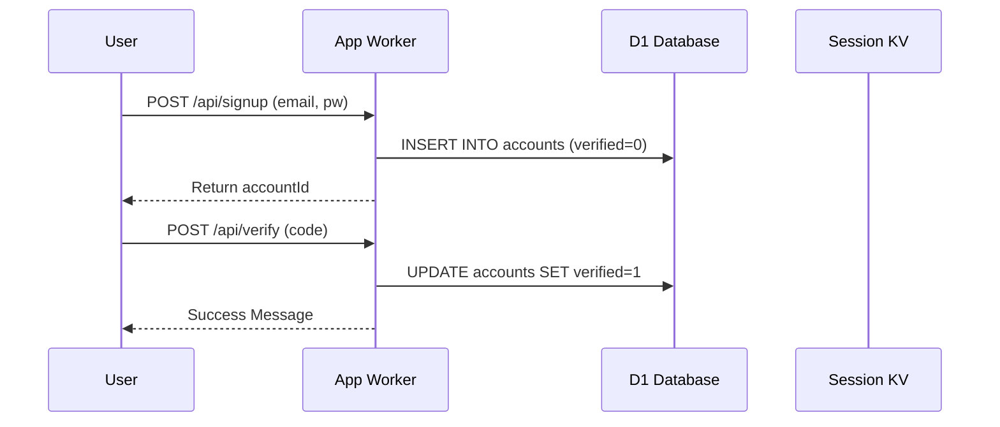
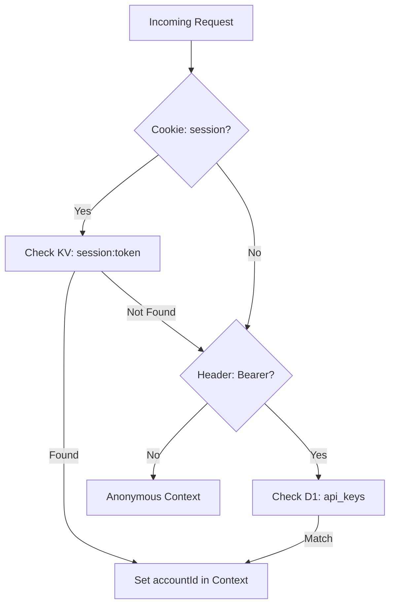

Relevant source files

The following files were used as context for generating this wiki page:

- [app/src/auth.ts](app/src/auth.ts)
- [infra/schema.sql](infra/schema.sql)
- [app/public/app.js](app/public/app.js)
- [app/src/index.ts](app/src/index.ts)
- [README.md](README.md)
- [AGENTS.md](AGENTS.md)
- [SECURITY.md](SECURITY.md)

# User Authentication & Session Management

## Introduction
The User Authentication and Session Management system in the `politiker-webapp` project provides a secure framework for citizens to manage accounts, link email credentials, and communicate with elected officials. The system supports multiple authentication methods, including traditional email/password sets, social OAuth providers (Google, GitHub, and Microsoft), and Time-based One-Time Password (TOTP) two-factor authentication.

The architecture leverages Cloudflare Workers for logic execution, Cloudflare KV for session storage, and Cloudflare D1 (SQLite) for persistent user data. Security is prioritized through the use of PBKDF2 password hashing (limited to 100,000 iterations), AES-GCM encryption for sensitive mail credentials, and strict account isolation where all database queries are filtered by `account_id`.

Sources: [README.md:18-24](README.md#L18-L24), [AGENTS.md:18-20](AGENTS.md#L18-L20), [SECURITY.md:13-16](SECURITY.md#L13-L16), [app/src/index.ts:25-30](app/src/index.ts#L25-L30)

## Account Architecture & Data Model

The authentication system is centered around the `accounts` table, which stores core identity and security settings. Related tables handle external identities, API keys, and session-specific metadata.

### Database Schema

*The entity relationship shows the central role of the account table in managing various authentication vectors.*
Sources: [infra/schema.sql:3-64](infra/schema.sql#L3-L64), [infra/schema.sql:162-171](infra/schema.sql#L162-L171)

### Data Field Summary
| Table | Field | Type | Description |
| :--- | :--- | :--- | :--- |
| `accounts` | `password_hash` | TEXT | PBKDF2 hashed password. |
| `accounts` | `totp_enabled` | INTEGER | Boolean (0/1) for 2FA status. |
| `oauth_identities` | `provider` | TEXT | Google, GitHub, Microsoft, or Apple. |
| `api_keys` | `key_hash` | TEXT | SHA-256 hash of the API key for programmatic access. |

Sources: [infra/schema.sql:3-33](infra/schema.sql#L3-L33), [infra/schema.sql:162-169](infra/schema.sql#L162-L169)

## Authentication Flow

The system supports a multi-step registration and login process, including email verification and optional 2FA.

### Registration and Verification
Users register with an email and password. A verification code is generated and stored with an expiration timestamp (`verification_expires_at`). The account remains unverified (`email_verified = 0`) until the user provides the correct 6-digit code.

*Sequence diagram for the initial user registration and email verification process.*
Sources: [app/src/index.ts:269-277](app/src/index.ts#L269-L277), [app/public/app.js:108-132](app/public/app.js#L108-L132), [infra/schema.sql:10-12](infra/schema.sql#L10-L12)

### Multi-Factor Authentication (TOTP)
Users can enable 2FA via the settings view. The system generates a TOTP secret and returns an `authUri` for integration with authenticator apps. Once confirmed with a valid 6-digit code, `totp_enabled` is set to 1 in the database.

Sources: [app/src/index.ts:167-175](app/src/index.ts#L167-L175), [app/public/app.js:467-486](app/public/app.js#L467-L486), [infra/schema.sql:17](infra/schema.sql#L17)

## Session Management

Sessions are managed using a combination of HTTP-only cookies and Cloudflare KV storage. 

### Session Implementation Details
- **Token Generation:** Session tokens are generated using two concatenated random IDs.
- **Storage:** Tokens are stored in Cloudflare KV with a prefix `session:<token>`, mapping to the `accountId`.
- **TTL:** Sessions have a standard expiration of 30 days (`Max-Age=2592000`).
- **Programmatic Access:** The system supports `Authorization: Bearer <api-nyckel>` as an alternative to session cookies.

*Request authentication flow determining session validity or API key access.*
Sources: [app/src/index.ts:50-56](app/src/index.ts#L50-L56), [app/src/index.ts:258-267](app/src/index.ts#L258-L267), [app/src/index.ts:340-345](app/src/index.ts#L340-L345), [AGENTS.md:37](AGENTS.md#L37)

## OAuth Integration & Linking

The application utilizes OAuth 2.0 for both authentication and linking external services.

### Supported Providers
The system supports Google, GitHub, and Microsoft for primary login. Microsoft Graph is specifically used for "passwordless" email connection, where the `mail_credentials` table stores encrypted `oauth_access_token` and `oauth_refresh_token` instead of SMTP passwords.

### Provider Linking
Users who originally signed up via email/password can link OAuth identities to their account via the `/api/oauth-link/` endpoints. This allows multiple login methods to point to the same `account_id`.

Sources: [README.md:18-20](README.md#L18-L20), [app/src/index.ts:200-250](app/src/index.ts#L200-L250), [infra/schema.sql:36-64](infra/schema.sql#L36-L64)

## Security Safeguards

| Feature | Implementation | Source |
| :--- | :--- | :--- |
| **Password Hashing** | PBKDF2 via Web Crypto (max 100k iterations) | [AGENTS.md:34](AGENTS.md#L34) |
| **Credential Encryption** | AES-GCM using `MAIL_CRED_KEY` wrangler secret | [SECURITY.md:14](SECURITY.md#L14) |
| **Rate Limiting** | Durable Objects implementation (token bucket per mail connection) | [README.md:38-41](README.md#L38-L41) |
| **Anti-Bot** | Cloudflare Turnstile integration on Signup/Reset forms | [app/src/index.ts:270-272](app/src/index.ts#L270-L272) |
| **Admin Protection** | Admin endpoints require `is_admin = 1` and are often behind Cloudflare Access | [README.md:105-108](README.md#L105-L108), [app/src/index.ts:354-358](app/src/index.ts#L354-L358) |

## Summary
User Authentication & Session Management in the `politiker-webapp` is a robust, serverless implementation that balances user convenience (OAuth, SPA session persistence) with high security standards (2FA, AES-GCM encryption, and PBKDF2 hashing). By utilizing Cloudflare's edge infrastructure (Workers, KV, D1), it ensures low-latency authentication while maintaining strict data isolation between users.

Sources: [README.md:18-24](README.md#L18-L24), [AGENTS.md:10-15](AGENTS.md#L10-L15), [app/src/index.ts:1-20](app/src/index.ts#L1-L20)
