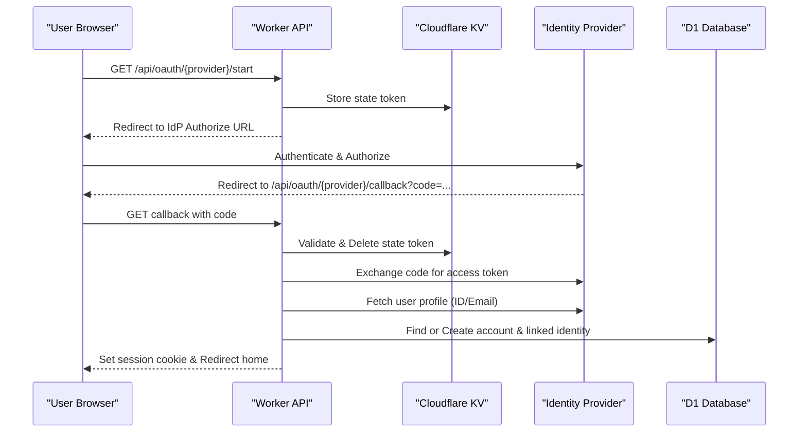

<details>
<summary>Relevant source files</summary>

The following files were used as context for generating this wiki page:

- [app/src/oauth.ts](app/src/oauth.ts)
- [infra/schema.sql](infra/schema.sql)
- [app/src/index.ts](app/src/index.ts)
- [app/public/app.js](app/public/app.js)
- [README.md](README.md)
- [infra/setup.sh](infra/setup.sh)
</details>

# OAuth & Social Login Integrations

The OAuth and Social Login system in the Politiker-webapp enables users to authenticate using third-party identity providers, including Google, GitHub, and Microsoft. This integration serves two primary purposes: facilitating user login/signup (Social Login) and authorizing the application to send emails via the user's own Microsoft Graph account. The system is built on Cloudflare Workers, utilizing Cloudflare KV for state management and D1 for persistent storage of linked identities.

By leveraging OAuth, the platform avoids the need for users to manage local passwords unless they explicitly choose to set one. Furthermore, the Microsoft Graph integration allows for passwordless email sending, enhancing security by eliminating the storage of sensitive SMTP credentials for those users.

Sources: [README.md:14-16](README.md#L14-L16), [app/src/index.ts:382-385](app/src/index.ts#L382-L385)

## Authentication Architecture

The system supports multiple OAuth flows to handle different authentication contexts. The primary flows include the login/signup flow and the account linking flow, which allows an existing user to attach additional social identities to their profile.

### Core Components
- **Identity Providers (IdP):** Google, GitHub, and Microsoft are the currently supported providers for social login. Apple login is identified as a future addition.
- **Cloudflare KV:** Used to store transient `oauthstate` and `oauthlinkstate` tokens to prevent Cross-Site Request Forgery (CSRF).
- **D1 Database:** Stores the mapping between local `accounts` and remote `oauth_identities`.
- **Microsoft Graph API:** Specifically used for passwordless email integration, separate from general login.

Sources: [app/src/oauth.ts:1-10](app/src/oauth.ts#L1-L10), [infra/schema.sql:22-31](infra/schema.sql#L22-L31), [app/src/index.ts:401-410](app/src/index.ts#L401-L410)

### Social Login Sequence
The following diagram illustrates the sequence for a standard Social Login request:



The authentication flow utilizes specific endpoints for starting the process and handling callbacks. Sources: [app/src/index.ts:382-416](app/src/index.ts#L382-L416), [app/src/oauth.ts:30-70](app/src/oauth.ts#L30-L70)

## Data Models

Linked identities are managed through a dedicated table that maps internal account IDs to provider-specific user identifiers.

### The `oauth_identities` Table
| Field | Type | Description |
| :--- | :--- | :--- |
| `id` | TEXT (PK) | Unique identifier for the mapping record. |
| `account_id` | TEXT | Reference to the `accounts` table. |
| `provider` | TEXT | The IdP name (google, github, microsoft, apple). |
| `provider_user_id` | TEXT | The unique ID returned by the IdP. |
| `created_at` | INTEGER | Timestamp of when the identity was linked. |

Sources: [infra/schema.sql:22-31](infra/schema.sql#L22-L31)

### The `mail_credentials` Table (OAuth Extensions)
For Microsoft Graph integration, the `mail_credentials` table includes fields for storing encrypted OAuth tokens:
- `oauth_access_token`: Encrypted access token for the Graph API.
- `oauth_refresh_token`: Encrypted refresh token used to obtain new access tokens.
- `oauth_token_expires_at`: Expiration timestamp for the current access token.

Sources: [infra/schema.sql:33-52](infra/schema.sql#L33-L52)

## API Endpoints and Configuration

The application defines specific routes for managing OAuth states and identities.

### Social Login Endpoints
| Endpoint | Method | Description |
| :--- | :--- | :--- |
| `/api/oauth/{provider}/start` | GET | Initiates login flow, stores state in KV, and redirects to IdP. |
| `/api/oauth/{provider}/callback` | GET | Handles return from IdP, exchanges code, and establishes session. |
| `/api/oauth-identities` | GET | Lists all social identities linked to the current account. |
| `/api/oauth-identities/{provider}` | DELETE | Unlinks a specific social identity from the account. |

Sources: [app/src/index.ts:208-211](app/src/index.ts#L208-L211), [app/src/index.ts:382-400](app/src/index.ts#L382-L400)

### Email Integration Endpoints
| Endpoint | Method | Description |
| :--- | :--- | :--- |
| `/api/oauth-mail/microsoft/start` | GET | Initiates Microsoft Graph authorization for sending emails. |
| `/api/oauth-mail/microsoft/callback` | GET | Finalizes Graph API setup and stores tokens in the database. |

Sources: [app/src/index.ts:419-444](app/src/index.ts#L419-L444)

### Configuration Requirements
OAuth integration requires several environment variables and secrets to be configured during deployment via `infra/setup.sh` or `wrangler secret`.

```bash
# Required Client Secrets for Social Login
OAUTH_GOOGLE_CLIENT_SECRET="..."
OAUTH_GITHUB_CLIENT_SECRET="..."
OAUTH_MICROSOFT_CLIENT_SECRET="..."

# Encryption Key for storing tokens
MAIL_CRED_KEY="..."
```

Sources: [infra/setup.sh:65-80](infra/setup.sh#L65-L80), [infra/setup.sh:157-162](infra/setup.sh#L157-L162)

## Implementation Details

### State Management
To prevent CSRF, a random ID is generated and stored in Cloudflare KV with a short TTL (600 seconds) before redirecting the user to the provider. The callback endpoint verifies the presence of this state. For GitHub, which shares a single callback URL for both login and linking, the state value is prefixed (e.g., `link:<accountId>`) to distinguish the intent.

Sources: [app/src/index.ts:387-390](app/src/index.ts#L387-L390), [app/src/index.ts:397-408](app/src/index.ts#L397-L408)

### Account Linking Logic
When handling a callback, the system checks if the identity is already linked. If the user is logged in and initiates a link, the new `provider_user_id` is associated with the active `account_id`. If the identity is new during a login flow, a new local account is created with placeholder password credentials.

Sources: [app/src/oauth.ts:47-65](app/src/oauth.ts#L47-L65), [infra/schema.sql:22-25](infra/schema.sql#L22-L25)

```typescript
// Example state storage for linking (app/src/index.ts)
const state = randomId();
if (providerSharesLoginCallback(provider)) {
  await env.SESSIONS.put(`oauthstate:${state}`, `link:${account.id}`, { expirationTtl: 600 });
} else {
  await env.SESSIONS.put(`oauthlinkstate:${state}`, account.id, { expirationTtl: 600 });
}
```

Sources: [app/src/index.ts:457-463](app/src/index.ts#L457-L463)

## Conclusion
The OAuth and Social Login integration provides a modern authentication layer for Politiker-webapp. By segregating identity provider logic into `oauth.ts` and utilizing Cloudflare's edge capabilities (KV and Workers), the system achieves secure, CSRF-protected authentication. The dual-use of OAuth for both user login and Microsoft Graph email authorization significantly reduces the application's reliance on traditional password storage.
