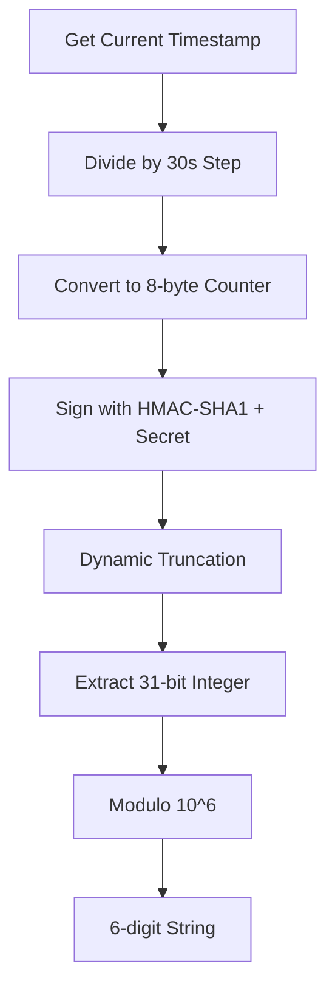
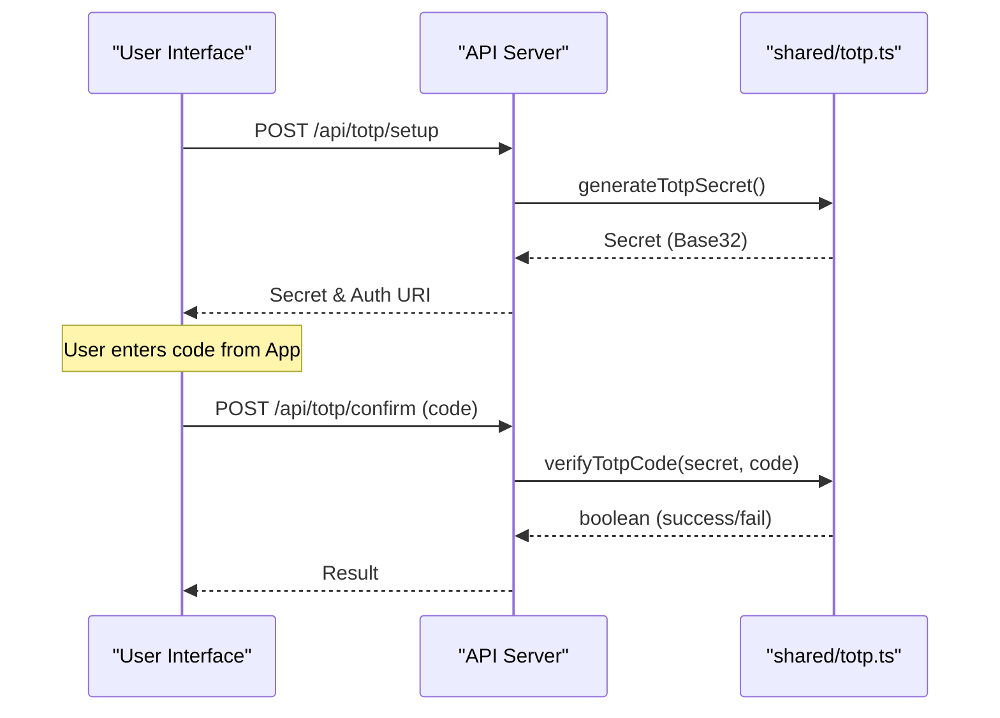

<details>
<summary>Relevant source files</summary>

The following files were used as context for generating this wiki page:

- [shared/totp.ts](shared/totp.ts)
- [app/public/app.js](app/public/app.js)
- [app/public/index.html](app/public/index.html)
- [README.md](README.md)
- [AGENTS.md](AGENTS.md)
</details>

# Two-Factor Authentication (TOTP)

Two-Factor Authentication (TOTP) in the `politiker-webapp` project provides an additional layer of security for user accounts by requiring a time-based one-time password during sensitive operations. It is implemented using standard RFC 6238 protocols via Web Crypto HMAC-SHA1 to ensure compatibility with common authenticator apps like Google Authenticator or Authy without relying on external dependencies.

Sources: [shared/totp.ts:1-5](shared/totp.ts#L1-L5), [README.md:17-19](README.md#L17-L19)

## Core Logic and Cryptography

The system generates 160-bit secrets (20 bytes), which is the standard for TOTP. These secrets are encoded in Base32 for manual entry by users. The implementation avoids third-party QR code generation services to prevent exposing secrets to external servers.

### TOTP Parameters
The implementation follows specific constants to ensure synchronization with client apps:

| Parameter | Value | Description |
| :--- | :--- | :--- |
| Algorithm | HMAC-SHA1 | Standard hashing algorithm for TOTP |
| Step Seconds | 30 | Duration for which a single code is valid |
| Digits | 6 | Length of the generated numeric code |
| Secret Size | 20 bytes | 160-bit random value |

Sources: [shared/totp.ts:7-13](shared/totp.ts#L7-L13), [shared/totp.ts:36-39](shared/totp.ts#L36-L39)

### Technical Workflow Diagram
The following diagram illustrates the internal process of computing a TOTP code from a shared secret and the current system time.



Sources: [shared/totp.ts:36-50](shared/totp.ts#L36-L50)

## User Interface and API Integration

The frontend manages TOTP through three primary states: Disabled, Setup, and Enabled. Users can enable TOTP in the settings view, which involves a verification step to ensure the secret has been correctly saved in their authenticator app.

### API Endpoints for TOTP

| Endpoint | Method | Description |
| :--- | :--- | :--- |
| `/api/totp/setup` | `POST` | Generates a new secret and returns the Base32 string and Auth URI |
| `/api/totp/confirm` | `POST` | Verifies a 6-digit code to finalize activation |
| `/api/totp/disable` | `POST` | Removes TOTP protection from the account |

Sources: [app/public/app.js:511-540](app/public/app.js#L511-L540)

### TOTP Verification Sequence
The sequence below shows how the frontend interacts with the API to set up TOTP.



Sources: [app/public/app.js:511-540](app/public/app.js#L511-L540), [shared/totp.ts:21-29](shared/totp.ts#L21-L29)

## Sensitive Operations Protection

TOTP is required in the project for several high-security actions:

1.  **Login:** If `totpEnabled` is true for a user, the login process returns a `TOTP_REQUIRED` error, prompting the UI to show the code input field.
2.  **Account Deletion:** Users must provide their current password and a valid TOTP code (if enabled) to permanently delete their account.

Sources: [app/public/app.js:124-135](app/public/app.js#L124-L135), [app/public/app.js:774-785](app/public/app.js#L774-L785)

### Code Implementation Example (Verification)
The system allows for a "window" of synchronization (typically ±1 step) to account for slight clock drifts between the server and the user's device.

```typescript
export async function verifyTotpCode(secret: string, code: string, windowSteps = 1): Promise<boolean> {
  const key = base32Decode(secret);
  const now = Math.floor(Date.now() / 1000 / STEP_SECONDS);

  for (let offset = -windowSteps; offset <= windowSteps; offset++) {
    const expected = await computeTotp(key, now + offset);
    if (expected === code) return true;
  }
  return false;
}
```

Sources: [shared/totp.ts:21-29](shared/totp.ts#L21-L29)

## Security Guidelines
Developers must ensure that `TOTP-secrets` are never logged or exposed in client-side error reporting. While the project uses automated error reporting via `autoReportError`, these sensitive tokens are explicitly excluded from data capture.

Sources: [AGENTS.md:38-40](AGENTS.md#L38-L40), [app/public/app.js:52-70](app/public/app.js#L52-L70)

## Conclusion
The TOTP implementation in `politiker-webapp` is a self-contained, standard-compliant security feature. By utilizing the Web Crypto API for SHA-1 HMAC signatures and managing verification windows, it provides robust account protection while maintaining a zero-dependency architecture. Significant actions such as login and account deletion are gated behind this verification when enabled by the user.
