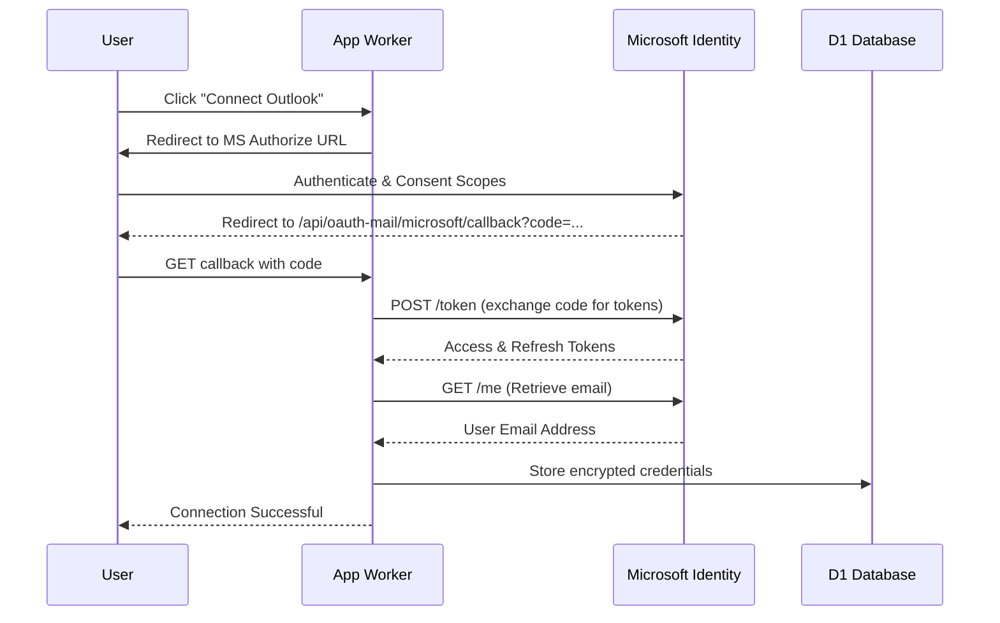

<details>
<summary>Relevant source files</summary>

The following files were used as context for generating this wiki page:

- [shared/graph-mail.ts](shared/graph-mail.ts)
- [app/src/index.ts](app/src/index.ts)
- [app/public/app.js](app/public/app.js)
- [infra/schema.sql](infra/schema.sql)
- [README.md](README.md)
- [infra/setup.sh](infra/setup.sh)
</details>

# Mail Account Linking & MS Graph

The Mail Account Linking system allows citizens to connect their own email accounts to the platform to send personalized messages to elected officials. By ensuring the user is the direct sender, the platform avoids becoming the sender itself, allowing politicians to respond directly to the constituent. The system supports traditional SMTP providers (Gmail, Outlook, iCloud, Yahoo) and passwordless integration via the Microsoft Graph API.

Sources: [README.md:3-8](README.md#L3-L8), [app/public/app.js:189-194](app/public/app.js#L189-L194)

## System Architecture

The mail linking architecture is split between the frontend UI for credential management, the main App Worker for handling OAuth flows and storage, and a shared module for Microsoft Graph API interactions. Security is a primary concern; all SMTP passwords and OAuth tokens are encrypted using AES-GCM before storage in the D1 database.

### Data Model

Mail credentials are stored in the `mail_credentials` table, which distinguishes between SMTP-based and OAuth-based (Microsoft Graph) connections using specific columns and a `provider` type.

| Field | Type | Description |
| :--- | :--- | :--- |
| `provider` | TEXT | gmail, outlook, icloud, yahoo, generic, or microsoft_graph |
| `smtp_host` | TEXT | SMTP server address (placeholder for Graph) |
| `smtp_port` | INTEGER | SMTP port (placeholder for Graph) |
| `encrypted_password`| TEXT | AES-GCM encrypted SMTP password |
| `oauth_access_token`| TEXT | Encrypted Microsoft Graph access token |
| `oauth_refresh_token`| TEXT | Encrypted Microsoft Graph refresh token |
| `daily_cap` | INTEGER | Calculated daily limit based on provider and user settings |

Sources: [infra/schema.sql:35-50](infra/schema.sql#L35-L50)

## Microsoft Graph Integration (OAuth)

The platform utilizes Microsoft Graph to provide a "passwordless" experience for Outlook and Microsoft 365 users. This leverages the same Azure App Registration as the standard "Login with Microsoft" feature but requests additional scopes for email sending.

### Authentication Scopes
The system requests specific scopes to ensure it can send mail and maintain long-term access:
- `openid`, `email`, `profile`: Basic identity info.
- `User.Read`: Necessary to retrieve the sender's email address.
- `Mail.Send`: Permission to send emails on behalf of the user.
- `offline_access`: Allows the application to obtain refresh tokens for background sending.

Sources: [shared/graph-mail.ts:9-13](shared/graph-mail.ts#L9-L13)

### OAuth Connection Flow

The following sequence diagram illustrates the process of linking a Microsoft account for mailing:



Sources: [shared/graph-mail.ts:18-62](shared/graph-mail.ts#L18-L62), [app/src/index.ts:314-340](app/src/index.ts#L314-L340)

## Sending Logic & Token Maintenance

When sending via Microsoft Graph, the App Worker must ensure the access token is valid. If expired, it uses the refresh token to obtain a new access token.

### Graph Mail Payload
Emails are sent via the `https://graph.microsoft.com/v1.0/me/sendMail` endpoint. The platform supports HTML content and file attachments, which are converted to base64 `contentBytes` for the Graph API.

```typescript
export async function sendGraphMail(
  accessToken: string,
  opts: { to: string; subject?: string; html: string; attachments?: GraphMailAttachment[] },
): Promise<void> {
  const resp = await fetch("https://graph.microsoft.com/v1.0/me/sendMail", {
    method: "POST",
    headers: { Authorization: `Bearer ${accessToken}`, "Content-Type": "application/json" },
    body: JSON.stringify({
      message: {
        subject: opts.subject ?? "",
        body: { contentType: "HTML", content: opts.html },
        toRecipients: [{ emailAddress: { address: opts.to } }],
        attachments: (opts.attachments ?? []).map((att) => ({
          "@odata.type": "#microsoft.graph.fileAttachment",
          name: att.filename,
          contentType: att.contentType,
          contentBytes: bytesToBase64(att.bytes),
        })),
      },
      saveToSentItems: true,
    }),
  });
}
```

Sources: [shared/graph-mail.ts:86-116](shared/graph-mail.ts#L86-L116)

## Rate Limiting and Ceilings

To protect users from having their personal email accounts flagged for spam by providers, the system implements hardcoded daily limits and user-configurable ceilings.

- **Microsoft Graph Daily Limit**: Hardcoded at 10,000 (standard for personal accounts).
- **Security Cap**: The platform enforces a default cap of 10% below the provider's known limit.
- **User Customization**: Users can choose to use a lower percentage (e.g., 25%, 50%, 75%) of this allowed cap to further throttle their sending.

Sources: [README.md:38-40](README.md#L38-L40), [app/public/app.js:203-219](app/public/app.js#L203-L219), [app/src/index.ts:241-248](app/src/index.ts#L241-L248)

## Implementation Details

### Relevant Functions
- `getMicrosoftMailAuthorizeUrl`: Generates the initial authorization redirect URL.
- `exchangeMicrosoftMailCode`: Exchanges the authorization code for tokens and fetches the user's email.
- `refreshMicrosoftToken`: Uses a refresh token to obtain a new access token.
- `addMicrosoftGraphMailCredential`: App Worker handler that orchestrates token exchange and database storage.

Sources: [shared/graph-mail.ts:18-84](shared/graph-mail.ts#L18-L84), [app/src/mail-credentials.ts](app/src/mail-credentials.ts)

### Configuration
The Microsoft Graph client ID and secret are managed via Wrangler secrets during deployment, ensuring sensitive keys never exist in the source code.

```bash
put_secret app OAUTH_MICROSOFT_CLIENT_SECRET "$OAUTH_MICROSOFT_CLIENT_SECRET"
put_secret sender OAUTH_MICROSOFT_CLIENT_SECRET "$OAUTH_MICROSOFT_CLIENT_SECRET"
```

Sources: [infra/setup.sh:176-177](infra/setup.sh#L176-L177), [infra/setup.sh:181](infra/setup.sh#L181)

The Mail Account Linking system provides a secure bridge between the platform and users' personal mailboxes, utilizing MS Graph for a streamlined, password-free integration for Microsoft users while maintaining strict security via AES-GCM encryption for all stored credentials.
