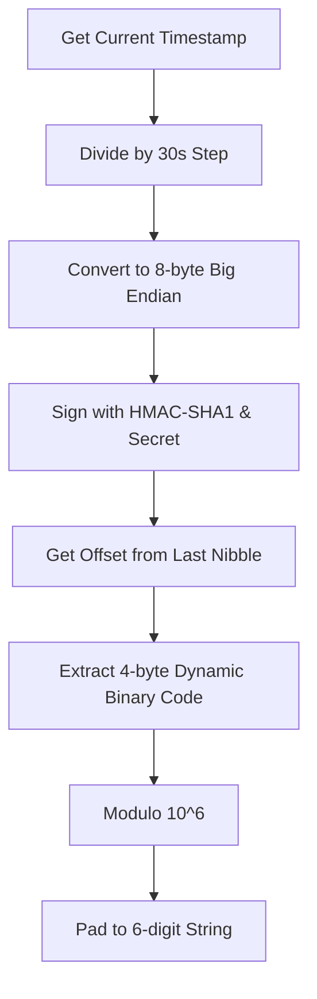
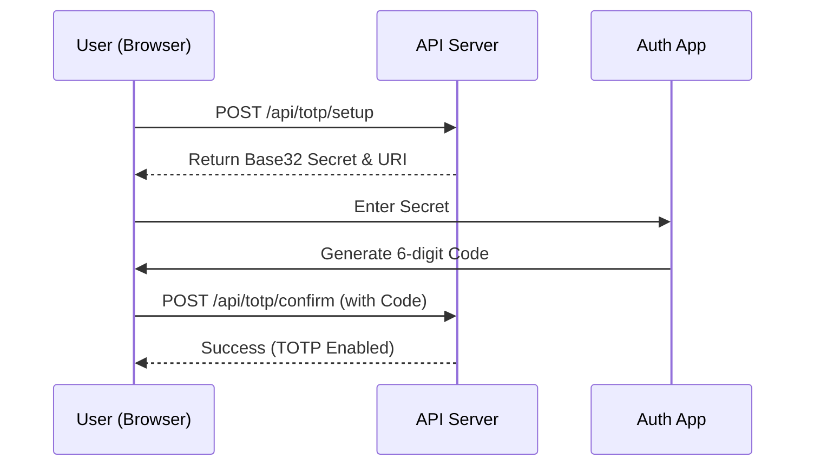

Relevant source files

The following files were used as context for generating this wiki page:

- [shared/totp.ts](shared/totp.ts)
- [app/public/app.js](app/public/app.js)
- [app/public/index.html](app/public/index.html)
- [README.md](README.md)
- [AGENTS.md](AGENTS.md)

# Two-Factor Authentication (TOTP)

Two-Factor Authentication (TOTP) in the `politiker-webapp` project provides an additional layer of security for user accounts beyond simple password authentication. It implements the Time-based One-Time Password (TOTP) algorithm as defined in RFC 6238, allowing users to verify their identity using standard authenticator applications like Google Authenticator or Authy.

The implementation is designed to be self-contained within the project's shared utilities, utilizing the Web Crypto API for cryptographic operations. This approach ensures that sensitive data, such as TOTP secrets, are not transmitted to third-party services for QR code generation or verification.

Sources: [shared/totp.ts:1-6](shared/totp.ts#L1-L6), [README.md:14-16](README.md#L14-L16), [AGENTS.md:31-31](AGENTS.md#L31)

## Core Logic and Cryptography

The system relies on HMAC-SHA1 and Base32 encoding to generate and verify 6-digit codes. The core logic is isolated in a shared utility file to be accessible by multiple Workers if necessary.

### Cryptographic Implementation
The implementation uses `crypto.subtle` for HMAC-SHA1 signing. The counter is derived from the current Unix timestamp divided by a 30-second step interval.

The diagram shows the standard TOTP calculation process used in the project.
Sources: [shared/totp.ts:32-51](shared/totp.ts#L32-L51)

### Key Functions
| Function | Description | Source |
| :--- | :--- | :--- |
| `generateTotpSecret` | Generates a random 20-byte (160-bit) secret and encodes it in Base32. | [shared/totp.ts:11-14](shared/totp.ts#L11-L14) |
| `verifyTotpCode` | Validates a user-provided code against the secret, allowing for a configurable clock drift window (default ±1 step). | [shared/totp.ts:21-30](shared/totp.ts#L21-L30) |
| `computeTotp` | Internal async function that performs the RFC 6238 mathematical operations using Web Crypto. | [shared/totp.ts:32-51](shared/totp.ts#L32-L51) |
| `totpAuthUri` | Generates a standard `otpauth://` URI for manual entry or local QR generation. | [shared/totp.ts:17-19](shared/totp.ts#L17-L19) |

## User Interface and Workflow

The TOTP feature is integrated into the frontend through the Settings view and the Login process. Users can enable, disable, and verify TOTP status through a series of interactive forms.

### Setup and Enablement Flow
The setup process involves generating a secret, displaying it to the user, and requiring a successful verification before activation.

The sequence diagram illustrates the activation process for a user enabling 2FA.
Sources: [app/public/app.js:688-713](app/public/app.js#L688-L713), [app/public/index.html:192-205](app/public/index.html#L192-L205)

### Login Integration
When TOTP is enabled for an account, the standard login flow requires an additional step.

1.  **Initial Attempt:** The user submits email and password via the login form.
2.  **Challenge:** If the server returns a `TOTP_REQUIRED` error, the frontend reveals a hidden `totpCode` input field.
3.  **Verification:** The user enters their 6-digit code and resubmits the login request.

Sources: [app/public/app.js:140-155](app/public/app.js#L140-L155), [app/public/index.html:84-84](app/public/index.html#L84)

## Security Considerations

*  **No External QR Services:** The project explicitly avoids using third-party QR generation APIs to prevent leaking secrets to external servers.
*  **Encrypted Storage:** While the storage logic is handled in the backend, the project policy dictates that TOTP secrets, similar to SMTP credentials, must never be logged or exposed in cleartext.
*  **Account Deletion:** If a user rades their account, they must provide their TOTP code if enabled to confirm the destructive action.

Sources: [shared/totp.ts:4-6](shared/totp.ts#L4-L6), [AGENTS.md:31-31](AGENTS.md#L31), [app/public/app.js:828-831](app/public/app.js#L828-L831)

## Technical Summary

The TOTP system is a vanilla implementation designed for the Cloudflare Workers environment. By using the Web Crypto API, it maintains high performance and security without increasing the deployment bundle size with external dependencies. The integration spans across the shared utility layer, the API endpoints, and the interactive frontend wizard.

Sources: [shared/totp.ts:1-2](shared/totp.ts#L1-L2), [README.md:14-16](README.md#L14-L16), [AGENTS.md:12-12](AGENTS.md#L12)
