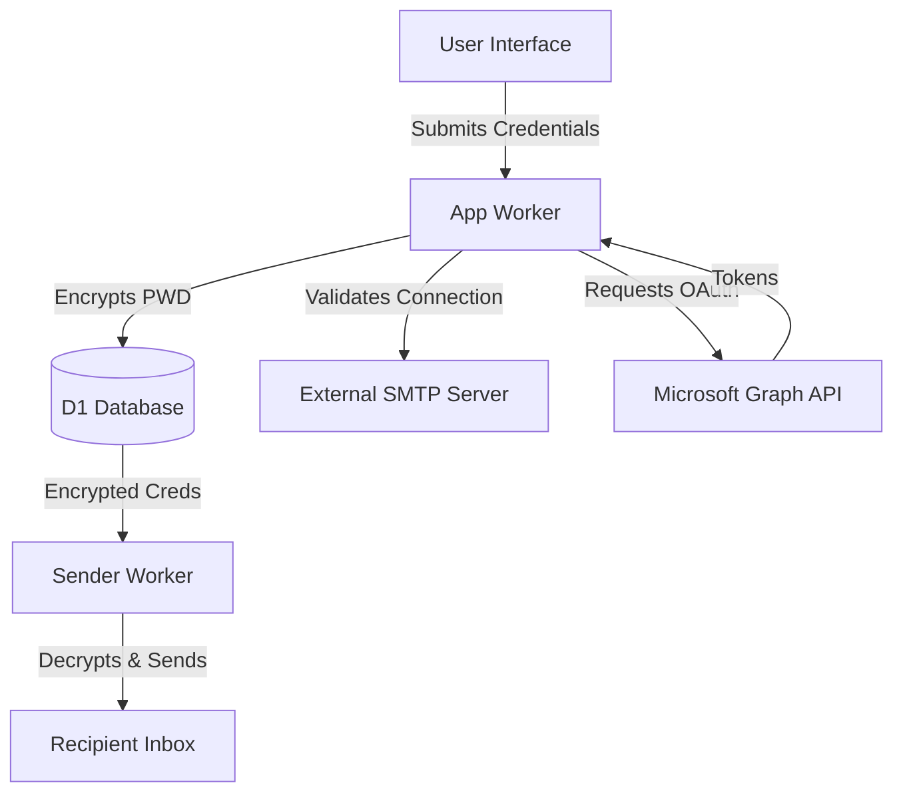
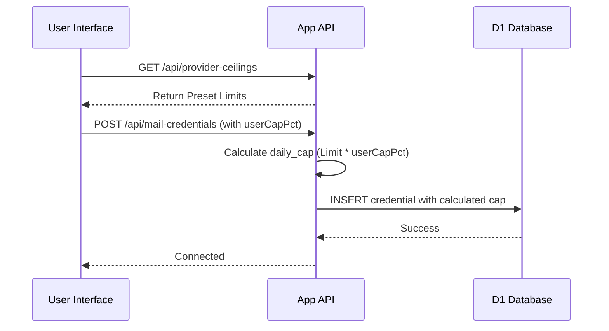

<details>
<summary>Relevant source files</summary>

The following files were used as context for generating this wiki page:

- [app/src/mail-credentials.ts](app/src/mail-credentials.ts)
- [shared/graph-mail.ts](shared/graph-mail.ts)
- [shared/smtp.ts](shared/smtp.ts)
- [app/src/index.ts](app/src/index.ts)
- [app/public/app.js](app/public/app.js)
- [infra/schema.sql](infra/schema.sql)
</details>

# Mail Account Linking

Mail Account Linking is a core feature of the Politiker-webapp that allows users to connect their personal email accounts to the platform. This enables the application to send personalized letters to elected officials directly from the user's own email address rather than from a centralized platform service. By linking their own accounts, users ensure that any responses from politicians are sent directly to their personal inboxes.

The system supports multiple connection methods, including standard SMTP for providers like Gmail, Outlook, iCloud, and Yahoo, as well as passwordless OAuth-based linking via Microsoft Graph. Security is maintained through AES-GCM encryption of credentials using a shared `MAIL_CRED_KEY` and the implementation of provider-specific rate limiting to protect the user's email reputation.

Sources: [AGENTS.md](AGENTS.md), [README.md](README.md), [app/src/index.ts:503-535](app/src/index.ts#L503-L535)

## Architecture and Data Flow

The mail linking architecture is split between the frontend UI, the main Worker (App) for credential management, and the Sender Worker for executing transmissions. Credentials are encrypted before storage in the Cloudflare D1 database.



The diagram shows the flow of credential submission, encryption, storage, and eventual usage by the background sender process.
Sources: [app/src/index.ts:250-275](app/src/index.ts#L250-L275), [infra/schema.sql:35-55](infra/schema.sql#L35-L55), [shared/smtp.ts:1-20](shared/smtp.ts#L1-L20)

## Supported Providers and Configuration

The application categorizes mail accounts into two primary implementation types: Generic SMTP and Microsoft Graph (OAuth).

### SMTP Connections
For most providers (Gmail, iCloud, Yahoo), the system uses `cloudflare:sockets` to establish a direct connection. It supports `STARTTLS` on port 587 and direct TLS on port 465.
*  **Validation:** Before saving, the system performs a `testSmtpAuth` call to ensure the provided credentials are functional.
*  **Encryption:** Passwords and app-passwords are encrypted using AES-GCM with a key stored as a Wrangler secret.

### Microsoft Graph (OAuth)
Users can link Outlook or Microsoft 365 accounts without providing a password. This flow uses the Microsoft identity platform to obtain access and refresh tokens.
*  **Flow:** The user is redirected to `/api/oauth-mail/microsoft/start` to begin the authorization.
*  **Storage:** The resulting tokens are encrypted and stored in the `mail_credentials` table.

Sources: [app/src/mail-credentials.ts:1-50](app/src/mail-credentials.ts#L1-L50), [shared/smtp.ts:145-155](shared/smtp.ts#L145-L155), [app/src/index.ts:503-535](app/src/index.ts#L503-L535)

## Credential Data Model

The `mail_credentials` table stores both connection parameters and encryption state for the linked accounts.

| Field | Type | Description |
| :--- | :--- | :--- |
| `id` | TEXT (PK) | Unique identifier for the credential. |
| `account_id` | TEXT | Reference to the user's platform account. |
| `provider` | TEXT | Type (gmail, outlook, icloud, yahoo, generic, microsoft_graph). |
| `smtp_host` | TEXT | The SMTP server address (e.g., smtp.gmail.com). |
| `smtp_port` | INTEGER | Port number (usually 465 or 587). |
| `encrypted_password` | TEXT | AES-GCM encrypted password or app-password. |
| `daily_cap` | INTEGER | Calculated daily limit based on provider presets. |
| `user_cap_pct` | INTEGER | User-defined percentage of the provider's limit to utilize (default 100). |
| `oauth_access_token` | TEXT | Encrypted token for Microsoft Graph connections. |

Sources: [infra/schema.sql:35-55](infra/schema.sql#L35-L55)

## Rate Limiting and Safety Thresholds

To prevent users from being flagged for spam by their providers, the system implements a "Safety Ceiling."

*  **Provider Presets:** The system includes hardcoded limits for known providers (e.g., Gmail, Yahoo).
*  **Safety Margin:** The `daily_cap` is typically set to 10% below the provider's known limit.
*  **User Control:** Users can further lower this limit via the UI (e.g., to 25%, 50%, or 75%) to ensure the webapp does not consume their entire daily quota.



The sequence diagram illustrates how the system calculates the effective sending limit during the account linking process.
Sources: [app/src/mail-credentials.ts:100-140](app/src/mail-credentials.ts#L100-L140), [app/public/app.js:200-240](app/public/app.js#L200-L240)

## Implementation Details

### SMTP Handshake Logic
The SMTP client is custom-built to ensure security and auditability. A critical implementation detail involves the `STARTTLS` upgrade.

```typescript
// shared/smtp.ts:47-60
  if (!useDirectTls) {
    await write("STARTTLS");
    await expect(await read(), 220, "STARTTLS nekades av servern");

    // Släpp låset (inte close!) innan TLS-uppgraderingen.
    writer.releaseLock();
    reader.releaseLock();

    socket = await socket.startTls();
    writer = socket.writable.getWriter();
    reader = socket.readable.getReader();
    // ...
  }
```

Citations: [shared/smtp.ts:47-60](shared/smtp.ts#L47-L60)

### Security Conventions
*  **Identical Keys:** The `MAIL_CRED_KEY` must be identical across both the `app` and `sender` Workers for successful encryption/decryption.
*  **No Logs:** Cleartext passwords, SMTP credentials, and session tokens are never logged.
*  **Isolation:** All database queries for mail credentials are filtered by `account_id` to maintain strict tenant isolation.

Sources: [AGENTS.md](AGENTS.md), [CLAUDE.md](CLAUDE.md), [app/src/index.ts:580-600](app/src/index.ts#L580-L600)

## Summary
Mail Account Linking provides a decentralized approach to citizen advocacy by allowing users to use their existing digital identity and infrastructure. By combining secure SMTP socket connections with modern OAuth flows, the system balances ease of use with robust security and provider compliance. The implementation of user-adjustable caps ensures that the platform remains a safe tool for large-scale contacting without jeopardizing the user's primary communication channel.
