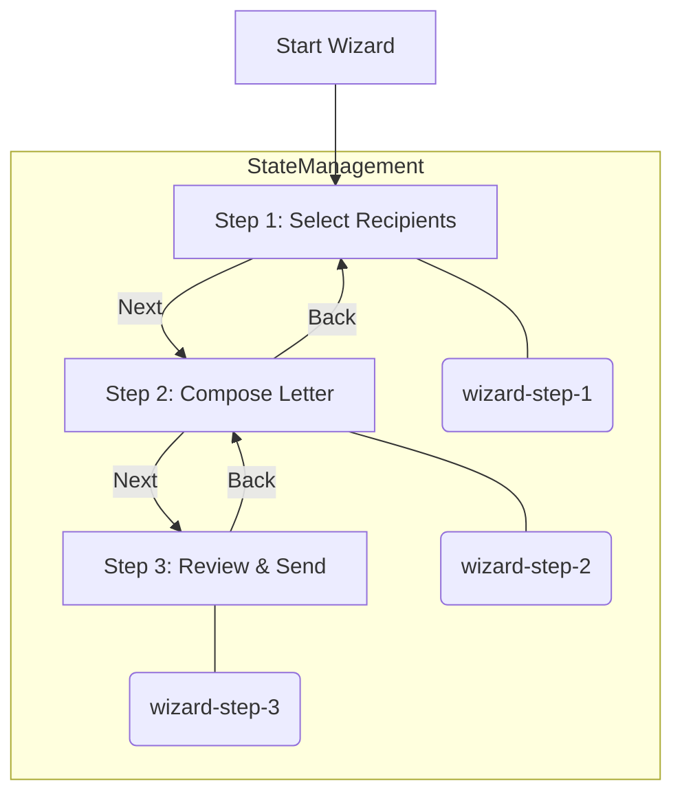
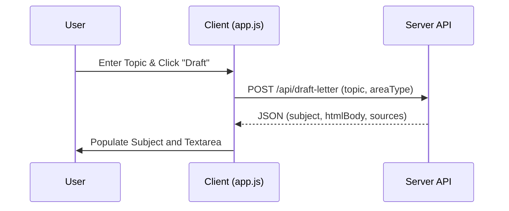

Relevant source files

The following files were used as context for generating this wiki page:

- [app/public/app.js](app/public/app.js)
- [app/public/style.css](app/public/style.css)
- [app/public/index.html](app/public/index.html)
- [README.md](README.md)
- [app/public/components/step-review.js](app/public/components/step-review.js)
- [AGENTS.md](AGENTS.md)

# Three-Step Contact Wizard

The Three-Step Contact Wizard is the core user-facing workflow of the Politiker-webapp, designed to facilitate communication between citizens and their elected representatives. It guides the user through a linear progression: selecting recipients (Step 1), composing a personalized letter (Step 2), and reviewing the final draft before dispatching it through the user's own email account (Step 3).

The wizard operates as a Single-Page Application (SPA) component within the `wizard-view` section of the main application. It leverages a vanilla JavaScript architecture supported by CSS-based visibility toggling and server-side API calls for data validation and recipient counting.

Sources: [README.md:14-16](README.md#L14-L16), [app/public/app.js:936-938](app/public/app.js#L936-L938), [app/public/index.html:123-125](app/public/index.html#L123-L125)

## Wizard Navigation and State Management

The wizard maintains an internal state variable `currentStep` to track the user's progress. Navigation is handled via a step-indicator bar and directional buttons ("Next", "Back"). Users can jump between steps by clicking the step indicator dots, as there are no mandatory validation requirements between stages; data is shared across the entire session.

### Step Transition Logic
The `goToStep(n)` function manages the visibility of DOM elements corresponding to each step. When the user navigates to Step 3, the wizard automatically triggers the `renderReviewStep()` function to compile current selections into a final summary.

Sources: [app/public/app.js:1037-1044](app/public/app.js#L1037-L1044), [app/public/app.js:1078-1081](app/public/app.js#L1078-L1081), [app/public/index.html:125-131](app/public/index.html#L125-L131)

## Step 1: Recipient Selection

Step 1 provides a multi-layered interface for targeting politicians. Users can choose broad categories (EU, Parliament, Government, Regional, Municipal) or apply granular filters.

### Selection Components
- **Area Type Cards:** Large UI cards representing political levels. Clicking a card selects or deselects all areas within that category.
- **Name Search:** A live search bar that queries the `/api/politicians/search` endpoint. It allows users to specifically include or exclude individual politicians regardless of regional filters.
- **Advanced Filters:** A collapsible section containing:
  - **Area Filter:** A list of specific municipalities or regions with toggleable checkboxes.
  - **Role Filter:** Allows narrowing the selection to specific titles (e.g., "Chairperson").
  - **Party Exclusion:** A list of political parties that can be entirely excluded from the current selection.

### Recipient Count Preview
The wizard provides real-time feedback on the number of selected recipients. It uses a "dual-calculation" approach:
1. **Approximate Count:** A synchronous client-side calculation for immediate feedback.
2. **Exact Count:** A debounced asynchronous call to `/api/recipients/count` to ensure server-side deduplication accuracy.

Sources: [app/public/app.js:345-350](app/public/app.js#L345-L350), [app/public/app.js:527-535](app/public/app.js#L527-L535), [app/public/app.js:655-660](app/public/app.js#L655-L660), [app/public/index.html:133-165](app/public/index.html#L133-L165)

## Step 2: Letter Composition

Step 2 focuses on creating the content of the message. The system supports manual entry, file attachments, and AI-assisted drafting.

### Composition Features
- **AI-Drafting:** Users can provide a topic (e.g., "public transport") and request an AI-generated draft. The client sends a POST request to `/api/draft-letter`, which returns a subject line and body text based on current events and the targeted political level.
- **File Attachments:** Support for PDF, TXT, DOC, and DOCX files up to 10MB. Certain formats (PDF, DOCX) can be automatically converted into the main letter body text.
- **Unsaved Changes Protection:** A `beforeunload` event listener warns users if they attempt to leave the page while the `letter-body` contains unsaved text.

Sources: [app/public/app.js:693-698](app/public/app.js#L693-L698), [app/public/app.js:712-716](app/public/app.js#L712-L716), [app/public/app.js:725-730](app/public/app.js#L725-L730), [README.md:18-20](README.md#L18-L20)

## Step 3: Review and Dispatch

Step 3 serves as the final confirmation gate. It aggregates all data points for a final review before the user initiates the sending process.

### Summary and Validation
The `renderReview` component (imported from `/components/step-review.js`) displays the exact recipient count, the targeted political levels, the subject line, and a preview of the body text. 

Before allowing a send operation, the wizard checks for:
- **Mail Credentials:** The "Send" button is disabled if no mail account is connected.
- **Recipient Selection:** A warning appears if the recipient count is zero.

### The Sending Process
When the user clicks "Send", the client processes any attachments into Base64 format and sends a comprehensive payload to the `/api/send` endpoint. The UI displays a progress bar mapped to the multi-stage process (file processing, then transmission).

| Field | Source | Description |
| :--- | :--- | :--- |
| `letterHtml` | Textarea | The main content of the letter. |
| `subject` | Input | The email subject line. |
| `mailCredentialId` | State | The ID of the user's connected SMTP/Graph account. |
| `areaNames` | Set | List of selected geographical areas. |
| `attachments` | File Input | Array of objects containing filename, content type, and base64 data. |

Sources: [app/public/app.js:770-785](app/public/app.js#L770-L785), [app/public/app.js:1056-1070](app/public/app.js#L1056-L1070), [app/public/components/step-review.js:7-15](app/public/components/step-review.js#L7-L15)

## Component Overview

The wizard relies on several key files and endpoints for its functionality.

### Key Functions
- `goToStep(n)`: Toggles visibility of step containers and updates the indicator bar.
- `updateRecipientCountPreview()`: Calculates local estimates of recipients.
- `renderReviewStep()`: Orchestrates the final data assembly for Step 3.
- `api(path, opts)`: A wrapper for fetch calls with standardized error handling and logging.

### API Endpoints Used
- `GET /api/areas`: Fetches available political areas for selection.
- `POST /api/recipients/count`: Returns deduplicated recipient totals based on filters.
- `POST /api/draft-letter`: Generates AI utkast based on a topic.
- `POST /api/send`: Submits the final letter job to the sending queue.

Sources: [app/public/app.js:125-130](app/public/app.js#L125-L130), [app/public/app.js:345](app/public/app.js#L345), [app/public/app.js:655](app/public/app.js#L655), [app/public/app.js:789-798](app/public/app.js#L789-L798)

## Conclusion
The Three-Step Contact Wizard is a robust, state-driven interface that abstracts the complexity of political hierarchies and SMTP protocols into a user-friendly workflow. By combining live data from the server with local state management, it ensures that users can precisely target their representatives while maintaining control over the content and delivery of their messages.
