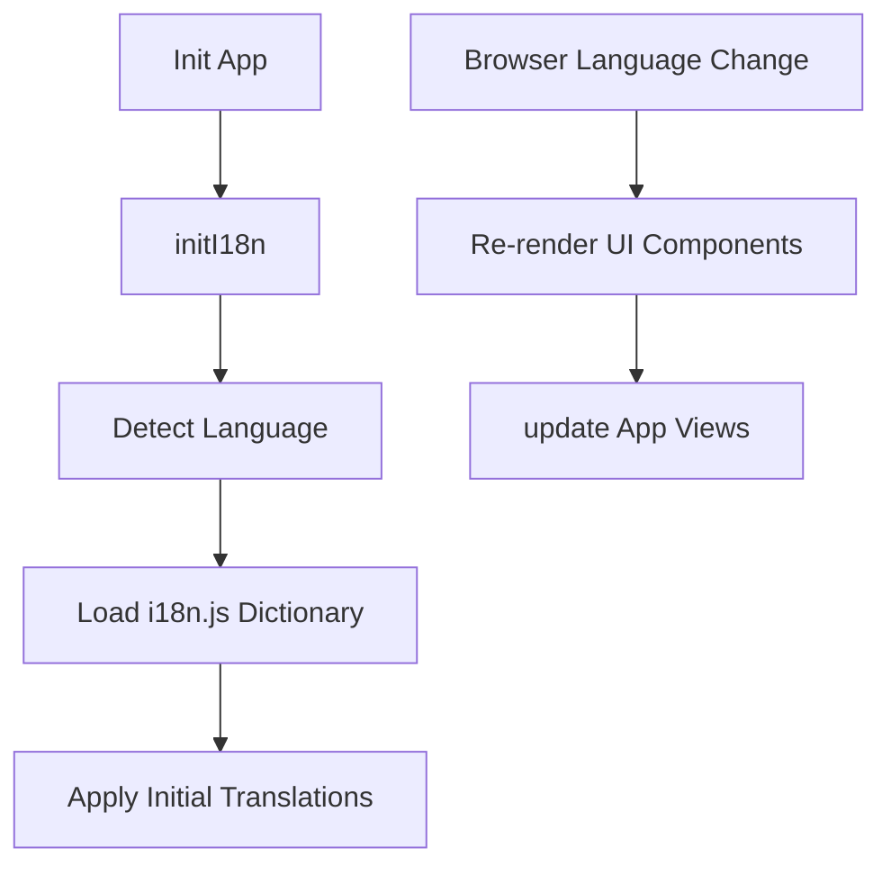
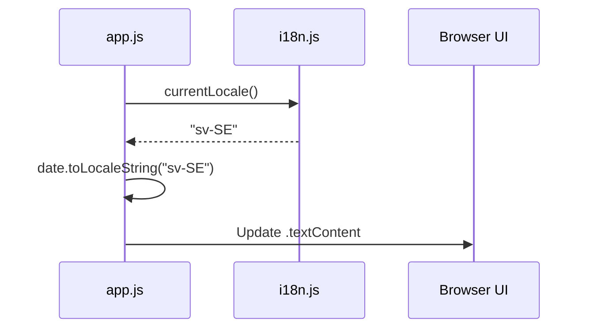

<details>
<summary>Relevant source files</summary>

The following files were used as context for generating this wiki page:

- [app/public/app.js](app/public/app.js)
- [README.md](README.md)
- [TODO.md](TODO.md)
- [app/public/index.html](app/public/index.html)
- [app/public/components/step-review.js](app/public/components/step-review.js)
- [app/src/admin-stats.ts](app/src/admin-stats.ts)
</details>

# Multilingual Interface (i18n)

The Multilingual Interface (i18n) system in the Politiker-webapp project enables a fully localized user experience across 18 supported languages. This includes support for Swedish, English, Nordic languages, German, French, Spanish, Polish, Turkish, Russian, Ukrainian, Arabic, Persian, Somali, Chinese, and Hindi. The system handles automatic language detection, manual selection, and dynamic translation of both static UI elements and server-driven messages.

Sources: [README.md:27-30](README.md#L27-L30)

## Architecture and Logic

The i18n implementation relies on a centralized translation engine located in `app/public/i18n.js`. This engine provides a global translation function, typically referenced as `t()`, which retrieves localized strings based on provided keys and optional interpolation parameters. The system is designed to translate the entire interface, including interactive wizards, settings, and administrator panels.

### Initialization and Language Detection

The initialization process, triggered by `initI18n()`, handles the initial setup of the translation environment. The application also listens for browser-level language changes to ensure the interface remains consistent with user preferences.



The application maintains the current locale and provides a `currentLocale()` helper for formatting dates and numbers according to local standards.

Sources: [app/public/app.js:33-34](app/public/app.js#L33-L34), [app/public/app.js:1062-1075](app/public/app.js#L1062-L1075)

### UI Translation Mechanisms

Localization is applied through two primary methods:
1.  **Data Attributes**: Elements in the HTML use `data-i18n` and `data-i18n-placeholder` attributes to mark themselves for translation.
2.  **Dynamic Rendering**: JavaScript components use the `t()` function to generate localized content during runtime.

| Component | Responsibility | Source Reference |
| :--- | :--- | :--- |
| `t(key, params)` | Core translation function for string lookup and interpolation. | [app/public/app.js:1-3](app/public/app.js#L1-L3) |
| `data-i18n` | HTML attribute for mapping elements to translation keys. | [app/public/index.html:15-18](app/public/index.html#L15-L18) |
| `data-i18n-placeholder` | HTML attribute specifically for translating input placeholders. | [app/public/index.html:56-58](app/public/index.html#L56-L58) |
| `currentLocale()` | Returns the active language code for date/number formatting. | [app/public/app.js:846-850](app/public/app.js#L846-L850) |

## Frontend Integration

The translation system is deeply integrated into the vanilla JavaScript frontend. Components such as the recipient selection wizard and the review step receive the `t` function as a dependency to ensure they remain decoupled from the global state while providing localized output.

### Component-Based Translation

When rendering specific steps of the application wizard, translation utilities are passed into the render functions. For example, the `renderReview` function in `step-review.js` uses these tools to display localized summaries of the user's selected politicians and letter content.

```javascript
// app/public/components/step-review.js:10-25
export function renderReview(container, { recipientCount, typeLabels, subject, bodyHtml, t }) {
  // ...
  const countRow = document.createElement("p");
  countRow.textContent = t("review_recipient_count", { count: recipientCount });
  // ...
  const subjectRow = document.createElement("p");
  subjectRow.innerHTML = `<strong>${t("review_subject_label")}:</strong> ${subject ? escapeHtml(subject) : t("review_no_subject")}`;
}
```

Sources: [app/public/components/step-review.js:1-30](app/public/components/step-review.js#L1-L30)

### Dynamic Data Localization

The system also handles the localization of dynamic data categories, such as politician area types (EU, Parliament, Government, etc.) and role titles. This is achieved by mapping backend identifiers to translation keys using a consistent naming convention (e.g., `area_type_{ty}`).

Sources: [app/public/app.js:958-961](app/public/app.js#L958-L961), [app/public/app.js:985-992](app/public/app.js#L985-L992)

## Implementation Details

The current implementation bundles all languages in a single file (`app/public/i18n.js`), which the developers have identified as a performance bottleneck for initial page loads. Future improvements suggest moving toward a "lazy-loading" strategy where languages are stored in separate files and imported dynamically.

### Navigation and Interaction

User interactions, such as changing the language via the `#lang-select` dropdown or toggling themes, trigger immediate UI updates. The application specifically refreshes several data-heavy sections upon language changes:
*  Mail credentials list
*  Political area selection list
*  Excluded/Included recipient lists
*  Administrative panels

Sources: [TODO.md:14-19](TODO.md#L14-L19), [app/public/app.js:1063-1074](app/public/app.js#L1063-L1074)

### Date and Statistical Formatting

For administrative views and logs, the system uses the standard `Intl` capabilities via `toLocaleString(currentLocale())` to ensure dates are presented in the user's preferred format.



Sources: [app/public/app.js:846-850](app/public/app.js#L846-L850), [app/public/app.js:886-888](app/public/app.js#L886-L888), [app/src/admin-stats.ts:110-120](app/src/admin-stats.ts#L110-L120)

## Conclusion

The i18n system provides a robust framework for delivering the Politiker-webapp to a diverse user base. By combining static attribute-based translation with dynamic runtime interpolation, the project maintains accessibility across nearly 20 languages. Ongoing architectural considerations regarding lazy-loading indicate a path toward better performance as the project scales.
