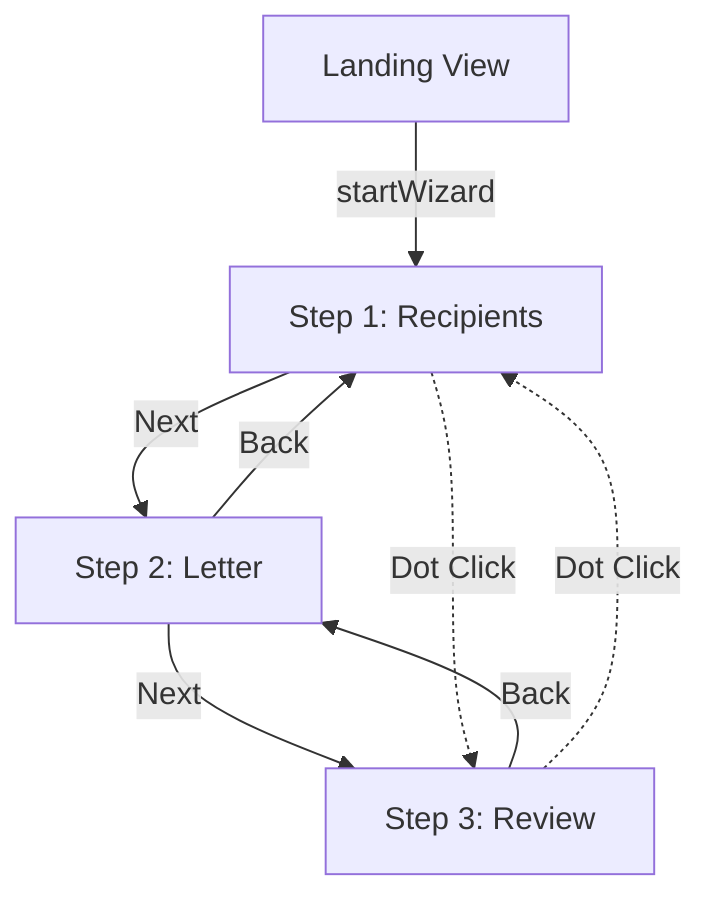
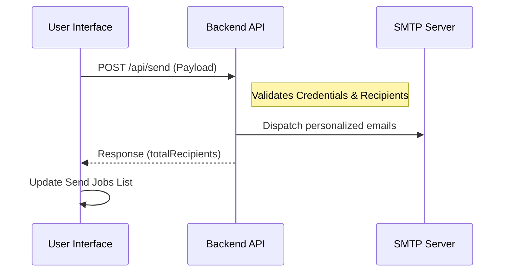

<details>
<summary>Relevant source files</summary>

The following files were used as context for generating this wiki page:

- [app/public/app.js](app/public/app.js)
- [app/public/components/step-select-recipients.js](app/public/components/step-select-recipients.js)
- [app/public/components/step-compose.js](app/public/components/step-compose.js)
- [app/public/components/step-review.js](app/public/components/step-review.js)
- [app/public/index.html](app/public/index.html)
- [README.md](README.md)
</details>

# Three-Step Contact Wizard

The **Three-Step Contact Wizard** is the core user interface component of the Politiker-webapp, designed to guide citizens through the process of contacting elected officials. It facilitates recipient selection, message composition, and final review before dispatching personalized emails via the user's own mail credentials. Sources: [README.md:16-16](README.md#L16), [app/public/app.js:770-776](app/public/app.js#L770-L776)

The wizard is structured as a linear progression (Recipients → Letter → Review) within a Single Page Application (SPA) architecture. It utilizes vanilla JavaScript and HTML, leveraging dynamic DOM manipulation to manage state across the three steps. Sources: [app/public/index.html:154-160](app/public/index.html#L154-L160), [app/public/app.js:847-854](app/public/app.js#L847-L854)

## Wizard Navigation and State Management

The wizard's state is managed primarily in `app.js`, tracking the current step and user selections such as selected areas, excluded parties, and message content. Navigation is non-restrictive, allowing users to jump between steps using a step indicator or "Next/Back" buttons. Sources: [app/public/app.js:847-862](app/public/app.js#L847-L862), [app/public/app.js:873-875](app/public/app.js#L873-L875)



The diagram shows the navigational flow between the landing view and the three steps of the contact wizard. Sources: [app/public/app.js:789-800](app/public/app.js#L789-L800), [app/public/app.js:873-875](app/public/app.js#L873-L875)

### Core State Variables
| Variable | Type | Description |
| :--- | :--- | :--- |
| `selectedAreas` | `Set` | Names of geographic/political areas selected by the user. |
| `excludedParties` | `Set` | Political parties to be filtered out of the recipient pool. |
| `includedRecipients` | `Map` | Specific individual recipients manually added by the user. |
| `excludedRecipients` | `Map` | Specific individual recipients manually removed by the user. |
| `includedRoles` | `Set` | Specific job titles (roles) used to filter recipients globally. |

Sources: [app/public/app.js:6-14](app/public/app.js#L6-L14)

## Step 1: Recipient Selection

This step allows users to define their target audience using a combination of broad categories and granular filters. The system organizes recipients by `area_type` (EU, Riksdag, Regering, Region, Kommun). Sources: [app/public/app.js:256-262](app/public/app.js#L256-L262), [README.md:18-24](README.md#L18-L24)

### Selection Methods
*  **Area Type Cards:** High-level cards for selecting all recipients within a category (e.g., all Municipalities). Sources: [app/public/components/step-select-recipients.js](app/public/components/step-select-recipients.js), [app/public/app.js:275-288](app/public/app.js#L275-L288)
*  **Granular Search:** A name-based search that allows adding or excluding specific individuals regardless of area filters. Sources: [app/public/app.js:464-475](app/public/app.js#L464-L475)
*  **Advanced Filtering:** Provides options to filter by specific administrative areas, exclude entire political parties, or limit by specific roles (e.g., only "Ordförande"). Sources: [app/public/app.js:337-340](app/public/app.js#L337-L340), [app/public/app.js:410-415](app/public/app.js#L410-L415)

### Recipient Count Preview
The UI provides a real-time estimation of the recipient count. A fast local calculation provides immediate feedback, followed by an exact server-side count via the `/api/recipients/count` endpoint to handle deduplication and complex filtering. Sources: [app/public/app.js:550-575](app/public/app.js#L550-L575), [app/public/app.js:578-605](app/public/app.js#L578-L605)

## Step 2: Letter Composition

In Step 2, users draft the subject and body of their message. The application provides an AI-assisted drafting feature and supports file attachments. Sources: [app/public/index.html:194-216](app/public/index.html#L194-L216), [app/public/app.js:636-640](app/public/app.js#L636-L640)

### Key Features
*  **AI Drafting:** Users can provide a topic, and the system researchs the subject to suggest a draft. The `areaType` is inferred from Step 1 selections to adjust the tone. Sources: [app/public/app.js:641-654](app/public/app.js#L641-L654)
*  **Attachments:** Supports PDF, TXT, DOC, and DOCX files up to 10MB. The system can handle files in different modes (e.g., as a standard attachment or converted to body text). Sources: [app/public/app.js:616-620](app/public/app.js#L616-L620), [README.md:29-29](README.md#L29)
*  **Unsaved Changes Protection:** A `beforeunload` listener warns users if they attempt to leave the page with a non-empty, unsent letter. Sources: [app/public/app.js:627-635](app/public/app.js#L627-L635)

## Step 3: Review and Send

The final step provides a summary of the selected recipients and a preview of the message. It also verifies that the user has connected a mail account. Sources: [app/public/app.js:847-854](app/public/app.js#L847-L854), [app/public/components/step-review.js](app/public/components/step-review.js)

### Final Validation and Dispatch
The `renderReviewStep` function compiles data from all previous steps to display a summary. If no mail credentials are found, the "Send" button is disabled. Sources: [app/public/app.js:855-871](app/public/app.js#L855-L871)



This diagram illustrates the final dispatch process when the user clicks the "Send" button in Step 3. Sources: [app/public/app.js:680-717](app/public/app.js#L680-L717)

### Dispatch Payload
The `recipientFilterPayload` function gathers the selection state for the API request:

```javascript
function recipientFilterPayload() {
  return {
    areaNames: [...selectedAreas],
    excludeParties: [...excludedParties],
    excludeEmails: [...excludedRecipients.keys()],
    includeRoles: [...includedRoles],
    includeEmails: [...includedRecipients.keys()],
  };
}
```

Sources: [app/public/app.js:540-548](app/public/app.js#L540-L548)

## Summary
The Three-Step Contact Wizard serves as a guided workflow for personalized political engagement. By separating recipient selection, composition, and review, it ensures users can target specific officials accurately while utilizing automated tools like AI drafting to enhance their communications. The system prioritizes data integrity through server-side count verification and secure dispatch via the user's own authenticated mail accounts. Sources: [README.md:1-12](README.md#L1-L12), [app/public/app.js:770-785](app/public/app.js#L770-L785)
