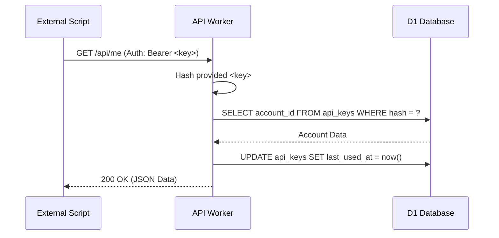
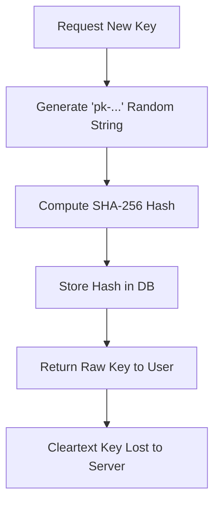

<details>
<summary>Relevant source files</summary>

The following files were used as context for generating this wiki page:

- [app/src/api-keys.ts](app/src/api-keys.ts)
- [app/src/index.ts](app/src/index.ts)
- [infra/schema.sql](infra/schema.sql)
- [app/public/app.js](app/public/app.js)
- [README.md](README.md)
</details>

# API Keys & Programmatic Access

## Introduction

API Keys provide a mechanism for programmatic access to the Politiker-webapp platform, serving as an alternative to session-based browser authentication. This system allows users to interact with the API using scripts or external tools by including a bearer token in the `Authorization` header of their requests. Sources: [app/src/index.ts:397-399](app/src/index.ts#L397-L399), [README.md:32-33](README.md#L32-L33)

The implementation ensures security by only storing cryptographic hashes of the keys in the database, meaning the cleartext key is only visible to the user at the moment of creation. Programmatic access is scoped to the specific account associated with the key, maintaining the same isolation and rate-limiting constraints as standard web sessions. Sources: [infra/schema.sql:154-159](infra/schema.sql#L154-L159), [app/src/api-keys.ts](app/src/api-keys.ts)

## Data Model & Schema

The system relies on a dedicated `api_keys` table within the SQLite (D1) database. This table links specific cryptographic hashes to user accounts and tracks usage metadata.

### The `api_keys` Table
| Field | Type | Description |
| :--- | :--- | :--- |
| `id` | TEXT | Primary key (unique identifier) for the key entry. |
| `account_id` | TEXT | Foreign key linking the key to a specific user in the `accounts` table. |
| `key_hash` | TEXT | SHA-256 hash of the API key for secure storage and lookup. |
| `name` | TEXT | User-defined label for the key (e.g., "my script"). |
| `created_at` | INTEGER | Timestamp of when the key was generated. |
| `last_used_at`| INTEGER | Timestamp of the most recent successful API call using this key. |

Sources: [infra/schema.sql:154-162](infra/schema.sql#L154-L162)

## Authentication Flow

Programmatic authentication is integrated into the main request handling logic. When a request lacks a valid session cookie, the system checks for a `Bearer` token in the `Authorization` header.

### Authorization Logic
1.  **Extraction**: The server looks for the `Authorization` header.
2.  **Verification**: If a `Bearer` token is present, it is hashed and compared against the `api_keys` table.
3.  **Account Retrieval**: If a match is found, the associated account details are loaded into the request context.
4.  **Metadata Update**: The `last_used_at` timestamp for that specific key is updated in the database.

Sources: [app/src/index.ts:397-402](app/src/index.ts#L397-L402), [app/src/api-keys.ts](app/src/api-keys.ts)

### Sequence Diagram: API Key Authentication
The following diagram illustrates how the API gateway resolves an API key into a user session.



Sources: [app/src/index.ts:397-402](app/src/index.ts#L397-L402), [app/src/api-keys.ts](app/src/api-keys.ts)

## Key Management API

Users manage their API keys through specific endpoints. These endpoints allow for the creation of new keys, listing existing keys, and revoking access.

### Endpoints
| Method | Endpoint | Description |
| :--- | :--- | :--- |
| `GET` | `/api/api-keys` | Lists all metadata for keys belonging to the logged-in user. |
| `POST` | `/api/api-keys` | Generates a new key. The response includes the cleartext key. |
| `DELETE` | `/api/api-keys/:id` | Revokes the specified key, immediately terminating its access. |

Sources: [app/src/index.ts:168-176](app/src/index.ts#L168-L176)

### Key Generation Process
When a key is created via `POST /api/api-keys`, the server generates a random string (prefixed with `pk-`). It then creates a SHA-256 hash of this string for storage. The raw `pk-` string is returned to the user exactly once.



Sources: [app/src/api-keys.ts](app/src/api-keys.ts)

## Implementation Details

### API Key Logic (`app/src/api-keys.ts`)
The core logic for key validation and creation is encapsulated in `api-keys.ts`. It utilizes the `crypto.subtle` API for secure hashing.

```typescript
// Example of how keys are retrieved (conceptual based on source)
export async function getAccountFromApiKey(env: Env, key: string) {
  const hash = await hashKey(key);
  const row = await env.DB.prepare(
    "SELECT account_id, id FROM api_keys WHERE key_hash = ?"
  ).bind(hash).first();
  // ... account retrieval logic
}
```

Sources: [app/src/api-keys.ts:38-51](app/src/api-keys.ts#L38-L51)

### Frontend Integration (`app/public/app.js`)
The web interface provides a management UI under the "Settings" view. It displays the key name, creation date, and last used timestamp.

- **Loading Keys**: The `loadApiKeys()` function fetches the list and renders it with a "Revoke" button.
- **Creation**: The `create-api-key-form` submits a name and displays the resulting raw key to the user in a message.

Sources: [app/public/app.js:646-681](app/public/app.js#L646-L681), [app/public/index.html:190-198](app/public/index.html#L190-L198)

## Conclusion
The API Key system provides a secure, robust path for automation within the Politiker-webapp ecosystem. By employing cryptographic hashing and standard Bearer token authentication, it balances developer convenience with high security standards, ensuring that programmatic access is as secure as interactive sessions. Sources: [README.md:32-33](README.md#L32-L33), [app/src/api-keys.ts](app/src/api-keys.ts)
