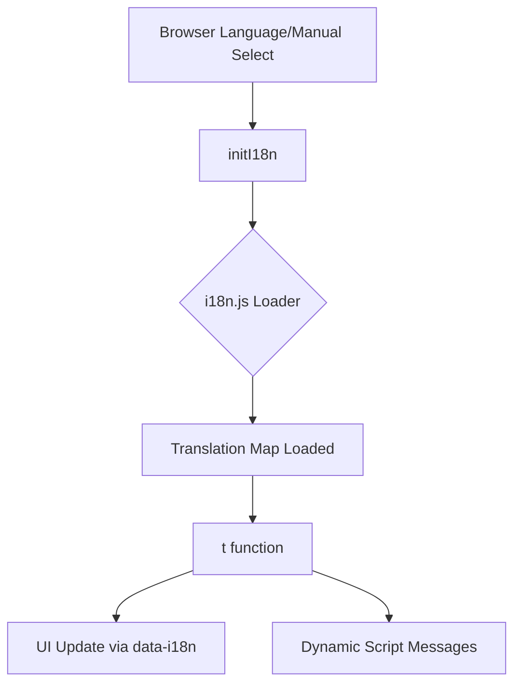
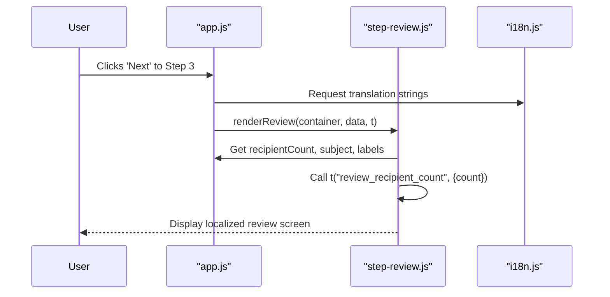

<details>
<summary>Relevant source files</summary>

The following files were used as context for generating this wiki page:

- [app/public/app.js](app/public/app.js)
- [app/public/index.html](app/public/index.html)
- [app/public/i18n.js](app/public/i18n.js) (Referenced in [app/public/app.js:1451](app/public/app.js#L1451))
- [README.md](README.md)
- [TODO.md](TODO.md)
- [app/public/components/step-review.js](app/public/components/step-review.js)
</details>

# Multilingual Interface (i18n)

## Introduction
The Multilingual Interface (i18n) in the `politiker-webapp` project is designed to provide a localized user experience for citizens contacting public officials. The system currently supports 18 languages, including Swedish, English, Nordic languages, German, French, Spanish, Polish, Turkish, Russian, Ukrainian, Arabic, Persian, Somali, Chinese, and Hindi. It features automatic language detection based on browser settings with an optional manual override via the user interface.

Sources: [README.md:38-41](README.md#L38-L41)

The implementation focuses on a vanilla JavaScript approach within a Cloudflare Workers environment. The core logic handles the translation of static UI elements, dynamic API-driven messages, and localizable templates for the 3-step wizard.

Sources: [app/public/app.js:46-47](app/public/app.js#L46-L47), [README.md:52-53](README.md#L52-L53)

## Architecture and Components

### Translation Logic
The i18n system uses a global `t(key, variables)` function to retrieve translated strings. This function looks up keys in a language mapping provided by `i18n.js`. UI elements in the HTML are often tagged with `data-i18n` or `data-i18n-placeholder` attributes to facilitate automatic translation during initialization or language switches.

Sources: [app/public/app.js:1-3](app/public/app.js#L1-L3), [app/public/index.html:15-20](app/public/index.html#L15-L20)



The diagram shows the flow from language detection to UI update.
Sources: [app/public/app.js:46-47](app/public/app.js#L46-L47), [app/public/app.js:1451](app/public/app.js#L1451)

### Initialization and Storage
Language settings are persisted and initialized during the application bootstrap. The `initI18n()` function is called early in the execution lifecycle. Changes to the language triggered by the user via the `#lang-select` element update the current locale and trigger a re-render of various UI components to ensure all content reflects the new selection.

Sources: [app/public/app.js:46](app/public/app.js#L46), [app/public/index.html:38](app/public/index.html#L38), [app/public/app.js:1434-1449](app/public/app.js#L1434-L1449)

## Core Functions and Data Structures

| Component | Description |
| :--- | :--- |
| `t(key, vars)` | The primary translation function. Accepts a translation key and an optional object for variable interpolation. |
| `initI18n()` | Bootstraps the translation system, detects browser language, and applies initial translations. |
| `currentLocale()` | Returns the currently active language code (e.g., 'sv', 'en'). |
| `data-i18n` | HTML attribute used to mark elements for text content translation. |
| `data-i18n-placeholder` | HTML attribute used to mark input placeholders for translation. |

Sources: [app/public/app.js:1-3](app/public/app.js#L1-L3), [app/public/app.js:46](app/public/app.js#L46), [app/public/app.js:1159](app/public/app.js#L1159), [app/public/index.html:125](app/public/index.html#L125)

### Implementation Details
The interface handles complex localization scenarios, such as localized date formats using `toLocaleString(currentLocale())` and dynamic counts within strings.

```javascript
// Example of localized date formatting
const lastUsed = k.last_used_at 
  ? new Date(k.last_used_at).toLocaleString(currentLocale()) 
  : t("never_used");

// Example of variable interpolation in translations
msg.textContent = t("msg_sending_to_n", { n: result.totalRecipients });
```

Sources: [app/public/app.js:1159-1160](app/public/app.js#L1159-L1160), [app/public/app.js:909](app/public/app.js#L909)

## UI Components and Wizard Localization
The 3-step wizard and the review components are designed to be fully localizable. The `renderReview` function in the review component takes the translation function `t` as a dependency to generate localized summaries of the user's selected recipients and levels.

Sources: [app/public/components/step-review.js:6-38](app/public/components/step-review.js#L6-L38)



The sequence shows how the translation function is passed to modular components.
Sources: [app/public/app.js:1322-1342](app/public/app.js#L1322-L1342), [app/public/components/step-review.js:6](app/public/components/step-review.js#L6)

## Maintenance and Future Improvements
The project documentation identifies a performance bottleneck where `app/public/i18n.js` contains all languages in a single large file, increasing the initial load weight.

**Proposed Optimizations:**
*  Lazy-loading translations by splitting `i18n.js` into one file per language.
*  Implementing dynamic imports for non-default languages.

Sources: [TODO.md:15-20](TODO.md#L15-L20)

## Conclusion
The Multilingual Interface (i18n) is a core system within the `politiker-webapp`, enabling accessibility across 18 languages. By utilizing a centralized translation utility and data attributes in the DOM, the project maintains a clear separation between logic and localized content, though future refactoring for lazy-loading is planned to optimize performance.

Sources: [README.md:38-41](README.md#L38-L41), [TODO.md:15-20](TODO.md#L15-L20)
