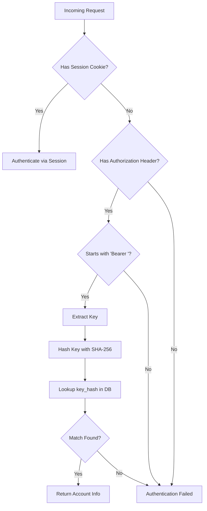
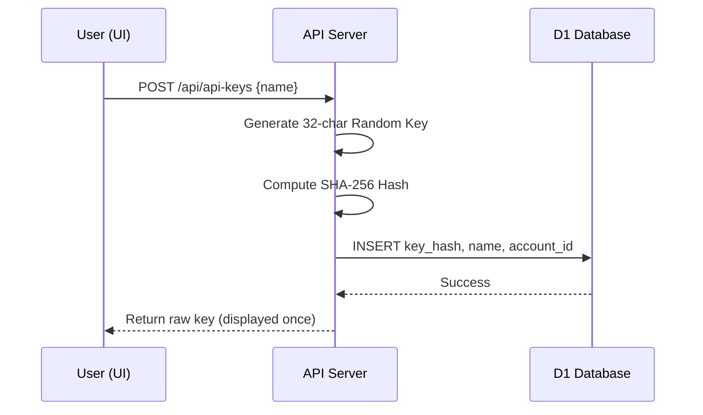

Relevant source files

The following files were used as context for generating this wiki page:

- [app/src/api-keys.ts](app/src/api-keys.ts)
- [app/src/index.ts](app/src/index.ts)
- [app/public/app.js](app/public/app.js)
- [infra/schema.sql](infra/schema.sql)
- [README.md](README.md)
- [AGENTS.md](AGENTS.md)

# API Keys & Programmatic Access

Programmatic access in the Politiker-webapp allows users and external scripts to interact with the system's API endpoints without relying on traditional browser-based session cookies. This is facilitated through the generation and validation of personal API keys, which serve as long-lived credentials for automated tasks or third-party integrations.

The system implements a secure hashing mechanism for storing keys, ensuring that even if the database is compromised, the raw keys remain protected. Users can manage their keys—creating new ones or revoking existing ones—directly through the web interface.

Sources: [README.md:27-28](README.md#L27-L28), [app/src/index.ts:474-477](app/src/index.ts#L474-L477), [app/public/app.js:527-529](app/public/app.js#L527-L529)

## System Architecture & Data Flow

The API key system is integrated into the main application Worker. It acts as an alternative authentication provider alongside the session-based authentication. When a request is received, the system checks for a `Bearer` token in the `Authorization` header. If found, it attempts to resolve the associated account by hashing the provided key and looking it up in the database.

### Authentication Logic Flow

The following diagram illustrates how the system determines user identity via API keys during an incoming request:

The system performs a `Bearer` token check in the `Authorization` header as a fallback when no session cookie is present.
Sources: [app/src/index.ts:474-482](app/src/index.ts#L474-L482), [app/src/api-keys.ts:25-30](app/src/api-keys.ts#L25-L30)

## Key Management Operations

Users interact with API keys through a dedicated section in the settings view. Management includes three primary actions: listing, creating, and revoking keys.

### Key Creation and Storage
When a user creates a key, the system generates a random 32-character alphanumeric string. This string is displayed to the user exactly once. Only the SHA-256 hash of this key is stored in the database for security purposes.

Sources: [app/src/api-keys.ts:7-16](app/src/api-keys.ts#L7-L16), [app/public/app.js:555-566](app/public/app.js#L555-L566)

### API Endpoints
| Endpoint | Method | Description |
| :--- | :--- | :--- |
| `/api/api-keys` | `GET` | Lists all API keys associated with the authenticated account. |
| `/api/api-keys` | `POST` | Generates a new API key with a user-provided name. |
| `/api/api-keys/:id` | `DELETE` | Revokes and deletes a specific API key by its ID. |

Sources: [app/src/index.ts:187-195](app/src/index.ts#L187-L195), [app/public/app.js:527-553](app/public/app.js#L527-L553)

## Data Schema

API keys are stored in the `api_keys` table within the Cloudflare D1 (SQLite) database. Each entry is linked to an account and tracks usage metadata.

### The `api_keys` Table
| Field | Type | Description |
| :--- | :--- | :--- |
| `id` | `TEXT` | Primary Key (random ID). |
| `account_id` | `TEXT` | Foreign Key referencing the `accounts` table. |
| `key_hash` | `TEXT` | Unique SHA-256 hash of the API key. |
| `name` | `TEXT` | User-defined name for the key (e.g., "my script"). |
| `created_at` | `INTEGER` | Unix timestamp of key creation. |
| `last_used_at` | `INTEGER` | Unix timestamp of the last time the key was used. |

Sources: [infra/schema.sql:133-141](infra/schema.sql#L133-L141), [app/src/api-keys.ts:2-6](app/src/api-keys.ts#L2-L6)

## Security Implementation

The implementation follows specific security conventions to protect programmatic access:

1.  **Hashing**: Raw keys are never stored. The system only stores and compares hashes.
2.  **Usage Tracking**: The `last_used_at` timestamp is updated every time a key is successfully used for authentication.
3.  **Account Isolation**: API queries are strictly filtered by `account_id` to ensure users can only see or manage their own keys.
4.  **Header-Based**: Keys are passed via the standard `Authorization: Bearer <key>` header, which is common in programmatic environments.

Sources: [app/src/api-keys.ts:25-36](app/src/api-keys.ts#L25-L36), [AGENTS.md:36](AGENTS.md#L36), [README.md:27-28](README.md#L27-L28)

## Conclusion

The API Keys and Programmatic Access module provides a secure and flexible way for users to automate interactions with the Politiker-webapp. By leveraging SHA-256 hashing and standard Bearer token authentication, the system maintains a high security posture while enabling developer-friendly features like usage tracking and self-service key management.
