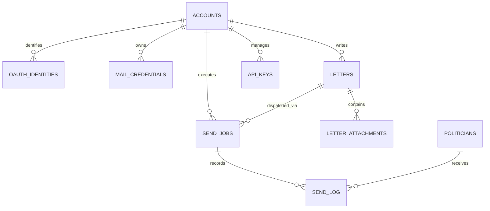
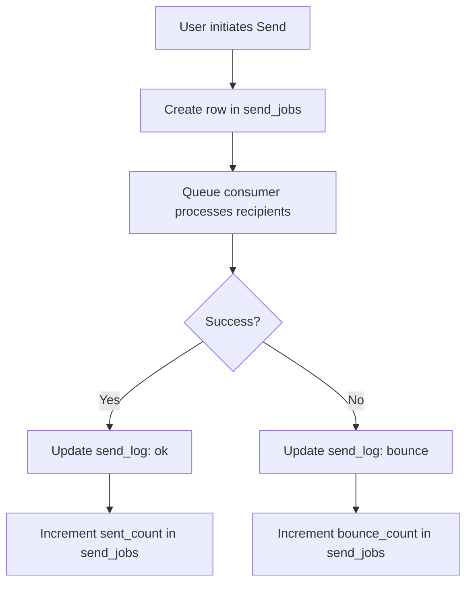

<details>
<summary>Relevant source files</summary>

The following files were used as context for generating this wiki page:

- [infra/schema.sql](infra/schema.sql)
- [app/src/admin-stats.ts](app/src/admin-stats.ts)
- [infra/setup.sh](infra/setup.sh)
- [README.md](README.md)
- [AGENTS.md](AGENTS.md)
- [app/public/app.js](app/public/app.js)
</details>

# Database Schema & D1 Configuration

The "politiker-webapp" project utilizes Cloudflare D1, a serverless relational database built on SQLite, to manage user accounts, politician contact data, mail credentials, and communication logs. The database serves as the primary persistence layer for the application, ensuring that user settings, encrypted SMTP credentials, and audit logs for sent letters are maintained across Worker invocations.

The schema is designed to handle multi-tenant isolation by filtering queries based on `account_id`, ensuring that user data remains private. It also supports complex features such as OAuth identity linking, Two-Factor Authentication (TOTP) status, and detailed delivery tracking (send jobs and logs) for bulk communication with politicians.

Sources: [README.md](README.md), [AGENTS.md:46](AGENTS.md#L46), [infra/schema.sql](infra/schema.sql)

## Entity-Relationship Overview

The database is structured around the `accounts` entity. Users can link multiple `oauth_identities` and `mail_credentials` to a single account. Communication is tracked via `send_jobs`, which link a specific `letter` to multiple recipients recorded in the `send_log`.

The following diagram illustrates the core relationships between the primary tables:



The diagram shows how accounts act as the central hub for user-generated content and configurations.
Sources: [infra/schema.sql:3-138](infra/schema.sql#L3-L138)

## Core Data Models

### User Management and Security
The `accounts` table stores core authentication data, including PBKDF2 password hashes and salts. It also tracks security states such as email verification and TOTP (Time-based One-Time Password) enablement.

| Field | Type | Description |
| :--- | :--- | :--- |
| `id` | TEXT | Primary Key (UUID). |
| `email` | TEXT | Unique user email address. |
| `password_hash` | TEXT | PBKDF2 hash of the user password. |
| `totp_enabled` | INTEGER | Boolean (0/1) indicating if 2FA is active. |
| `is_admin` | INTEGER | Boolean (0/1) granting access to `/api/admin/*`. |

Sources: [infra/schema.sql:3-20](infra/schema.sql#L3-L20), [AGENTS.md:42-46](AGENTS.md#L42-L46)

### Politician Directory
The `politicians` table contains the public contact information for various government levels (EU, Riksdag, Regering, Region, Kommun). It includes a `verification_status` to track email validity during actual send operations.

```sql
CREATE TABLE politicians (
  id TEXT PRIMARY KEY,
  name TEXT NOT NULL,
  email TEXT NOT NULL,
  area_name TEXT NOT NULL,
  area_type TEXT NOT NULL, -- kommun | region | riksdag | regering | eu
  party TEXT,
  role TEXT,
  last_scraped_at INTEGER NOT NULL,
  verification_status TEXT NOT NULL DEFAULT 'unknown',
  UNIQUE(email, area_name)
);
```

Sources: [infra/schema.sql:63-75](infra/schema.sql#L63-L75)

## Mail and Communication Tracking

### Encrypted Credentials
The `mail_credentials` table stores SMTP or Microsoft Graph details. Critically, sensitive passwords or OAuth tokens are stored in an encrypted format using AES-GCM, with the key managed as a Wrangler secret (`MAIL_CRED_KEY`).

| Field | Type | Description |
| :--- | :--- | :--- |
| `provider` | TEXT | gmail, outlook, icloud, yahoo, generic, or microsoft_graph. |
| `encrypted_password`| TEXT | AES-GCM encrypted password (for SMTP). |
| `oauth_refresh_token`| TEXT | Encrypted token used for Microsoft Graph. |
| `user_cap_pct` | INTEGER | User-defined percentage of the provider's daily limit. |

Sources: [infra/schema.sql:43-58](infra/schema.sql#L43-L58), [README.md:144-146](README.md#L144-L146)

### Send Job Execution
The communication flow uses `send_jobs` and `send_log` to manage bulk operations. A job represents a batch, while the log tracks individual delivery statuses (e.g., `ok` or `bounce`).



Sources: [infra/schema.sql:103-125](infra/schema.sql#L103-L125), [app/public/app.js:636-664](app/public/app.js#L636-L664)

## Administrative and Analytics Schema

The system collects anonymous statistics using a hashing mechanism to preserve privacy. The `visits` table uses a `visitor_hash` (SHA-256 of IP + User Agent + Salt) to count unique visitors without storing identifiable data.

### Analytics Tables
*  **`visits`**: Tracks unique visitors by hash and timestamp.
*  **`worker_errors`**: Logs 4xx/5xx API errors for debugging.
*  **`client_errors`**: Deduplicates unexpected JavaScript exceptions reported by the frontend.
*  **`feedback`**: Stores user-submitted bug reports and feature requests, optionally linked to a GitHub issue URL.

Sources: [infra/schema.sql:149-183](infra/schema.sql#L149-L183), [app/src/admin-stats.ts:24-43](app/src/admin-stats.ts#L24-L43)

## D1 Provisioning and Configuration

The project automates D1 setup through the `infra/setup.sh` script and `wrangler.jsonc` configuration files.

### Provisioning Logic
The `setup.sh` script performs the following actions for D1:
1.  **Creation**: Checks if the database `politiker_webapp` exists; if not, it creates it.
2.  **ID Patching**: Retrieves the UUID of the D1 instance and injects it into `app/wrangler.jsonc`, `sender/wrangler.jsonc`, and `campaign/wrangler.jsonc`.
3.  **Schema Application**: Executes the `infra/schema.sql` file against the remote D1 instance for new databases.

Sources: [infra/setup.sh:88-100](infra/setup.sh#L88-L100), [infra/setup.sh:110-113](infra/setup.sh#L110-L113)

### Manual Data Import
Because the schema initialization creates an empty `politicians` table, external data must be imported. This is typically done by executing a SQL dump from a companion repository:

```bash
wrangler d1 execute politiker_webapp --remote --yes --file ../politiker-kontakter/data/politiker.sql
```

Sources: [README.md:124-128](README.md#L124-L128)

## Conclusion

The Database Schema and D1 Configuration provide a robust, secure foundation for the Politikerkontakt platform. By leveraging Cloudflare D1's serverless SQLite capabilities, the project maintains high availability and low latency. The schema effectively balances public data management (politicians) with sensitive user data protection (encrypted credentials and multi-tenant isolation), while providing comprehensive audit trails for all communication activity.

Sources: [README.md](README.md), [AGENTS.md](AGENTS.md)
