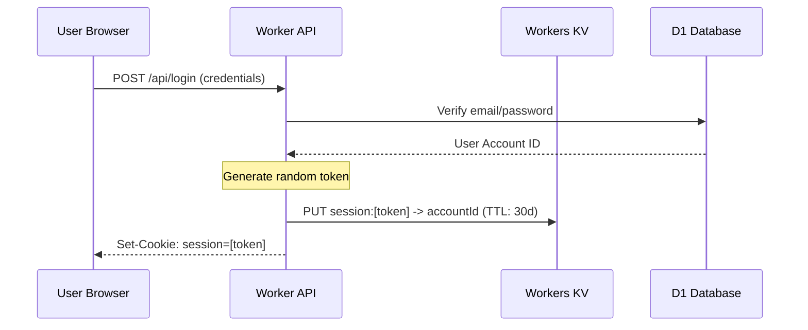
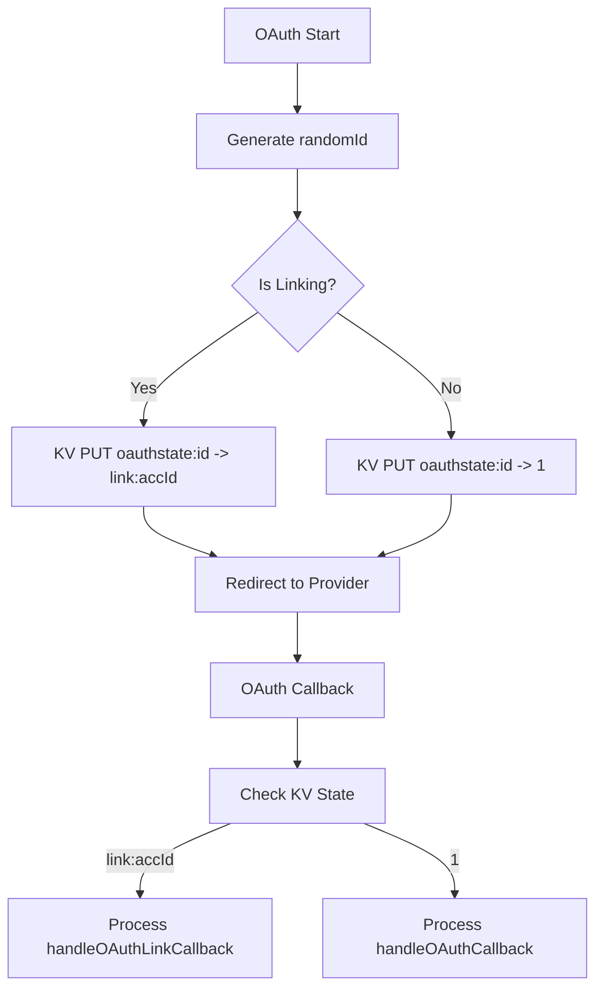

Relevant source files

The following files were used as context for generating this wiki page:

- [app/src/index.ts](app/src/index.ts)
- [app/src/auth.ts](app/src/auth.ts)
- [app/src/oauth.ts](app/src/oauth.ts)
- [app/public/app.js](app/public/app.js)
- [infra/setup.sh](infra/setup.sh)
- [infra/schema.sql](infra/schema.sql)

# Session Management & KV Storage

Session management in the Politiker-webapp is handled through a combination of HTTP-only cookies and Cloudflare Workers KV storage. This system facilitates secure user authentication, state management for OAuth flows, and temporary rate limiting for specific features like AI-driven letter drafting. By utilizing KV storage, the application achieves low-latency access to session data across Cloudflare's edge network.

The project relies on a Cloudflare KV namespace titled `politiker_webapp_sessions` to persist short-term data. This includes active user sessions linked to account IDs, state tokens for OAuth security, and temporary counters for usage quotas. Sources: [infra/setup.sh:34](infra/setup.sh#L34), [app/src/index.ts:70-75](app/src/index.ts#L70-L75)

## Session Infrastructure

### KV Namespace Configuration
The infrastructure is provisioned using a specific KV namespace for session data. This namespace is identified in the `wrangler.jsonc` configuration and managed via the Cloudflare CLI during setup.

| Component | KV Key Prefix | Purpose | TTL / Expiration |
| :--- | :--- | :--- | :--- |
| **User Session** | `session:` | Maps a random token to a User Account ID | 30 Days |
| **OAuth Login State** | `oauthstate:` | Prevents CSRF during OAuth login flows | 10 Minutes |
| **OAuth Link State** | `oauthlinkstate:` | Secures the process of linking new providers | 10 Minutes |
| **OAuth Mail State** | `oauthmailstate:` | Secures Microsoft Graph mail authorization | 10 Minutes |
| **Draft Rate Limit** | `draft-rate:` | Tracks AI draft usage per account per day | 24 Hours |

Sources: [infra/setup.sh:34](infra/setup.sh#L34), [app/src/index.ts:140](app/src/index.ts#L140), [app/src/index.ts:241](app/src/index.ts#L241), [app/src/index.ts:318](app/src/index.ts#L318), [app/src/index.ts:348](app/src/index.ts#L348)

### Session Creation and Validation
When a user logs in via credentials or OAuth, a cryptographically strong random token is generated. This token is stored in KV and returned to the client in a `Set-Cookie` header.

The application uses the `getAccountFromSession` function to validate requests by retrieving the `session` cookie and looking up the associated `account_id` in KV storage. Sources: [app/src/index.ts:70-75](app/src/index.ts#L70-L75), [app/src/index.ts:138-145](app/src/index.ts#L138-L145)

## OAuth State Management

To prevent Cross-Site Request Forgery (CSRF) and maintain context across redirects, the system uses KV to store transient state tokens.

### Shared Callback Logic
Certain providers (like GitHub) use a shared callback for both initial login and account linking. The system distinguishes these flows by prepending context to the KV value. For instance, a linking flow stores the value as `link:<accountId>` within the `oauthstate:` key. Sources: [app/src/index.ts:316-324](app/src/index.ts#L316-L324)

Sources: [app/src/index.ts:316-340](app/src/index.ts#L316-L340), [app/src/oauth.ts](app/src/oauth.ts)

## Feature-Specific KV Usage

### AI Drafting Rate Limits
The system implements a daily quota for AI letter drafting to control costs. This is managed using KV keys formatted as `draft-rate:<accountId>:<YYYY-MM-DD>`.

*  **Limit:** 10 drafts per day per account.
*  **Consistency:** The system uses "best-effort" consistency for this limit, acknowledging that KV's eventual consistency might allow minor overages in exchange for performance.
*  **Logic:** The current count is retrieved from KV, incremented if below the limit, and written back with a 24-hour expiration.

Sources: [app/src/index.ts:236-244](app/src/index.ts#L236-L244)

## Client-Side Interaction
On the client side, the web application manages local state such as the UI theme and temporary ID markers in `localStorage`, while relying on the browser's cookie management for authentication sessions.

*  **Theme Storage:** The preferred theme ("dark", "light", or "system") is saved in `localStorage.getItem("theme")`.
*  **API Interactions:** The `api()` helper function in `app.js` handles standard requests, while specialized forms (login, signup, verify) manage the transition between logged-out and logged-in states based on server-side session cookies.

Sources: [app/public/app.js:25-30](app/public/app.js#L25-L30), [app/public/app.js:84-100](app/public/app.js#L84-L100)

## Database Schema Correlation
While the active session tokens reside in KV, the persistent account data is stored in the `accounts` table within the D1 SQLite database.

| Field | Type | Description |
| :--- | :--- | :--- |
| `id` | TEXT | Primary Key (referenced by KV `account_id`) |
| `email` | TEXT | Unique user email |
| `totp_enabled` | INTEGER | Boolean flag for 2FA status |
| `disabled` | INTEGER | Boolean flag for administrative account locks |

Sources: [infra/schema.sql:3-20](infra/schema.sql#L3-L20)

## Conclusion
The session management system leverages the strengths of Cloudflare Workers KV to provide a scalable, low-latency authentication layer. By separating transient session data and security states into KV while maintaining persistent user records in D1, the architecture ensures both high performance for request validation and robust consistency for user account management. This hybrid approach effectively secures standard login, multi-provider OAuth flows, and internal feature rate-limiting.
