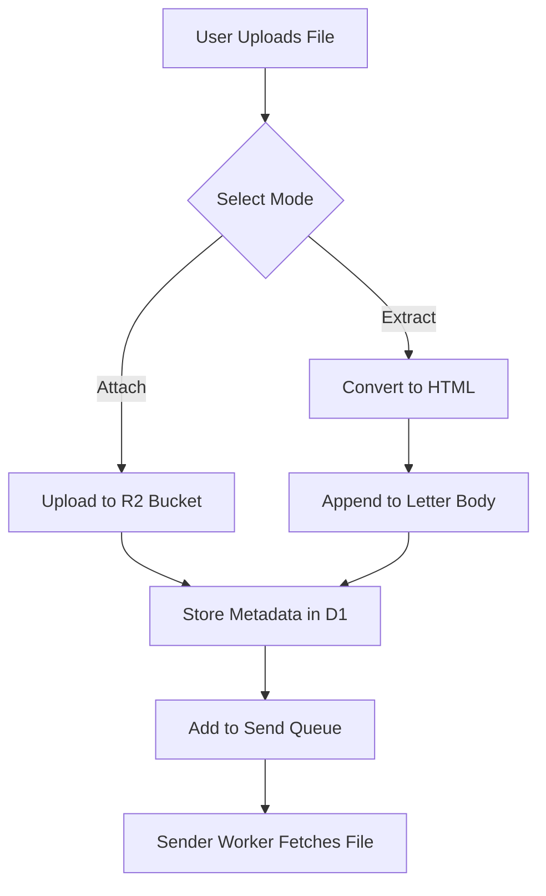
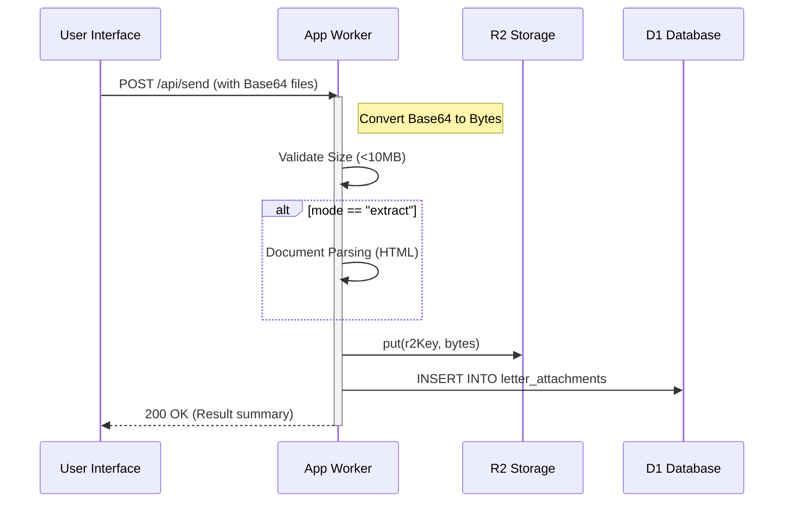

Relevant source files

The following files were used as context for generating this wiki page:

- [app/src/attachments.ts](app/src/attachments.ts)
- [app/public/app.js](app/public/app.js)
- [app/public/components/step-compose.js](app/public/components/step-compose.js)
- [infra/schema.sql](infra/schema.sql)
- [README.md](README.md)
- [app/package.json](app/package.json)

# Attachment Parsing & Handling

The Attachment Parsing & Handling system manages the lifecycle of files uploaded by users during the letter composition process. Its primary purpose is to allow citizens to either attach documents directly to their emails or extract content from those documents to be used as part of the letter's HTML body.

The system supports various formats including PDF, TXT, DOC, and DOCX. While most formats allow for text extraction, legacy `.doc` files are restricted to being sent only as attachments. The architecture leverages Cloudflare R2 for binary storage and Cloudflare D1 (SQLite) for metadata tracking, ensuring that attachments are securely stored and efficiently retrieved during the asynchronous sending process managed by the `sender` Worker.

Sources: [app/public/app.js:560-575](app/public/app.js#L560-L575), [app/src/attachments.ts:1-5](app/src/attachments.ts#L1-L5), [README.md:27-28](README.md#L27-L28)

## System Architecture & Data Flow

The attachment workflow begins in the frontend wizard where users upload files and select a handling mode. The data is then transmitted to the `app` Worker, processed, and stored for later use by the `sender` Worker.

### Attachment Processing Logic

When a user submits a letter, the `app.js` script converts files to Base64 strings and bundles them with metadata (filename, content type, and mode). This payload is sent to the `/api/send` endpoint.

The diagram above shows the dual-path logic for file handling based on the user's selected mode.
Sources: [app/public/app.js:560-575](app/public/app.js#L560-L575), [app/src/attachments.ts:25-45](app/src/attachments.ts#L25-L45)

### Data Models & Storage

The system uses a specific table in the D1 database to track attachment metadata and relates them to specific letters.

| Field | Type | Description |
| :--- | :--- | :--- |
| `id` | TEXT | Primary Key (Random UUID) |
| `letter_id` | TEXT | Reference to the `letters` table |
| `filename` | TEXT | Original name of the uploaded file |
| `content_type` | TEXT | MIME type (e.g., application/pdf) |
| `r2_key` | TEXT | The unique path to the file in Cloudflare R2 |
| `size_bytes` | INTEGER | File size in bytes |
| `mode` | TEXT | Handling mode: 'attach' or 'extract' |

Sources: [infra/schema.sql:98-108](infra/schema.sql#L98-L108), [app/src/attachments.ts:40-45](app/src/attachments.ts#L40-L45)

## Component Logic

### Frontend Handling (`step-compose.js`)
The `renderFileModeList` function dynamically generates the UI for uploaded files. It provides radio buttons for selecting between "Attach" (`attach`) and "Use as text" (`extract`). 

- **Restriction**: Files ending in `.doc` have the "extract" option disabled, as the system only supports extraction for modern formats like `.docx` and `.pdf`.
- **Validation**: The UI indicates file size in KB for user feedback.

Sources: [app/public/components/step-compose.js:7-39](app/public/components/step-compose.js#L7-L39)

### Backend Processing (`attachments.ts`)
The `processAttachments` function is the core backend logic. 

1. **Validation**: It enforces a strict `MAX_ATTACHMENT_BYTES` limit of 10 MB per file to prevent abuse.
2. **Extraction**: If the mode is `extract`, it calls `convertToHtml` (utilizing libraries like `mammoth` for DOCX or `unpdf` for PDF) and appends the result to the letter's HTML body.
3. **Storage**: All files are uploaded to the Cloudflare R2 bucket (`ATTACHMENTS`) with a key structured as `${letterId}/${randomId()}-${filename}`.
4. **Persistence**: Metadata is inserted into the `letter_attachments` table.

Sources: [app/src/attachments.ts:11-50](app/src/attachments.ts#L11-L50), [app/package.json:20-21](app/package.json#L20-L21)

### Sequence Diagram: File Submission

This diagram illustrates the sequence of operations within the `app` Worker when processing a letter with files.
Sources: [app/src/attachments.ts:25-50](app/src/attachments.ts#L25-L50), [app/public/app.js:565-585](app/public/app.js#L565-L585)

## Technical Constraints & Configurations

The system relies on external libraries and specific environment configurations to handle document parsing.

| Dependency | Purpose |
| :--- | :--- |
| `mammoth` | Converting `.docx` files to HTML |
| `unpdf` | Handling PDF content parsing |
| `R2_BUCKET` | Named `politiker-webapp-attachments` in infrastructure |

**Key Constants**:
- `MAX_ATTACHMENT_BYTES`: `10 * 1024 * 1024` (10 MB).
- **Supported Extensions**: `.pdf`, `.txt`, `.doc`, `.docx`.

Sources: [app/package.json:20-21](app/package.json#L20-L21), [app/src/attachments.ts:11](app/src/attachments.ts#L11), [infra/setup.sh:22](infra/setup.sh#L22), [app/public/index.html:150](app/public/index.html#L150)

## Conclusion
The Attachment Parsing & Handling module provides a robust mechanism for users to include external documentation in their communications with politicians. By strictly validating file sizes and providing a clear distinction between raw attachments and parsed content, the system ensures high deliverability while maintaining server-side security. The use of R2 and D1 allows the system to handle asynchronous mail delivery without keeping large binary blobs in the primary application memory or database records.
