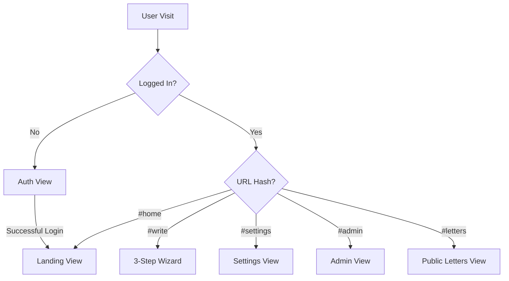
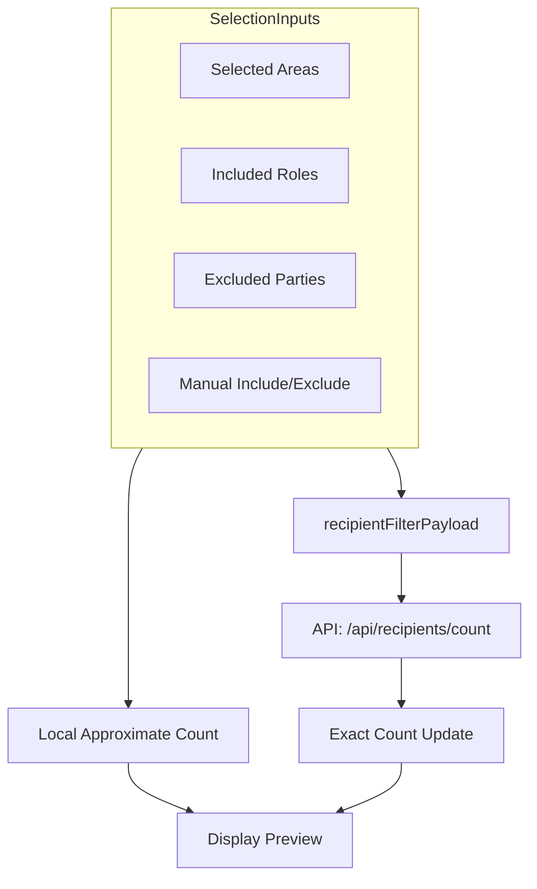
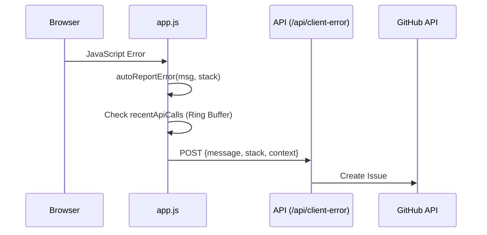

Relevant source files

The following files were used as context for generating this wiki page:

- [app/public/index.html](app/public/index.html)
- [app/public/app.js](app/public/app.js)
- [app/public/style.css](app/public/style.css)
- [app/public/components/step-review.js](app/public/components/step-review.js)
- [app/public/components/step-compose.js](app/public/components/step-compose.js)
- [README.md](README.md)
- [TODO.md](TODO.md)

# Frontend Architecture

The frontend of the Politiker-webapp is a lightweight, Single Page Application (SPA) built using vanilla JavaScript, HTML5, and CSS3. It is served by a Cloudflare Worker and interacts with a backend API also hosted on Cloudflare Workers. The architecture avoids heavy frontend frameworks, prioritizing speed and low overhead while providing complex features like a three-step wizard for letter composition, AI-assisted drafting, and a comprehensive administrative dashboard.

The application follows a modular structure where `app/public/app.js` serves as the primary entry point for client-side logic, managing global state, routing via URL hashes, and coordinating between various functional views and dynamic components. The UI is divided into four main functional areas: an authentication view, a landing/wizard flow, a settings panel, and an admin interface.

Sources: [README.md:65-71](README.md#L65-L71), [app/public/app.js:1071-1085](app/public/app.js#L1071-L1085), [TODO.md:23-28](TODO.md#L23-L28)

## Core Component Structure

The frontend is organized into distinct views managed by toggling the `hidden` attribute of DOM elements. While much of the logic resides in a central script, specific complex logic for the 3-step wizard is modularized into external component files.

### Main View Navigation
The application uses a hash-based navigation system to switch between different high-level views.

Sources: [app/public/app.js:1071-1085](app/public/app.js#L1071-L1085), [app/public/app.js:1225-1246](app/public/app.js#L1225-L1246)

### Component Modules
The project utilizes ES modules to separate complex UI rendering logic from the main application flow.

| Component File | Responsibility |
| :--- | :--- |
| `step-select-recipients.js` | Renders cards for level selection (EU, Riksdag, etc.). |
| `step-compose.js` | Manages file attachment lists and text extraction modes. |
| `step-review.js` | Generates the final summary before sending. |
| `step-landing.js` | Renders the initial start screen for logged-in users. |

Sources: [app/public/app.js:274-278](app/public/app.js#L274-L278), [app/public/app.js:985-992](app/public/app.js#L985-L992), [app/public/components/step-compose.js:8-39](app/public/components/step-compose.js#L8-L39), [app/public/components/step-review.js:7-36](app/public/components/step-review.js#L7-L36)

## State and Data Flow

The application maintains a centralized set of global variables in `app.js` to track user selections, recipient filters, and application state.

### Recipient Filtering Logic
The filtering system allows users to combine geographic areas, political roles, and party exclusions. The recipient count is calculated both locally for immediate feedback and via an API call for server-side deduplication.

Sources: [app/public/app.js:10-20](app/public/app.js#L10-L20), [app/public/app.js:534-548](app/public/app.js#L534-L548), [app/public/app.js:555-585](app/public/app.js#L555-L585)

## 3-Step Wizard Flow

The primary user journey is the letter-writing wizard, which guides the user through recipient selection, content composition (including AI drafting), and final review.

### Step 1: Recipient Selection
Uses a combination of high-level category cards and an "Advanced" section for granular filtering by area, role, or party.
- **Functions:** `renderAreas()`, `renderRoleFilterList()`, `renderPartyExcludeList()`.
- **API Endpoints:** `/api/areas`, `/api/parties`, `/api/roles`, `/api/politicians/search`.

### Step 2: Letter Composition
Allows for manual text entry or AI-assisted drafting. It also handles file uploads with two modes: "attach" (send as attachment) or "extract" (convert content to letter text).
- **Functions:** `draftLetter()`, `renderFileModeList()`.
- **AI Integration:** Hits `/api/draft-letter` which uses Anthropic Claude to generate content based on a topic and search results.

### Step 3: Review & Send
Displays a final summary of the recipients and letter content. The sending process involves generating a job in the background.
- **Functions:** `renderReview()`, `send-btn.click`.
- **API Endpoints:** `/api/send`, `/api/send-jobs`.

Sources: [app/public/app.js:296-368](app/public/app.js#L296-L368), [app/public/app.js:636-663](app/public/app.js#L636-L663), [app/public/components/step-review.js:7-36](app/public/components/step-review.js#L7-L36), [README.md:27-38](README.md#L27-L38)

## Technical Implementations

### Error Reporting and Context
The frontend includes an autonomous error reporter that captures unhandled exceptions and promise rejections, sending them to `/api/client-error` to create GitHub issues.

Sources: [app/public/app.js:46-68](app/public/app.js#L46-L68), [app/public/app.js:90-101](app/public/app.js#L90-L101)

### Theme and Internationalization (i18n)
- **Theme:** Supports "dark" (default), "light", and "system" modes using CSS variables and the `data-theme` attribute on the `<html>` element.
- **i18n:** Supports 18 languages with automatic detection and manual overrides. Translations are applied via a `t()` function and `data-i18n` attributes.

Sources: [app/public/app.js:23-41](app/public/app.js#L23-L41), [app/public/index.html:15-32](app/public/index.html#L15-L32), [README.md:43-46](README.md#L43-L46)

### Configuration & Deployment
The frontend assets and routing are configured via `wrangler.jsonc`.
- **Durable Objects:** Used for rate limiting (token bucket) per mail connection.
- **Static Assets:** Served via Cloudflare Workers static asset layer.
- **SPA Fallback:** Configured to handle Single Page Application routing, ensuring `/api/*` routes are handled by the worker while other paths return the index.

Sources: [app/package.json:7-14](app/package.json#L7-L14), [README.md:162-171](README.md#L162-L171), [TODO.md:58-60](TODO.md#L58-L60)

## Summary
The Politiker-webapp frontend architecture is designed for simplicity and efficiency. By utilizing vanilla JavaScript and native browser APIs (like `fetch`, `Set`, `Map`, and `dialog`), it minimizes dependency management while delivering a robust, secure, and multilingual user experience. The modularity of the wizard steps and the centralized state management in `app.js` provide a clear path for future refactoring into more granular domain modules.

Sources: [TODO.md:23-28](TODO.md#L23-L28), [app/public/app.js:10-20](app/public/app.js#L10-L20)
