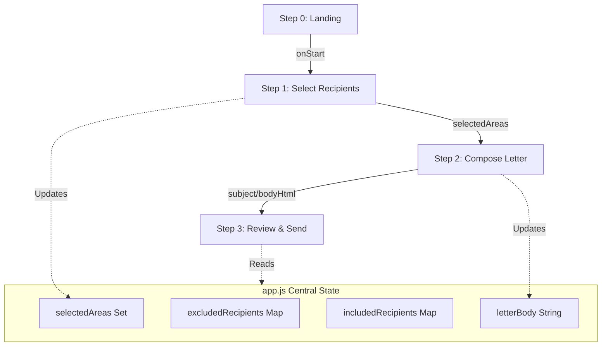
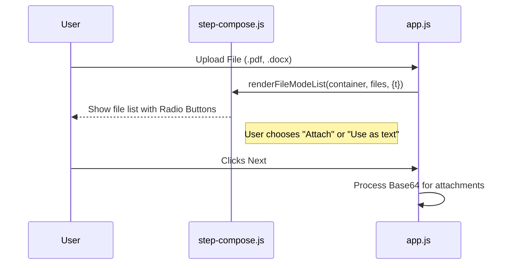
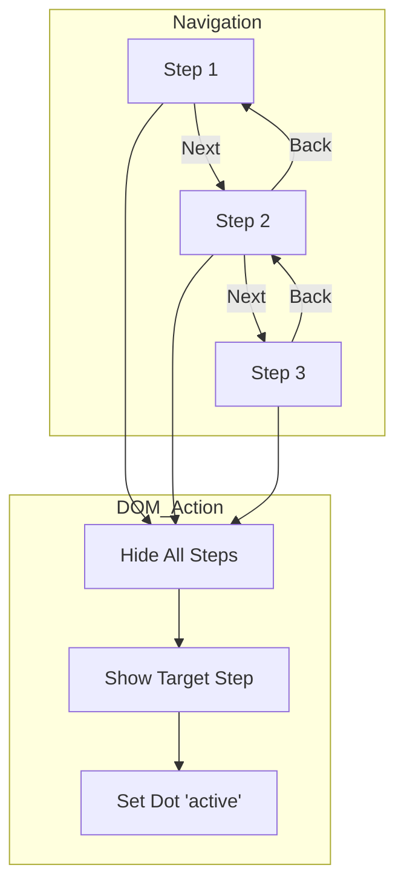

Relevant source files

The following files were used as context for generating this wiki page:

- [app/public/components/step-landing.js](app/public/components/step-landing.js)
- [app/public/components/step-select-recipients.js](app/public/components/step-select-recipients.js)
- [app/public/components/step-compose.js](app/public/components/step-compose.js)
- [app/public/components/step-review.js](app/public/components/step-review.js)
- [app/public/app.js](app/public/app.js)
- [app/public/index.html](app/public/index.html)

# Wizard Web Components

The Wizard Web Components form the core user interface for the citizen communication workflow in the Politiker-webapp. These components are designed as a modular, 3-step sequence that guides users through selecting political recipients, composing a personalized letter, and reviewing the final message before transmission through their own email account. Sources: [README.md](README.md), [app/public/app.js:1010-1015](app/public/app.js#L1010-L1015)

Architecturally, the wizard is implemented using a "vanilla" JavaScript approach where state management is handled by a central controller (`app.js`) while the visual structure and DOM manipulation for each step are delegated to specialized component modules. Sources: [AGENTS.md](AGENTS.md), [app/public/components/step-landing.js:1-5](app/public/components/step-landing.js#L1-L5)

## Component Architecture and Data Flow

The wizard operates as a single-page application (SPA) module where different "steps" are shown or hidden based on user progression. The state (selected areas, recipients, letter body) is maintained globally in `app.js` and passed to the components during the rendering phase. Sources: [app/public/app.js:1052-1057](app/public/app.js#L1052-L1057), [app/public/components/step-landing.js:1-5](app/public/components/step-landing.js#L1-L5)

### Application State Flow
The following diagram illustrates how data flows from the initial landing page through the three functional steps of the wizard.

Sources: [app/public/app.js:6-14](app/public/app.js#L6-L14), [app/public/app.js:1052-1060](app/public/app.js#L1052-L1060)

## Wizard Modules

### Step 0: Landing Component
The landing component (`step-landing.js`) serves as the entry point for authenticated users. It provides a "Hero" section with a call-to-action to begin the wizard and an overview of the process. Sources: [app/public/components/step-landing.js:1-10](app/public/components/step-landing.js#L1-L10)

*  **Function:** `renderLanding(container, { t, onStart })`
*  **Purpose:** Builds the introductory UI including the process steps (`landing_step1`, `landing_step2`, `landing_step3`).
*  **Interaction:** Triggers the `onStart` callback which executes `startWizard()` in the main application logic.
Sources: [app/public/components/step-landing.js:7-40](app/public/components/step-landing.js#L7-L40), [app/public/app.js:1027-1034](app/public/app.js#L1027-L1034)

### Step 1: Recipient Selection
Recipient selection is managed through a combination of high-level category cards and advanced filtering. The `renderAreaTypeCards` function displays categories like EU, Riksdag, and Municipalities with real-time recipient counts. Sources: [app/public/app.js:313-333](app/public/app.js#L313-L333)

| Feature | Description | File Reference |
| :--- | :--- | :--- |
| **Area Cards** | Displays categories (EU, Region, etc.) with cumulative counts. | `step-select-recipients.js` |
| **Search** | Real-time politician lookup with add/exclude functionality. | `app.js:521-590` |
| **Advanced Filters** | Detailed selection of specific municipalities or party exclusions. | `app.js:463-518` |

### Step 2: Composition and Attachments
The composition step allows users to write their letter or use AI to draft an utkast. The `step-compose.js` component specifically handles the display of file attachments and allows users to choose between attaching a file or extracting its text for the letter body. Sources: [app/public/components/step-compose.js:1-8](app/public/components/step-compose.js#L1-L8)

Sources: [app/public/components/step-compose.js:10-40](app/public/components/step-compose.js#L10-L40), [app/public/app.js:705-725](app/public/app.js#L705-L725)

### Step 3: Review and Send
The final step (`step-review.js`) provides a read-only summary of the intended message. It visualizes the final recipient count, the levels of government targeted, and a preview of the letter body. Sources: [app/public/components/step-review.js:1-5](app/public/components/step-review.js#L1-L5)

*  **Function:** `renderReview(container, { recipientCount, typeLabels, subject, bodyHtml, t })`
*  **Key Logic:** It escapes HTML for the subject and body to ensure safe rendering in the preview card. Sources: [app/public/components/step-review.js:7-38](app/public/components/step-review.js#L7-L38)

## Implementation Details

### State Management and Transitions
Step transitions are handled by `goToStep(n)`, which toggles the `hidden` attribute on step containers and updates the `wizard-step-dot` indicators. Sources: [app/public/app.js:1115-1123](app/public/app.js#L1115-L1123)

Sources: [app/public/app.js:1115-1123](app/public/app.js#L1115-L1123), [app/public/index.html:132-136](app/public/index.html#L132-L136)

### AI Integration in Step 2
The wizard includes an AI drafting feature triggered by the `ai-draft-btn`. It sends a request to `/api/draft-letter` with the user's topic and a hint about the selected `areaType` to adjust the tone of the draft. Sources: [app/public/app.js:743-772](app/public/app.js#L743-L772)

## Summary
The Wizard Web Components provide a structured, user-centric flow for complex political communication. By separating the presentation of individual steps into discrete modules (`step-landing.js`, `step-compose.js`, etc.) while maintaining state in `app.js`, the system ensures a responsive and navigable experience that supports advanced features like AI-assisted drafting and multi-format attachment handling. Sources: [app/public/app.js:1010-1025](app/public/app.js#L1010-L1025), [TODO.md:10-18](TODO.md#L10-L18)
