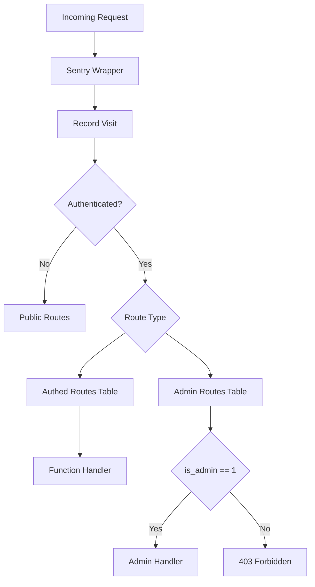
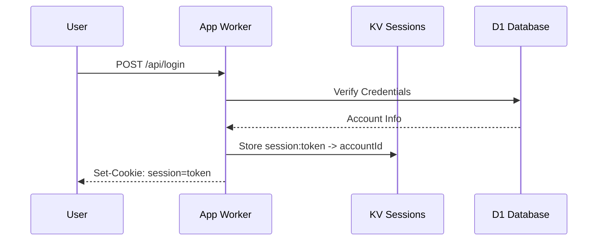
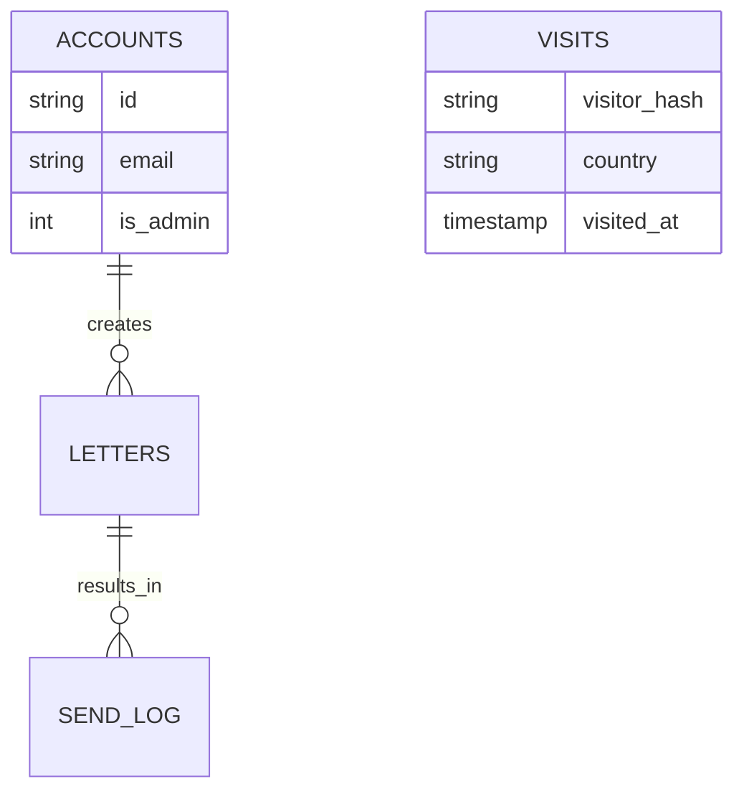

Relevant source files

The following files were used as context for generating this wiki page:

- [app/src/index.ts](app/src/index.ts)
- [app/src/civic-outreach.ts](app/src/civic-outreach.ts)
- [app/src/admin-stats.ts](app/src/admin-stats.ts)
- [app/public/app.js](app/public/app.js)
- [README.md](README.md)
- [AGENTS.md](AGENTS.md)

# App API & Routing

The **App API & Routing** system serves as the central orchestration layer for the "politiker-webapp". Built on Cloudflare Workers, it handles static asset delivery, user authentication, data retrieval for politicians and areas, and the coordination of asynchronous mail sending jobs. The system bridges the vanilla JavaScript frontend with various backend services, including Cloudflare D1 (SQL database), KV (session storage), and Sentry for error tracking.

Sources: [app/src/index.ts](app/src/index.ts), [README.md](README.md), [AGENTS.md](AGENTS.md)

## Architecture Overview

The backend is implemented as a Cloudflare Worker that processes incoming HTTP requests through a specialized fetch handler. It employs a mix of table-driven routing for standardized JSON endpoints and explicit handlers for complex flows like OAuth and file uploads.

The application uses Sentry for comprehensive error tracking and logs API failures to a internal `worker_errors` table for triage.
Sources: [app/src/index.ts:77-133](app/src/index.ts#L77-L133), [app/src/index.ts:544-555](app/src/index.ts#L544-L555)

## Routing Mechanisms

The project utilizes two primary routing strategies within `app/src/index.ts`:

### 1. Table-Driven Routing
Standardized API endpoints are defined in `AUTHED_ROUTES` and `ADMIN_ROUTES` arrays. These use regular expressions for path matching and specific HTTP methods to trigger handlers.

| Route Table | Purpose | Security Requirement |
| :--- | :--- | :--- |
| `AUTHED_ROUTES` | General user operations (API keys, mail creds, sending) | Valid Session or API Key |
| `ADMIN_ROUTES` | System-wide management (Stats, accounts, exports) | `is_admin = 1` flag on account |

Sources: [app/src/index.ts:153-171](app/src/index.ts#L153-L171), [app/src/index.ts:316-324](app/src/index.ts#L316-L324)

### 2. Explicit Handlers
Complex routes that require specific cookie manipulation, redirects, or third-party integrations (OAuth) are handled explicitly within the `handleRequest` function. This includes:
*  **OAuth Flows:** `/api/oauth/:provider/start` and `callback`.
*  **Civic Outreach:** `/api/civic-letter/:id/approve` or `reject`.
*  **Authentication:** `/api/login`, `/api/signup`, and `/api/logout`.

Sources: [app/src/index.ts:400-475](app/src/index.ts#L400-L475)

## Key API Modules

### Authentication and Session Management
Authentication supports both traditional email/password (hashed with PBKDF2) and OAuth (Google, GitHub, Microsoft). Sessions are managed via tokens stored in Cloudflare KV.

Sources: [app/src/index.ts:494-510](app/src/index.ts#L494-L510), [AGENTS.md](AGENTS.md), [app/public/app.js:106-125](app/public/app.js#L106-L125)

### Mail Credentials & Sending
The API manages user-provided SMTP and Microsoft Graph credentials. These are used to enqueue jobs into the `politiker-send-jobs` Queue.

*  **Endpoint:** `POST /api/send`
*  **Logic:** Validates attachments, stores the letter in D1, and creates a send job.
*  **Security:** SMTP passwords are encrypted using AES-GCM before storage.

Sources: [app/src/index.ts:275-303](app/src/index.ts#L275-L303), [SECURITY.md](SECURITY.md)

### Civic Outreach & Kvartalsbrev
This module handles autonomous campaign drafting and human-in-the-loop approval for quarterly letters sent to all politicians.

| Function | Endpoint | Description |
| :--- | :--- | :--- |
| `createCivicLetterDraft` | `POST /api/admin/civic-letter` | Creates a pending draft for review |
| `approveCivicLetterDraft` | `/api/civic-letter/:id/approve` | Validates token and marks draft as `approved` |
| `setCivicLetterStatus` | `POST /api/admin/civic-letter/:id/status` | Transitions status from `approved` to `sending` |

Sources: [app/src/civic-outreach.ts:33-46](app/src/civic-outreach.ts#L33-L46), [app/src/index.ts:340-366](app/src/index.ts#L340-L366)

## Administrative System

The admin panel provides real-time statistics and data management. It uses the `admin-stats.ts` module to aggregate data from multiple tables.

*  **Time Series:** Supports granularities from `minute` to `year` for tracking visitors and sent emails.
*  **Exports:** Provides CSV/JSON exports for accounts, feedback, and politician data.

Sources: [app/src/admin-stats.ts:79-115](app/src/admin-stats.ts#L79-L115), [app/src/index.ts:373-392](app/src/index.ts#L373-L392)

## Error Handling & Telemetry
The API implements automatic client and server error reporting.
*  **Client Errors:** Captured in `app.js` and POSTed to `/api/client-error`, which creates GitHub issues.
*  **Server Errors:** API failures (Status >= 400, excluding 401/404) are binded to the `worker_errors` table in D1.
*  **Security Headers:** The router explicitly deletes `Speculation-Rules` to prevent speculative pre-fetching of sensitive OAuth links and sets `Strict-Transport-Security`.

Sources: [app/public/app.js:52-75](app/public/app.js#L52-L75), [app/src/index.ts:98-124](app/src/index.ts#L98-L124)

## Summary
The App API & Routing system is a robust, security-focused orchestrator. It manages the lifecycle of a political contact campaign—from user onboarding and politician selection to the secure handling of mail credentials and the execution of autonomous outreach initiatives. Its use of Cloudflare's edge capabilities (D1, KV, Queues) ensures high availability and performance while maintaining strict data isolation between user accounts.
