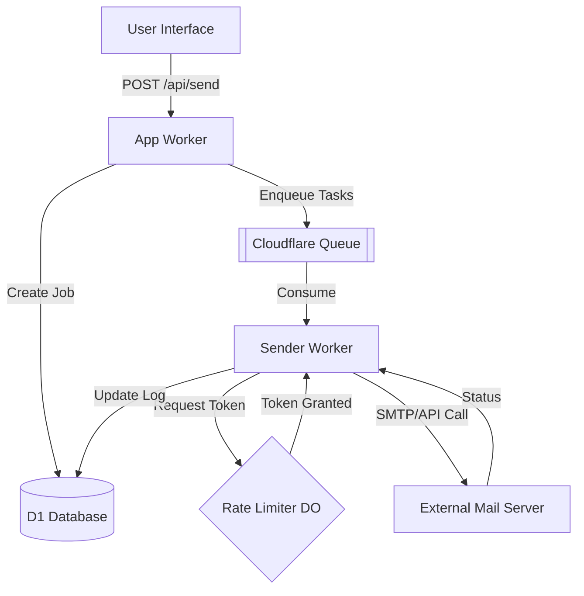
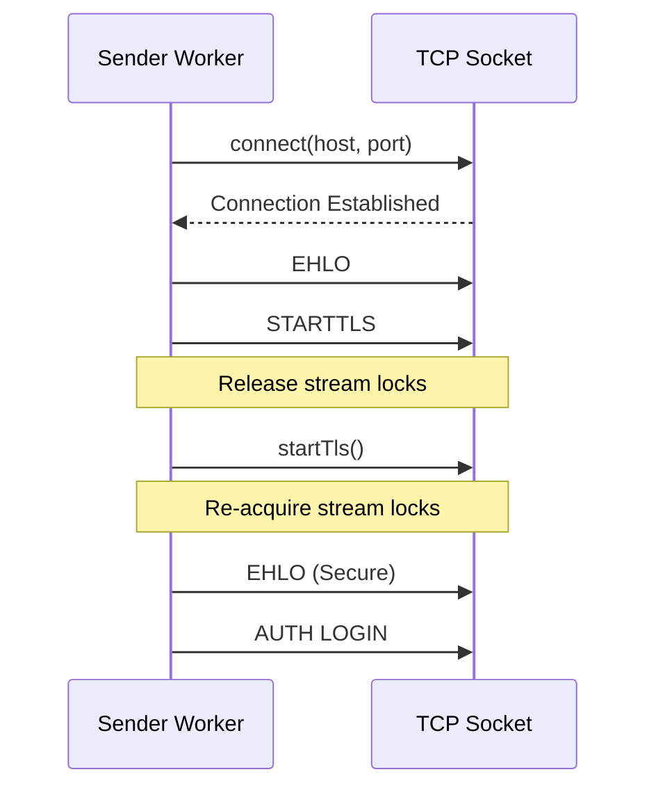

Relevant source files

The following files were used as context for generating this wiki page:

- [AGENTS.md](AGENTS.md)
- [README.md](README.md)
- [app/src/index.ts](app/src/index.ts)
- [shared/smtp.ts](shared/smtp.ts)
- [infra/schema.sql](infra/schema.sql)
- [sender/package.json](sender/package.json)
- [campaign/src/quarterly-campaign.ts](campaign/src/quarterly-campaign.ts)

# Sender Worker & Mail Queues

The **Sender Worker** is a specialized Cloudflare Worker designed as a queue consumer responsible for the actual delivery of emails. It decouples the web interface and API logic from the potentially slow and error-prone process of communicating with external mail servers. By utilizing Cloudflare Queues, the system ensures asynchronous delivery, allowing users to trigger large send jobs without waiting for individual SMTP handshakes to complete.

Sources: [AGENTS.md:14-16](AGENTS.md#L14-L16), [README.md:68-69](README.md#L68-L69)

This system supports multiple delivery methods, including generic SMTP, provider-specific presets (Gmail, Outlook, iCloud, Yahoo), and passwordless Microsoft Graph API integration. It also implements sophisticated rate limiting to protect user accounts from being flagged by providers for exceeding daily sending limits.

Sources: [README.md:38-41](README.md#L38-L41), [infra/schema.sql:39-41](infra/schema.sql#L39-L41)

## System Architecture

The mail delivery architecture is split between the main `app` Worker, which handles user input and job creation, and the `sender` Worker, which consumes the queue.

### Core Components

| Component | Responsibility |
| :--- | :--- |
| **Main App Worker** | Validates recipients, encrypts credentials, and enqueues send jobs via `/api/send`. |
| **Cloudflare Queue** | Acts as the buffer between the API and the delivery engine. |
| **Sender Worker** | Consumes the queue, manages rate limits, and performs the actual SMTP/Graph dispatch. |
| **Durable Objects** | Implements a "token bucket" per mail connection to ensure true shared rate limiting across parallel workers. |
| **Cloudflare D1** | Stores the `send_jobs` and `send_log` for tracking and status reporting. |

Sources: [AGENTS.md:14-16](AGENTS.md#L14-L16), [README.md:46-48](README.md#L46-L48), [app/src/index.ts:255-285](app/src/index.ts#L255-L285)

### Data Flow Diagram
The following diagram illustrates the flow from a user submitting a letter to the final delivery through the Sender Worker.

Sources: [AGENTS.md:14-16](AGENTS.md#L14-L16), [README.md:46-48](README.md#L46-L48), [infra/schema.sql:92-114](infra/schema.sql#L92-L114)

## Queue Management and Jobs

Large-scale mailings are broken down into `send_jobs`. Each job represents a single mailing campaign from a user to a filtered set of politicians.

### Send Job Lifecycle
1.  **Pending**: The job is created in D1 and tasks are added to the Cloudflare Queue.
2.  **Sending**: The Sender Worker is actively processing messages from the queue.
3.  **Done/Aborted**: All messages have been processed or the job was cancelled.

Sources: [infra/schema.sql:92-101](infra/schema.sql#L92-L101), [app/src/index.ts:279-281](app/src/index.ts#L279-L281)

### Send Log Schema
Every attempt to send an email is logged in the `send_log` table to provide audit trails and bounce tracking.

| Field | Type | Description |
| :--- | :--- | :--- |
| `id` | TEXT | Primary key (UUID). |
| `send_job_id` | TEXT | Reference to the parent job. |
| `recipient_email` | TEXT | The destination address. |
| `status` | TEXT | `ok` or `bounce`. |
| `error` | TEXT | Detailed error message if the send failed. |

Sources: [infra/schema.sql:104-114](infra/schema.sql#L104-L114)

## SMTP Delivery Engine

The system uses a custom-built SMTP client implemented using the `cloudflare:sockets` API. This allows the worker to establish raw TCP connections to mail servers.

### SMTP Protocol Implementation
The client supports standard SMTP features required for modern delivery:
-  **STARTTLS**: Upgrading insecure connections on port 587.
-  **Direct TLS**: Connecting securely on port 465.
-  **AUTH LOGIN**: Authenticating using Base64 encoded credentials.
-  **MIME Construction**: Building multipart messages to support HTML bodies and file attachments (PDF, txt, doc, docx).

Sources: [shared/smtp.ts:1-20](shared/smtp.ts#L1-L20), [README.md:44-45](README.md#L44-L45)

### Connection Logic
A critical implementation detail for Cloudflare Workers is the handling of stream locks during TLS upgrades. Before calling `socket.startTls()`, the existing writer/reader locks must be released using `.releaseLock()`.

Sources: [shared/smtp.ts:10-14](shared/smtp.ts#L10-L14), [shared/smtp.ts:46-55](shared/smtp.ts#L46-L55)

## Rate Limiting and Safety

To protect the user's personal mail account from being blocked by providers (Gmail, Outlook, etc.), the system enforces a strict "safety ceiling."

### Provider Ceilings
The platform calculates a daily limit that is typically **10% below** the provider's known limit. Users can further lower this via a `user_cap_pct` setting (e.g., only using 50% of the allowed daily quota).

| Provider | Limit Policy |
| :--- | :--- |
| **Generic SMTP** | Defined by the user or preset. |
| **Microsoft Graph** | Hardcoded limit applied via API. |
| **Gmail/Outlook/iCloud** | 10% below known provider limits. |

Sources: [README.md:38-41](README.md#L38-L41), [infra/schema.sql:56-59](infra/schema.sql#L56-L59), [app/src/index.ts:210-218](app/src/index.ts#L210-L218)

### Distributed Rate Limiting
Since Cloudflare Workers are distributed, the system uses **Durable Objects** to provide a centralized "token bucket" for each mail credential. This ensures that even if multiple worker instances are sending emails in parallel, they respect the global rate limit for that specific SMTP account.

Sources: [README.md:46-48](README.md#L46-L48), [AGENTS.md:14-16](AGENTS.md#L14-L16)

## Quarterly Campaign Queues

Beyond user-initiated mailings, the system includes an autonomous **Campaign Worker** that manages large-scale quarterly mailings to approximately 17,000 politicians.

### Quarterly Drain Logic
Unlike standard user mailings that use Gmail or SMTP, quarterly campaigns are drained via the **Cloudflare Email Service**. To manage costs and provider limits, the system implements a "drain" that runs 4 times per day, processing 300 emails per run. This allows the entire country's political database to be contacted over approximately two weeks.

Sources: [campaign/src/quarterly-campaign.ts:100-112](campaign/src/quarterly-campaign.ts#L100-L112), [campaign/src/quarterly-campaign.ts:121-135](campaign/src/quarterly-campaign.ts#L121-L135)

### Safety Caps for Campaigns
A hard monthly cap (`MONTHLY_SEND_CAP = 25,000`) is enforced to prevent runaway costs or logic loops from sending excessive emails.

Sources: [campaign/src/quarterly-campaign.ts:114-129](campaign/src/quarterly-campaign.ts#L114-L129)

## Conclusion

The Sender Worker and its associated queuing infrastructure provide a robust, asynchronous delivery system for the Politiker-webapp. By combining Cloudflare Queues for task buffering, a custom SMTP implementation for raw socket communication, and Durable Objects for distributed rate limiting, the system achieves reliable mail delivery while strictly adhering to external provider constraints and protecting user account reputation.
