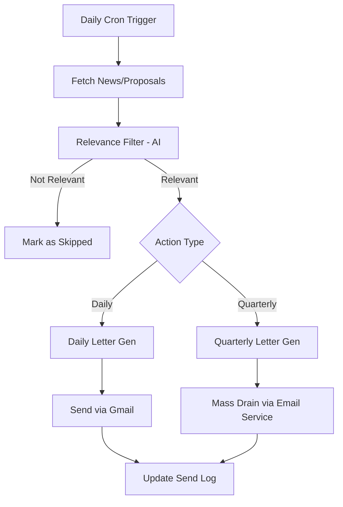
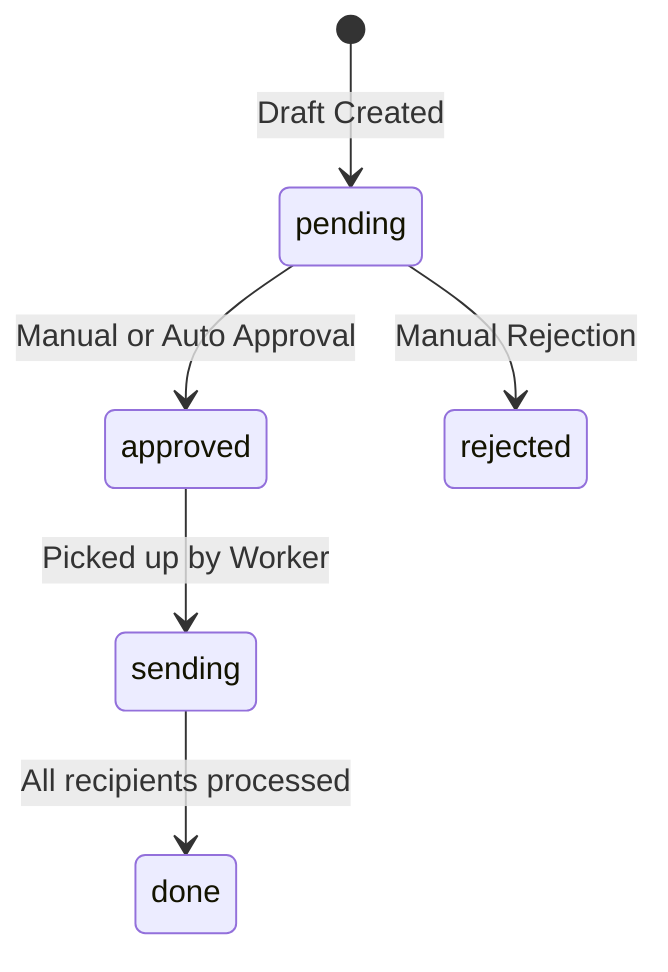

Relevant source files

The following files were used as context for generating this wiki page:

- [README.md](README.md)
- [AGENTS.md](AGENTS.md)
- [campaign/src/quarterly-campaign.ts](campaign/src/quarterly-campaign.ts)
- [campaign/src/letter-generator.ts](campaign/src/letter-generator.ts)
- [infra/schema.sql](infra/schema.sql)
- [app/src/civic-outreach.ts](app/src/civic-outreach.ts)

# Autonomous Campaign Worker

The **Autonomous Campaign Worker** is a specialized, cron-driven Cloudflare Worker designed to automate civic advocacy without human intervention. It operates by monitoring news sources and parliamentary proceedings, identifying socially relevant issues through AI analysis, and generating personalized correspondence to elected officials at various government levels.

The system handles two primary workflows: a daily cycle that targets specific politicians based on breaking news, and a quarterly mass-outreach campaign that addresses systemic societal problems. It leverages the Anthropic Claude API for content generation and relevance filtering, while utilizing Cloudflare D1 for state management and Cloudflare Email Service for high-volume delivery.

Sources: [README.md:46-51](README.md#L46-L51), [campaign/src/quarterly-campaign.ts:8-13](campaign/src/quarterly-campaign.ts#L8-L13)

## Architecture and Execution

The campaign worker is executed daily via a cron trigger between 05:00 and 09:00 UTC. It is architected as an independent module within the `campaign/` directory, separate from the main user-facing application.

### Tech Stack Integration
*  **Runtime**: Cloudflare Workers.
*  **Database**: Cloudflare D1 (SQLite) for tracking monitored items and letter drafts.
*  **AI Engine**: Anthropic Claude (Claude 3.5 Sonnet and Claude 3 Haiku).
*  **Mail Delivery**: Gmail for daily targeted letters and Cloudflare Email Service for quarterly mass campaigns.

Sources: [README.md:46-51](README.md#L46-L51), [AGENTS.md:12-16](AGENTS.md#L12-L16), [campaign/src/quarterly-campaign.ts:108-111](campaign/src/quarterly-campaign.ts#L108-L111)

### System Flow
The following diagram illustrates the high-level process of the daily and quarterly campaign routines.

Sources: [campaign/src/letter-generator.ts:48-103](campaign/src/letter-generator.ts#L48-L103), [campaign/src/quarterly-campaign.ts:21-105](campaign/src/quarterly-campaign.ts#L21-L105)

## Daily Campaign Logic (Letter Generator)

The `runLetterGenerator` function manages the processing of new items from the `monitored_items` table. It limits processing to a configurable number of items per run to prevent API or rate limit exhaustion.

### Relevance Filtering
Before generating a letter, the system uses the `ANTHROPIC_HAIKU` model to determine if a news item or parliamentary motion concerns specific social areas such as healthcare, housing, education, or justice. Technical or environmental issues without a social connection are explicitly skipped.
Sources: [campaign/src/letter-generator.ts:18-31](campaign/src/letter-generator.ts#L18-L31)

### Target Selection
When an item is deemed relevant, the system selects targets based on the item's scope:
*  **Riksdag items**: A random selection of national parliament members.
*  **Regional items**: Politicians from the specific region mentioned in the news item.
*  **Communication**: A small set of local municipal (kommun) politicians are added to every campaign to ensure local awareness.

Sources: [campaign/src/letter-generator.ts:60-77](campaign/src/letter-generator.ts#L60-L77)

### Letter Generation
Letters are generated in the first person, adopting the persona of a "critical and engaged Swedish citizen." The prompt instructs the AI to:
1.  Address the politician by name.
2.  Describe the failure of the system regarding the specific issue.
3.  Cite facts from international or national bodies (e.g., SCB, OECD, WHO).
4.  Demand specific actions and timeframes.

Sources: [campaign/src/letter-generator.ts:33-47](campaign/src/letter-generator.ts#L33-L47)

## Quarterly Mass Campaign

The quarterly campaign is a broader advocacy effort designed to reach all ~17,000 politicians in Sweden with a single, comprehensive letter summarizing the quarter's most critical social issues.

### Research and Content Creation
The worker retrieves up to 40 monitored items that were previously marked for correspondence. It then uses the `ANTHROPIC_SONNET` model to synthesize these into a 500–700 word letter. Unlike the daily letters, the quarterly letter uses a generic salutation ("Till dig som förtroendevald") because it is sent to all levels of government simultaneously.
Sources: [campaign/src/quarterly-campaign.ts:21-72](campaign/src/quarterly-campaign.ts#L21-L72)

### Distribution Strategy (Quarterly Drain)
Because mass distribution to 17,000+ recipients exceeds Gmail's quotas, the quarterly campaign uses a "drain" mechanism:
*  **Recipient Queueing**: All eligible politicians are inserted into the `campaign_recipients` table.
*  **Throttled Delivery**: The `runQuarterlyDrain` function sends a maximum of 300 emails per run (4 times per day).
*  **Safety Cap**: A hard monthly cap of 25,000 emails prevents runaway costs or potential bot-loop incidents.

Sources: [campaign/src/quarterly-campaign.ts:108-125](campaign/src/quarterly-campaign.ts#L108-L125), [campaign/src/quarterly-campaign.ts:140-145](campaign/src/quarterly-campaign.ts#L140-L145)

## Data Structures

The campaign system relies on several tables in the Cloudflare D1 database for persistence and safety.

### Campaign Recipient States
The `campaign_recipients` table (dynamically utilized in quarterly logic) and the `send_log` table track the status of each communication attempt.

| Field | Type | Description |
| :--- | :--- | :--- |
| `status` | TEXT | `pending`, `sent`, `failed`, or `bounced`. |
| `politician_email` | TEXT | The target address. |
| `draft_id` | TEXT | Reference to the generated letter content. |
| `error` | TEXT | Stores the error message if delivery fails. |

Sources: [infra/schema.sql:109-118](infra/schema.sql#L109-L118), [campaign/src/quarterly-campaign.ts:140-150](campaign/src/quarterly-campaign.ts#L140-L150)

### Governance and Approvals
While the campaign worker is largely autonomous, it utilizes the `civic_letter_drafts` table which supports an approval-based workflow if manual oversight is required.

Sources: [infra/schema.sql:109-118](infra/schema.sql#L109-L118), [app/src/civic-outreach.ts:106-114](app/src/civic-outreach.ts#L106-L114)

## Configuration and Safety Limits

The system defines hard-coded constants to ensure operational stability and cost control.

| Constant | Value | Source File |
| :--- | :--- | :--- |
| `MAX_ITEMS` | 5 | `campaign/src/letter-generator.ts` |
| `MAX_MAIN` | 10 | `campaign/src/letter-generator.ts` |
| `DRAIN_PER_RUN` | 300 | `campaign/src/quarterly-campaign.ts` |
| `MONTHLY_SEND_CAP` | 25,000 | `campaign/src/quarterly-campaign.ts` |
| `RESEARCH_ITEMS` | 40 | `campaign/src/quarterly-campaign.ts` |

The `MONTHLY_SEND_CAP` is specifically implemented as a financial safeguard, limiting potential monthly costs for the Cloudflare Email Service to approximately $8 in a worst-case scenario.
Sources: [campaign/src/quarterly-campaign.ts:113-116](campaign/src/quarterly-campaign.ts#L113-L116), [campaign/src/letter-generator.ts:4-6](campaign/src/letter-generator.ts#L4-L6)

## Summary

The Autonomous Campaign Worker provides the project with a persistent, AI-driven advocacy layer. By combining daily targeted responses to news with quarterly broad-scale outreach, it ensures that socially relevant issues are consistently brought to the attention of politicians. The system is built with significant safeguards, including throttled delivery and monthly send caps, to maintain financial and operational stability.
