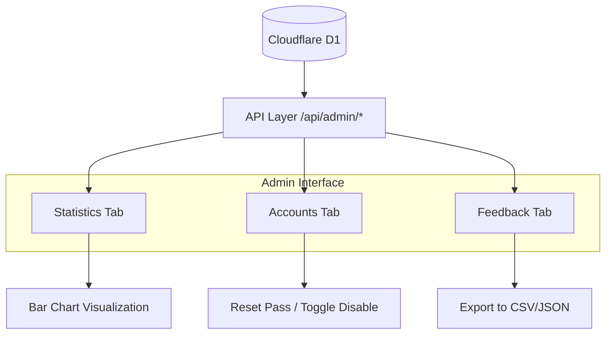
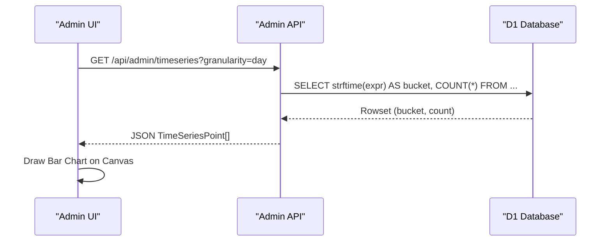

<details>
<summary>Relevant source files</summary>

The following files were used as context for generating this wiki page:

- [app/src/admin-stats.ts](app/src/admin-stats.ts)
- [app/public/app.js](app/public/app.js)
- [app/public/index.html](app/public/index.html)
- [README.md](README.md)
- [infra/healthcheck.py](infra/healthcheck.py)
</details>

# Admin Panel & Statistics

The Admin Panel is a restricted administrative interface designed to provide system oversight, user management, and data-driven insights for the Politiker-webapp platform. It allows administrators to monitor platform activity, handle user feedback, manage accounts, and export critical datasets for external analysis.

The system aggregates data from multiple sources, including account records, letter sending logs, and visitor traffic metrics. This information is visualized through interactive charts and summaries, ensuring that administrators can track the platform's health and usage patterns effectively. Access to this panel is strictly limited to users with the `isAdmin` flag and is further protected by infrastructure-level security such as Cloudflare Access.

Sources: [README.md:32-34](README.md#L32-L34), [app/public/app.js:1016-1019](app/public/app.js#L1016-L1019), [app/public/app.js:1134-1136](app/public/app.js#L1134-L1136)

## Architecture and Data Flow

The administrative system follows a typical client-server model within the Cloudflare Workers ecosystem. The frontend, built with vanilla JavaScript, communicates with the API to fetch statistics and perform administrative actions. The backend queries the Cloudflare D1 (SQLite) database to aggregate metrics across various tables.

### Administrative Data Components
The admin panel is organized into three primary functional areas:
1.  **Account Management**: CRUD operations and status monitoring for registered users.
2.  **Feedback & Error Tracking**: Reviewing user-submitted feedback and automated client-side error reports.
3.  **Analytics & Statistics**: Visualizing time-series data for visitors and mail activity.

The following diagram illustrates the flow of data from the database to the administrative interface:



The data flow involves aggregating raw logs into summarized metrics for the UI.
Sources: [app/src/admin-stats.ts:13-64](app/src/admin-stats.ts#L13-L64), [app/public/app.js:777-802](app/public/app.js#L777-L802)

## Account Management

The Accounts section provides a tabular view of all registered users. Administrators can monitor account status (verified, admin, or disabled) and perform corrective actions.

### Key Administrative Actions
*  **Toggle Account Status**: Enable or disable user accounts to control platform access.
*  **Password Resets**: Trigger administrative password resets for users.
*  **Account Deletion**: Permanently remove accounts and associated data.
*  **Data Export**: Export the full user list to CSV for auditing.

| Field | Description | Source |
| :--- | :--- | :--- |
| Email | The registered email address of the user. | [app/public/app.js:808](app/public/app.js#L808) |
| Status Badges | Visual indicators for "Verified", "Admin", or "Disabled" status. | [app/public/app.js:812-827](app/public/app.js#L812-L827) |
| Daily Cap | The current limit on how many emails the account can send per day. | [app/public/app.js:830](app/public/app.js#L830) |

Sources: [app/public/app.js:804-855](app/public/app.js#L804-L855), [app/src/admin-stats.ts:127-130](app/src/admin-stats.ts#L127-L130)

## Statistics and Analytics

The statistics module tracks platform growth and usage. It utilizes a combination of additive metrics (e.g., total letters sent) and unique identifiers (e.g., visitor hashes) to generate reports.

### Metric Aggregation Logic
The system calculates stats using SQL aggregation over the `accounts`, `letters`, `send_log`, and `visits` tables. Unique visitors are calculated using `COUNT(DISTINCT visitor_hash)` to ensure accuracy even if a single user refreshes the page multiple times.

```typescript
// Example of aggregation query for admin totals
// Sources: [app/src/admin-stats.ts:14-20]
const totals = await env.DB.prepare(
  `SELECT
     (SELECT COUNT(*) FROM accounts) as totalAccounts,
     (SELECT COUNT(*) FROM letters) as totalLetters,
     (SELECT COUNT(*) FROM send_log WHERE status = 'ok') as totalSent,
     (SELECT COUNT(*) FROM send_log WHERE status = 'bounce') as totalBounced`,
).first();
```

### Time-Series Visualization
The panel supports multiple time granularities (minute, hour, day, week, month, quarter, half, year) for charts. This is implemented by dynamically generating SQL `strftime` expressions based on the selected granularity.



This sequence ensures that fine-grained or long-term data can be viewed efficiently.
Sources: [app/src/admin-stats.ts:88-118](app/src/admin-stats.ts#L88-L118), [app/public/app.js:964-974](app/public/app.js#L964-L974)

## Data Export and System Monitoring

The admin panel facilitates data portability through multiple export formats and integrates with external monitoring scripts.

### Export Capabilities
Administrators can export data sections or the entire database state.
*  **Formats**: CSV (for tabular data like accounts/politicians) and JSON (for full system snapshots).
*  **Sections**: Accounts, Feedback, Stats, and a master list of all `politicians` (public officials).

### Healthcheck Integration
An external Python-based healthcheck script (`infra/healthcheck.py`) monitors the platform by querying administrative endpoints and the database directly. It checks for:
*  **HTTP Status**: Verifies that `/` and `/api/me` respond correctly.
*  **Worker Status**: Ensures both the main `app` and `sender` workers are active.
*  **Queue Health**: Identifies "stuck" send jobs that have been in a `pending` or `sending` state for more than 24 hours.

Sources: [app/src/admin-stats.ts:121-177](app/src/admin-stats.ts#L121-L177), [infra/healthcheck.py:46-95](infra/healthcheck.py#L46-L95)

## Summary

The Admin Panel & Statistics system acts as the operational hub for Politiker-webapp. By combining user management tools with robust SQL-based analytics and multi-format data exports, it allows for both high-level system monitoring and granular user support. The integration with external health checks ensures that technical issues, such as stuck mail queues or infrastructure misconfigurations, are identified and reported automatically.

Sources: [README.md:32-34](README.md#L32-L34), [app/src/admin-stats.ts:13-16](app/src/admin-stats.ts#L13-L16), [infra/healthcheck.py:97-105](infra/healthcheck.py#L97-L105)
