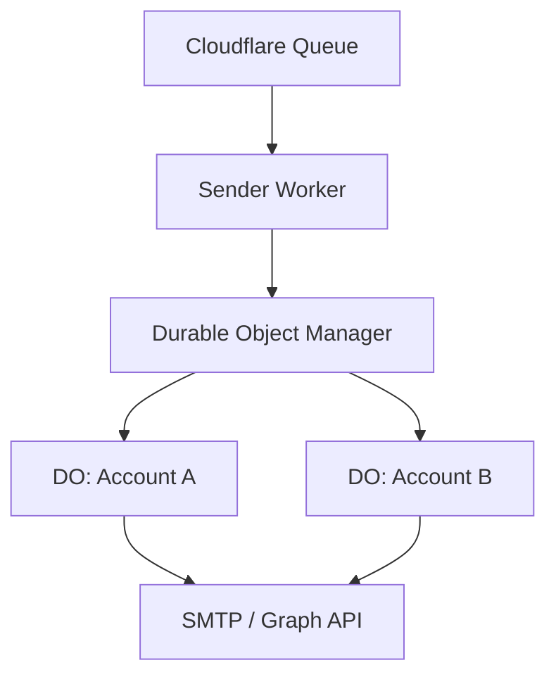
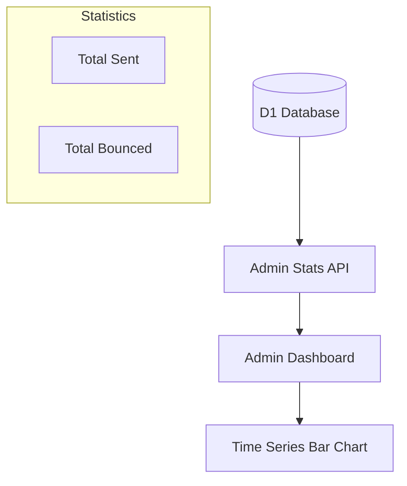

<details>
<summary>Relevant source files</summary>

The following files were used as context for generating this wiki page:

- [README.md](README.md)
- [TODO.md](TODO.md)
- [infra/schema.sql](infra/schema.sql)
- [app/public/app.js](app/public/app.js)
- [app/src/admin-stats.ts](app/src/admin-stats.ts)
- [infra/setup.sh](infra/setup.sh)
</details>

# Rate Limiting & Durable Objects

The rate limiting system in this project is designed to manage the sending frequency of emails to ensure compliance with third-party mail provider limits (such as Gmail, Outlook, or iCloud). By utilizing Cloudflare Durable Objects, the system maintains a consistent global state for each mail connection, even when multiple concurrent sending jobs are active across different worker instances.

The primary goal is to provide a "shared sending pace" (token bucket mechanism) per mail credential, preventing the platform from being flagged or blocked by providers due to excessive request rates. Each mail account is governed by its own independent rate limit, which is calculated based on known provider ceilings and user-defined preferences.

Sources: [README.md:19-21](README.md#L19-L21), [README.md:65-66](README.md#L65-L66)

## Core Architecture

The rate limiting architecture consists of a `sender` Worker that consumes tasks from a Cloudflare Queue and coordinates with a Durable Object to manage throughput.

### Token Bucket Logic
The system implements a token bucket algorithm where each mail credential (identified by its `mail_credential_id`) is associated with a specific Durable Object instance. This object manages the available tokens, representing the permission to send an email. If no tokens are available, the sending process waits for a token to be generated based on the provider's specific rate.

Sources: [README.md:19-21](README.md#L19-L21), [TODO.md:65-67](TODO.md#L65-L67)

### Architecture Overview
The following diagram illustrates the relationship between the sending queue, the sender worker, and the Durable Object instances.



*The diagram shows how individual Durable Object instances provide isolated rate limiting for different mail credentials.*
Sources: [README.md:65-66](README.md#L65-L66), [TODO.md:65-67](TODO.md#L65-L67)

## Provider Ceilings and User Constraints

Rate limits are not static; they are derived from a combination of hard-coded provider limits and user-adjustable settings.

### Calculation Logic
1.  **Provider Limit**: A known maximum daily limit for providers like Gmail or Outlook.
2.  **System Ceiling**: The platform sets a safety ceiling, typically 10% below the provider's known limit.
3.  **User Capacity Percentage**: Users can further restrict this limit (e.g., to 25%, 50%, 75%, or 100% of the system ceiling) to ensure the service does not exhaust their entire daily mail allowance for personal use.

Sources: [README.md:13-14](README.md#L13-L14), [app/public/app.js:192-205](app/public/app.js#L192-L205), [infra/schema.sql:37-43](infra/schema.sql#L37-L43)

### Mail Credential Data Model
The database tracks the calculated limits and user preferences within the `mail_credentials` table.

| Field | Type | Description |
| :--- | :--- | :--- |
| `daily_cap` | INTEGER | Calculated daily limit: `floor(provider_limit * user_cap_pct / 100)` |
| `user_cap_pct` | INTEGER | The percentage of the available ceiling the user wishes to utilize (Default: 100) |
| `provider` | TEXT | The mail provider (gmail, outlook, icloud, yahoo, generic, microsoft_graph) |

Sources: [infra/schema.sql:37-43](infra/schema.sql#L37-L43)

## Frontend Integration & Previews

The user interface provides real-time feedback on how selected settings will impact the sending rate.

### Rate Limit Preview
In the mail credential setup, users can see a preview of their daily limit before saving. This is handled by fetching `provider-ceilings` via the API and calculating the expected `cap` based on the selected provider and percentage.

```javascript
// app/public/app.js:200-205
async function updateCapPreview() {
  const provider = document.getElementById("provider-select").value;
  const ceilings = await loadProviderCeilings();
  const info = ceilings[provider];
  // ...
  const pct = resolveCapPctChoice();
  const cap = Math.max(1, Math.floor(info.ceiling * (pct / 100)));
  preview.textContent = t("msg_cap_preview", { ceiling: info.ceiling, limit: info.providerDailyLimit, pct, cap });
}
```

Sources: [app/public/app.js:192-205](app/public/app.js#L192-L205)

### Administrative Monitoring
Admins can monitor sending health and rate limit effectiveness through the admin panel, which tracks successful sends versus bounces.



*Admins track sending performance to ensure rate limits are preventing excessive bounces.*
Sources: [app/src/admin-stats.ts:7-14](app/src/admin-stats.ts#L7-L14), [app/public/app.js:770-800](app/public/app.js#L770-L800)

## Infrastructure and Provisioning

The Durable Objects and related infrastructure are provisioned using Wrangler. The `infra/setup.sh` script automates the creation of required namespaces and resources.

| Resource | Scope | Purpose |
| :--- | :--- | :--- |
| Durable Object | Per Credential | Manages the token bucket for individual mail accounts. |
| Cloudflare Queue | Global | Buffer for outgoing mail jobs to be processed by the Sender. |
| D1 Database | Global | Stores credentials, calculated caps, and sending logs. |

Sources: [infra/setup.sh:110-135](infra/setup.sh#L110-L135), [infra/schema.sql:85-115](infra/schema.sql#L85-L115)

## Conclusion

By combining Cloudflare Durable Objects with a token bucket algorithm, the platform achieves reliable, distributed rate limiting. This architecture ensures that even as the system scales or handles high volumes of concurrent requests, the integrity of the user's external mail account remains protected from provider-imposed penalties. The inclusion of user-defined capacity percentages further empowers users to manage their own sending footprint.

Sources: [README.md:19-21](README.md#L19-L21), [TODO.md:65-67](TODO.md#L65-L67)
