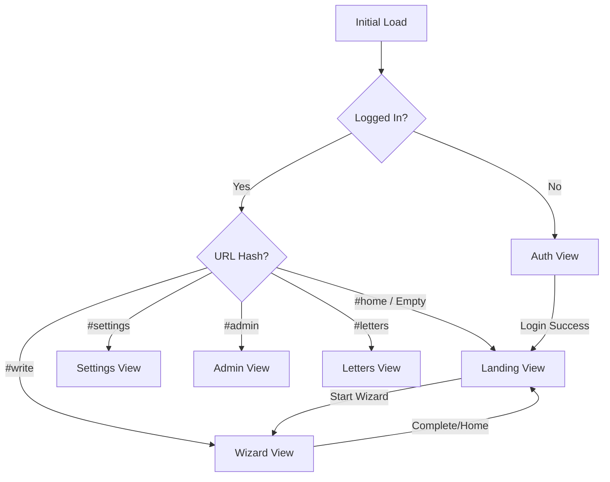
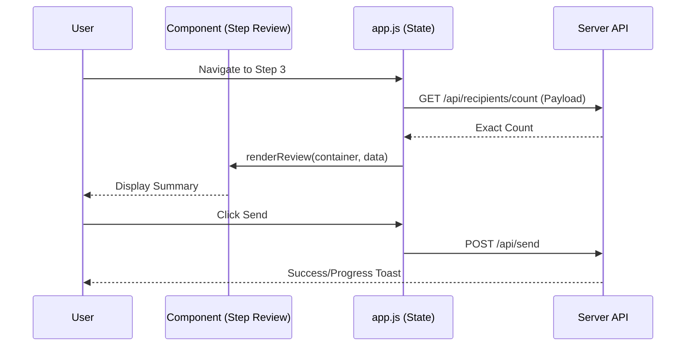

Relevant source files

The following files were used as context for generating this wiki page:

- [app/public/app.js](app/public/app.js)
- [app/public/index.html](app/public/index.html)
- [app/public/style.css](app/public/style.css)
- [app/public/components/step-review.js](app/public/components/step-review.js)
- [app/public/components/step-compose.js](app/public/components/step-compose.js)
- [README.md](README.md)
- [TODO.md](TODO.md)

# Frontend Architecture

## Introduction
The frontend of the Politiker-webapp is designed as a lightweight Single Page Application (SPA) built using vanilla JavaScript, HTML5, and CSS3. It avoids heavy frontend frameworks, opting instead for a component-based structure using ES modules for complex wizard steps while maintaining a central logic hub in a primary script. The architecture is optimized for the Cloudflare Workers environment, focusing on performance, internationalization (i18n), and a seamless transition between authentication and application states.

The primary purpose of the frontend is to provide a multi-step "Wizard" flow that allows citizens to select political recipients, compose personalized letters (assisted by AI if desired), and send them through their own connected email accounts. It also includes comprehensive settings for account management, email credentials, and an administrative dashboard for system monitoring.

Sources: [README.md:14-16](README.md#L14-L16), [TODO.md:65-68](TODO.md#L65-L68), [app/public/app.js:952-965](app/public/app.js#L952-L965)

## View Management and Routing
The application manages multiple top-level views within a single `index.html` file. Visibility is controlled via the `hidden` attribute, managed by JavaScript functions that reflect the application's state or URL hash.

### Primary Application Views
| View ID | Description |
| :--- | :--- |
| `auth-view` | Handles Login, Signup, Password Reset, and Verification cards. |
| `landing-view` | The initial entry point for logged-in users, providing an overview and start button for the wizard. |
| `wizard-view` | The 3-step process: Recipient Selection, Composition, and Review. |
| `settings-view` | User configuration for mail accounts, 2FA, API keys, and account deletion. |
| `admin-view` | Administrative dashboard for accounts, feedback, and statistics. |
| `letters-view` | Public archive of published letters. |

Sources: [app/public/index.html:43-345](app/public/index.html#L43-L345), [app/public/app.js:955-962](app/public/app.js#L955-L962)

### Navigation Flow
The following diagram illustrates the high-level transition between main application views:

Sources: [app/public/app.js:964-1000](app/public/app.js#L964-L1000), [app/public/app.js:1062-1085](app/public/app.js#L1062-L1085)

## The 3-Step Wizard Architecture
The core functionality is encapsulated in a three-step wizard. While central state is maintained in `app.js`, specific rendering logic for steps is modularized into the `components/` directory.

### Step 1: Recipient Selection
Users select recipients by geographic area (EU, Parliament, Region, etc.) or by specific roles and parties.
- **Dynamic Preview**: The UI provides an approximate recipient count in real-time, which is later refined by a debounced call to `/api/recipients/count`.
- **Advanced Filtering**: Includes searching for specific names, excluding parties, or filtering by canonical roles (e.g., "Chairman").

### Step 2: Composition and AI Assistance
This step handles the letter content and attachments.
- **AI Integration**: Users can request a draft from `/api/draft-letter`, which uses AI to research a topic and generate a draft.
- **File Handling**: Supports `.pdf`, `.txt`, `.doc`, and `.docx`. The `renderFileModeList` function allows users to choose between "Attach" or "Use as Text" (extract).

### Step 3: Review and Dispatch
A final summary is rendered using the `renderReview` component before the letter is sent via the user's connected mail account.

Sources: [app/public/app.js:585-610](app/public/app.js#L585-L610), [app/public/app.js:900-930](app/public/app.js#L900-L930), [app/public/components/step-review.js:7-35](app/public/components/step-review.js#L7-L35), [app/public/components/step-compose.js:8-37](app/public/components/step-compose.js#L8-L37)

## Technical Utilities and State
The frontend implements several robust patterns for error handling, API communication, and theming.

### API Communication
The `api()` wrapper function standardizes fetch requests, handles JSON parsing, and maintains a "recent API calls" ring-buffer (max 15 entries) for debugging and error reporting.
Sources: [app/public/app.js:105-120](app/public/app.js#L105-L120)

### Error Reporting and Resilience
- **Auto-Reporting**: Unexpected JavaScript errors are captured via `window.addEventListener("error")` and sent to `/api/client-error` to create GitHub issues.
- **Noise Filtering**: Scripts from browser extensions (e.g., `safari-web-extension`) and common network noise are filtered out to prevent spamming the error logs.
Sources: [app/public/app.js:43-90](app/public/app.js#L43-L90)

### Theme and i18n
- **Theming**: Supports `dark`, `light`, and `system` themes, persisted in `localStorage`.
- **i18n**: Multi-language support is initialized via `initI18n()` and applied using a `t()` translation function. The UI updates dynamically upon the `languagechange` event.
Sources: [app/public/app.js:20-35](app/public/app.js#L20-L35), [app/public/app.js:1043-1056](app/public/app.js#L1043-L1056)

## UI Components and Styling
The styling is defined in `style.css` using CSS Variables for theme consistency. It employs a responsive card-based layout.

| Feature | implementation Detail |
| :--- | :--- |
| **Theme Switching** | Controlled via `:root[data-theme="light"]` variables. |
| **Components** | Uses `<dialog>` for modals (FAQ, Donate, Feedback) and `
` for advanced filters. |
| **Progress** | Visual progress bar for email sending flows using `send-progress-fill`. |
| **Mobile** | Media queries adjust the area-type grid to 2 columns on screens under 480px. |

Sources: [app/public/style.css:1-55](app/public/style.css#L1-L55), [app/public/style.css:348-360](app/public/style.css#L348-L360), [app/public/index.html:361-450](app/public/index.html#L361-L450)

## Conclusion
The frontend architecture of Politiker-webapp emphasizes a "Vanilla JS" philosophy to minimize dependencies while providing a modern, responsive user experience. By offloading complex rendering to ES modules and maintaining a robust error-reporting and state-management system in the core, the application achieves a balance between simplicity and feature-rich functionality necessary for civic engagement.

Sources: [README.md:14-18](README.md#L14-L18), [TODO.md:65-72](TODO.md#L65-L72)
