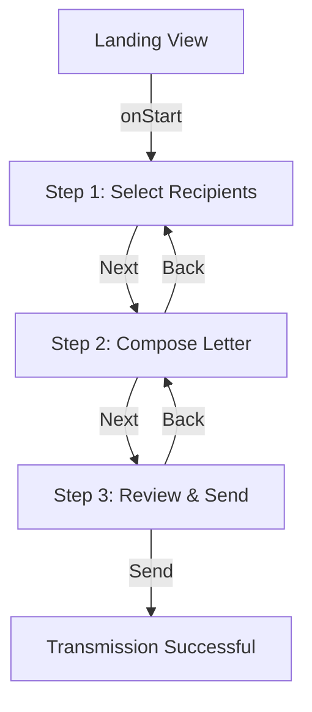
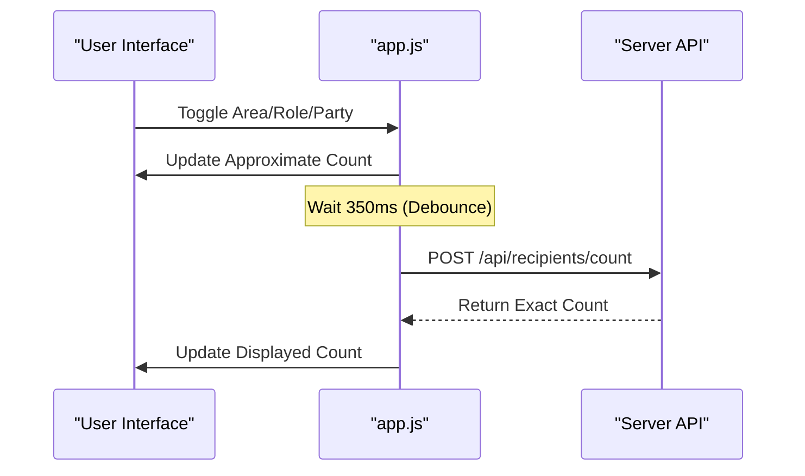
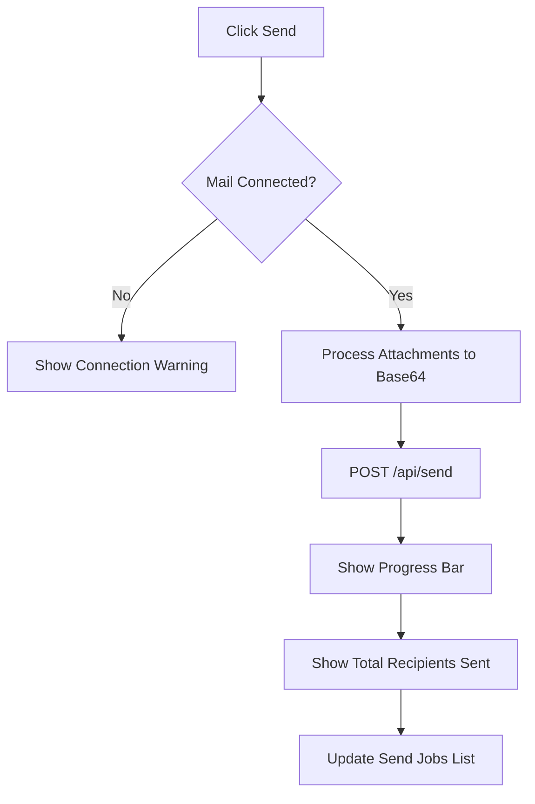

Relevant source files

The following files were used as context for generating this wiki page:

- [app/public/components/step-landing.js](app/public/components/step-landing.js)
- [app/public/components/step-compose.js](app/public/components/step-compose.js)
- [app/public/components/step-review.js](app/public/components/step-review.js)
- [app/public/app.js](app/public/app.js)
- [app/public/index.html](app/public/index.html)
- [app/public/style.css](app/public/style.css)

# Wizard UI Components

The Wizard UI Components constitute the core interactive flow of the Politiker-webapp, guiding users through the process of selecting political recipients, composing messages, and reviewing them before transmission. This module is designed as a multi-step single-page application (SPA) experience within the `wizard-view` container, utilizing vanilla JavaScript and modular component renders to manage complex state transitions.

Sources: [app/public/app.js:1062-1064](app/public/app.js#L1062-L1064), [app/public/index.html:150-155](app/public/index.html#L150-L155), [README.md:25-30](README.md#L25-L30)

## Architecture and Design

The wizard architecture follows a modular approach where specific rendering logic is offloaded to separate component files under `app/public/components/`. The main application logic in `app.js` manages the global state (selected areas, recipients, letter content) and coordinates transitions between steps.

### Application State Management
Global variables in `app.js` track the user's progress and choices throughout the wizard:
- `selectedAreas`: A `Set` of geographical or administrative regions.
- `includedRecipients`: A `Map` of specific individuals added via search.
- `excludedRecipients`: A `Map` of individuals specifically removed from the selection.
- `includedRoles`: A `Set` of specific political roles/titles to filter by.
- `letterUnsaved`: A boolean tracking if there is draft content in the editor.

Sources: [app/public/app.js:5-15](app/public/app.js#L5-L15), [app/public/app.js:636-641](app/public/app.js#L636-L641)

### User Interface Flow
The following diagram illustrates the progression through the wizard steps:

The flow is controlled by the `goToStep(n)` function, which toggles visibility of HTML sections and updates the step indicator.

Sources: [app/public/app.js:1071-1080](app/public/app.js#L1071-L1080), [app/public/index.html:157-161](app/public/index.html#L157-L161)

---

## Step 0: Landing View
The Landing View acts as the entry point to the wizard after user authentication. It provides a high-level overview of the process and a clear Call to Action (CTA).

- **Function:** `renderLanding(container, { t, onStart })`
- **Key Elements:** Hero section with project description and a 3-step numbered list explaining the process.
- **Action:** Clicking the "Start" button triggers the `onStart` callback, which transitions the UI to Step 1.

Sources: [app/public/components/step-landing.js:5-15](app/public/components/step-landing.js#L5-L15), [app/public/app.js:1065-1070](app/public/app.js#L1065-L1070)

---

## Step 1: Recipient Selection
Step 1 allows users to define the "Pool" of politicians who will receive the letter. It combines broad category selection with granular filters.

### Component Logic
The UI provides five primary category cards (EU, Parliament, Government, Region, Municipality). Users can also use the "Advanced" section to filter by:
- **Specific Areas:** Checkbox list of regions or municipalities.
- **Roles:** Filtering by specific positions (e.g., "Chairman").
- **Parties:** Excluding specific political parties from the selection.
- **Individual Search:** A search bar to specifically include or exclude individuals by name.

Sources: [app/public/app.js:337-350](app/public/app.js#L337-L350), [app/public/index.html:167-195](app/public/index.html#L167-L195)

### Recipient Counting Sequence
The wizard provides real-time feedback on the number of recipients via a debounced API call.

Sources: [app/public/app.js:581-602](app/public/app.js#L581-L602)

---

## Step 2: Letter Composition
Step 2 provides the interface for creating the message content, including an AI-assisted drafting feature and file attachment handling.

| Feature | Description | File/Function |
| :--- | :--- | :--- |
| **AI Draft** | Generates a topic-based draft using web research. | `app.js: ai-draft-btn` |
| **Subject Line** | UTF-8 supported input for the email subject. | `index.html: #letter-subject` |
| **Main Editor** | Textarea for the letter body; "Hi [FirstName]" is added automatically. | `index.html: #letter-body` |
| **File Handling** | Supports PDF, TXT, DOC, DOCX. Users can choose to "Attach" or "Use as Text". | `step-compose.js: renderFileModeList` |

Sources: [app/public/index.html:203-228](app/public/index.html#L203-L228), [app/public/components/step-compose.js:10-20](app/public/components/step-compose.js#L10-L20), [README.md:32-35](README.md#L32-L35)

---

## Step 3: Review and Transmission
The final step displays a summary of the choices made in previous steps for verification.

### Review Summary Rendering
The `renderReview` function builds a summary including:
1.  **Recipient Total:** Final count of deduperated recipients.
2.  **Selected Levels:** Labels for selected categories (e.g., "Municipality").
3.  **Subject Preview:** The chosen subject line or a "No subject" warning.
4.  **Body Preview:** A scrollable preview of the letter content.

Sources: [app/public/components/step-review.js:7-25](app/public/components/step-review.js#L7-L25)

### Send Job Process
When the user clicks "Send", the application initiates an asynchronous job via the `/api/send` endpoint.

Sources: [app/public/app.js:685-730](app/public/app.js#L685-L730), [app/public/app.js:739-745](app/public/app.js#L739-L745)

## Visual Styling
Wizard components use specific CSS variables for layout, such as `--wiz-r: 14px` for border radii. Step indicators use `wizard-step-dot` classes with an `.active` state to highlight the current progress. Cards within the wizard view feature enhanced padding and shadow depth to differentiate the interactive workflow from static settings pages.

Sources: [app/public/style.css:235-240](app/public/style.css#L235-L240), [app/public/style.css:295-310](app/public/style.css#L295-L310)

## Conclusion
The Wizard UI Components provide a streamlined, user-friendly interface for political engagement. By decoupling the rendering logic of each step into modular components and maintaining a robust global state in the main application, the system ensures a consistent and responsive experience across complex recipient filtering and content composition tasks.

Sources: [app/public/app.js:1062-1110](app/public/app.js#L1062-L1110), [TODO.md:14-20](TODO.md#L14-L20)
