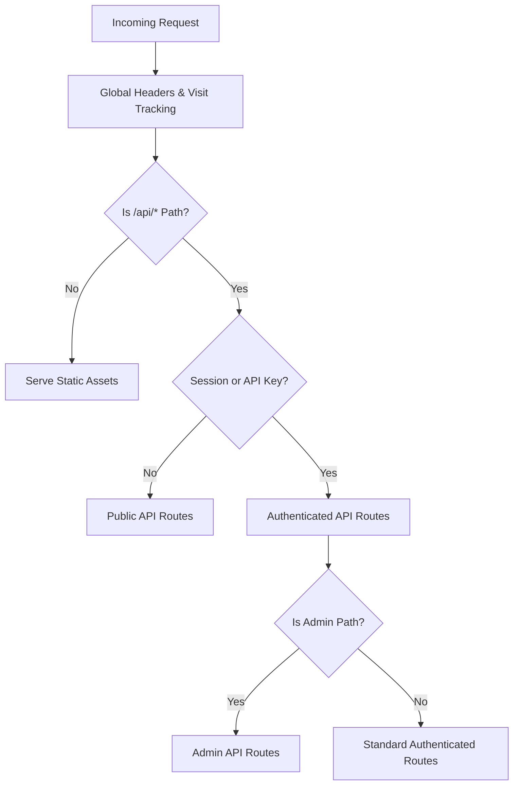
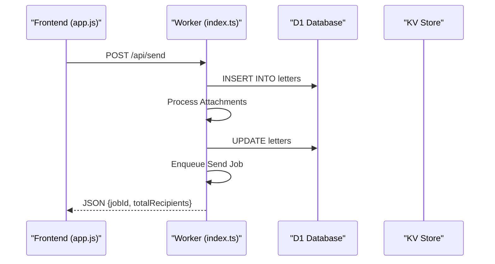

<details>
<summary>Relevant source files</summary>

The following files were used as context for generating this wiki page:

- [app/src/index.ts](app/src/index.ts)
- [app/public/app.js](app/public/app.js)
- [app/src/admin-stats.ts](app/src/admin-stats.ts)
- [README.md](README.md)
- [infra/setup.sh](infra/setup.sh)
- [TODO.md](TODO.md)
</details>

# App API & Routing

## Introduction
The "App API & Routing" system forms the backbone of the Politiker-webapp, handling all interactions between the vanilla JavaScript frontend and the Cloudflare Workers backend. It manages authentication, politician data retrieval, mail credential configuration, and administrative oversight. The system is designed to run as a Single Page Application (SPA) where the backend provides both static assets and a RESTful JSON API.

Sources: [app/src/index.ts:1-135](app/src/index.ts#L1-L135), [README.md:1-50](README.md#L1-L50)

## Architecture and Core Components

The routing logic is primarily contained within the main Worker entry point. It utilizes a table-driven approach for authenticated routes and explicit handlers for complex flows like OAuth and authentication.

### Request Handling Flow
The `fetch` handler in the main Worker serves as the entry point. It manages session cookies, security headers, and directs traffic to either the static asset handler or the internal routing logic.



The system ensures that `/api/*` responses are never cached by setting `Cache-Control: no-store` and removes Cloudflare's "Speed Brain" headers to prevent speculative prefetching of sensitive links like OAuth triggers.
Sources: [app/src/index.ts:63-95](app/src/index.ts#L63-L95), [README.md:144-155](README.md#L144-L155)

### Authentication & Session Management
Authentication supports multiple methods including traditional email/password, OAuth (Google, GitHub, Microsoft), and API keys.

| Component | Description |
| :--- | :--- |
| **Session Cookies** | Set as `HttpOnly; Secure; SameSite=Lax` with a 30-day expiration. |
| **API Keys** | Programmatic access via `Authorization: Bearer <key>` header. |
| **Turnstile** | Cloudflare Turnstile protection for signup, password reset, and newsletter subscription. |
| **OAuth State** | Transient state stored in KV to prevent CSRF during login/linking flows. |

Sources: [app/src/index.ts:58-61](app/src/index.ts#L58-L61), [app/src/index.ts:400-420](app/src/index.ts#L400-L420), [app/public/app.js:105-150](app/public/app.js#L105-L150)

## API Endpoint Categories

### Public Routes
These endpoints do not require an active session or API key.
*  **POST `/api/signup`**: Registers a new account with Turnstile validation.
*  **POST `/api/login`**: Authenticates user and returns a session cookie. Supports TOTP.
*  **GET `/api/public/letters`**: Retrieves a paginated list of published letters for the public feed.
*  **POST `/api/feedback`**: Submits user feedback or bug reports.
*  **POST `/api/client-error`**: Automatically logs unexpected JavaScript exceptions from the client.

Sources: [app/src/index.ts:436-470](app/src/index.ts#L436-L470), [app/src/index.ts:518-535](app/src/index.ts#L518-L535), [app/public/app.js:45-80](app/public/app.js#L45-L80)

### Authenticated User Routes
Managed via the `AUTHED_ROUTES` table.



*  **GET `/api/areas`**: Lists all geographical areas (municipalities, regions, etc.).
*  **POST `/api/recipients/count`**: Calculates exact, de-duplicated recipient counts based on filters.
*  **POST `/api/mail-credentials`**: Adds encrypted SMTP credentials for sending mail.
*  **POST `/api/draft-letter`**: Generates an AI-assisted letter draft (limited to 10 per day).

Sources: [app/src/index.ts:168-245](app/src/index.ts#L168-L245), [app/public/app.js:330-360](app/public/app.js#L330-L360)

### Administrative Routes
Routes under `/api/admin/*` require the `is_admin` flag in the account record.

*  **GET `/api/admin/stats`**: Provides high-level metrics (total accounts, letters, bounces, visitors).
*  **GET `/api/admin/timeseries`**: Returns activity data (sent mails, unique visitors) bucketed by granularity (minute to year).
*  **GET `/api/admin/export`**: Generates CSV or JSON exports of accounts, feedback, stats, or politician data.

Sources: [app/src/admin-stats.ts:7-140](app/src/admin-stats.ts#L7-L140), [app/src/index.ts:325-375](app/src/index.ts#L325-L375)

## Error Handling and Monitoring
The API includes a robust error logging mechanism.

1.  **Server-side Errors**: Errors (status 400+, excluding 401/404) are logged into the `worker_errors` table in D1, capturing the method, endpoint, account ID, and error message.
2.  **Client-side Errors**: The frontend `autoReportError` function catches global `error` and `unhandledrejection` events, sending them to `/api/client-error`.
3.  **Sentry Integration**: The Worker is wrapped with `Sentry.withSentry` for deep tracing and log capture.

```javascript
// Server-side logging example
if (resp.status >= 400 && resp.status !== 401 && resp.status !== 404) {
  const data = await resp.clone().json();
  await env.DB.prepare(
    "INSERT INTO worker_errors (id, account_id, method, endpoint, status, error_message, created_at) ..."
  ).bind(randomId(), account?.id, req.method, url.pathname, resp.status, data.error, Date.now()).run();
}
```

Sources: [app/src/index.ts:25-45](app/src/index.ts#L25-L45), [app/src/index.ts:98-125](app/src/index.ts#L98-L125), [app/public/app.js:46-65](app/public/app.js#L46-L65)

## Technical Constraints and Configuration
*  **Durable Objects**: Used for rate-limiting individual mail credentials to ensure shared quotas are respected.
*  **Execution Context**: Uses `execCtx.waitUntil` for non-blocking tasks like visit recording and error reporting to GitHub.
*  **Infrastructure**: Managed via `wrangler.jsonc` and provisioned through `infra/setup.sh`, which patches database and KV IDs into the environment.

Sources: [TODO.md:45-50](TODO.md#L45-L50), [infra/setup.sh:80-120](infra/setup.sh#L80-L120), [README.md:85-95](README.md#L85-L95)

## Conclusion
The "App API & Routing" system provides a secure and scalable interface for the Politiker-webapp. By combining table-driven routing for standard requests with specialized handlers for security-sensitive operations, the architecture maintains a balance between maintainability and flexibility within the Cloudflare Workers environment.
