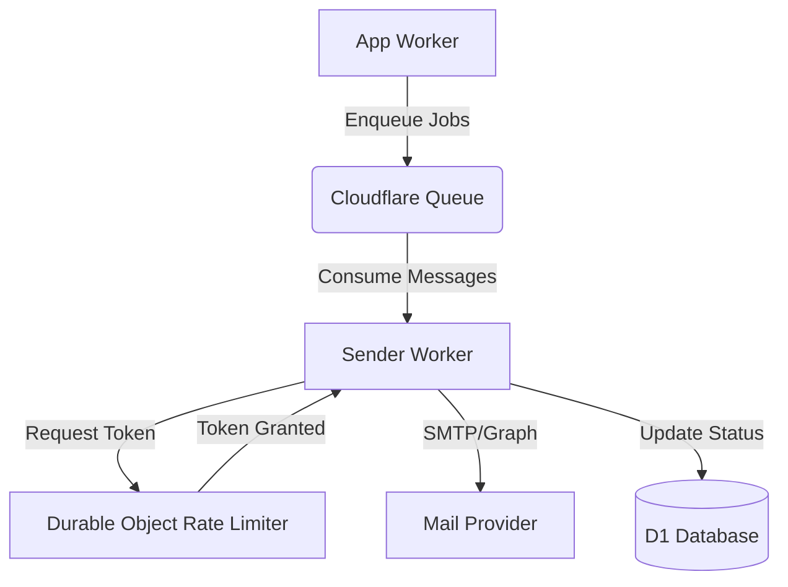
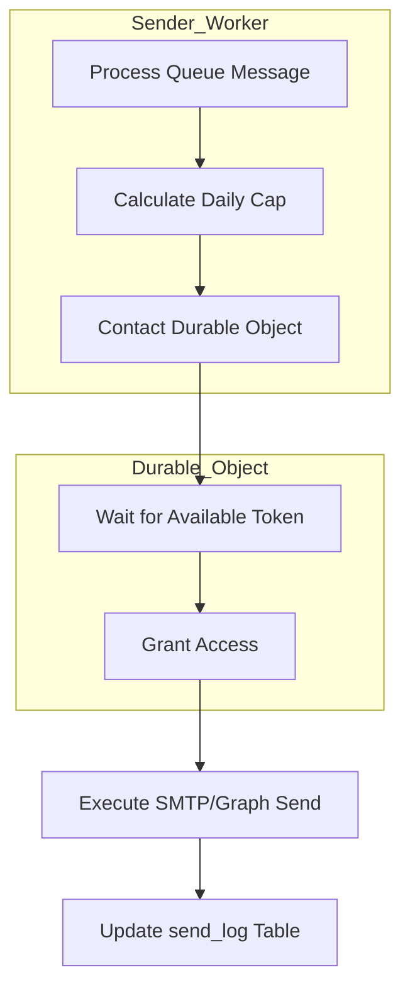

Relevant source files

The following files were used as context for generating this wiki page:

- [sender/src/index.ts](sender/src/index.ts)
- [shared/smtp.ts](shared/smtp.ts)
- [app/src/index.ts](app/src/index.ts)
- [infra/schema.sql](infra/schema.sql)
- [AGENTS.md](AGENTS.md)
- [README.md](README.md)

# Sender Worker & Mail Queues

The **Sender Worker** is a specialized Cloudflare Worker designed as a queue consumer responsible for the asynchronous delivery of emails. It decouples the user-facing application logic from the time-consuming and rate-limited process of communicating with various SMTP and Microsoft Graph mail providers. This system ensures that citizens can contact elected officials using their own mail accounts without the platform itself acting as the sender.

The architecture relies on Cloudflare Queues for job distribution and Durable Objects for localized rate limiting per mail connection. This design prevents users from exceeding provider-specific thresholds (e.g., Gmail or Outlook limits) while maintaining a responsive user interface during large-scale mail campaigns.

Sources: [AGENTS.md:1-12](AGENTS.md#L1-L12), [README.md:35-42](README.md#L35-L42)

## Architecture and Data Flow

The mail delivery system follows a producer-consumer pattern. The main `app` Worker acts as the producer, creating "send jobs" and enqueuing individual recipient tasks. The `sender` Worker consumes these tasks from the Cloudflare Queue named `politiker-send-jobs`.

*This diagram illustrates the flow from the initial job creation in the App Worker through the queue to the Sender Worker and final delivery.*

Sources: [AGENTS.md:18-21](AGENTS.md#L18-L21), [infra/schema.sql:102-105](infra/schema.sql#L102-L105)

### Job Enqueuing Logic
When a user initiates a mailing, the system creates a record in the `send_jobs` table. This record tracks the overall progress, including the total number of recipients, successful sends, and bounces. Individual delivery attempts are logged in the `send_log` table to ensure auditability and prevent duplicate sends in case of worker retries.

Sources: [infra/schema.sql:115-125](infra/schema.sql#L115-L125), [infra/schema.sql:127-135](infra/schema.sql#L127-L135)

## Mail Transmission Protocols

The Sender Worker supports multiple transmission methods to accommodate different mail providers. It features a custom-built SMTP client and integration with the Microsoft Graph API.

### Custom SMTP Client
The project utilizes a minimal SMTP client built directly on the `cloudflare:sockets` API. This allows the Worker to establish outbound connections without external dependencies. It supports:
- **STARTTLS**: Upgrading insecure connections on port 587.
- **Direct TLS**: Secure connections on port 465.
- **AUTH LOGIN**: Standard authentication for providers like Gmail, iCloud, and Yahoo.

| Feature | Implementation Detail |
| :--- | :--- |
| Socket API | Uses `connect` from `cloudflare:sockets` |
| Security | `socket.startTls()` with required `.releaseLock()` before upgrade |
| Encoding | RFC 2047 "encoded-word" for UTF-8 Subject headers |
| MIME | Support for `multipart/mixed` with attachments |

Sources: [shared/smtp.ts:1-15](shared/smtp.ts#L1-L15), [shared/smtp.ts:44-55](shared/smtp.ts#L44-L55), [shared/smtp.ts:175-185](shared/smtp.ts#L175-L185)

### Microsoft Graph Integration
For users connecting Outlook or Microsoft 365 accounts, the system can send mail without requiring an app password by using OAuth-based Microsoft Graph API calls.

Sources: [app/src/index.ts:380-385](app/src/index.ts#L380-L385), [infra/schema.sql:45-50](infra/schema.sql#L45-L50)

## Rate Limiting and Performance

To avoid provider blocks, the system implements a "Token Bucket" rate limiting strategy using Durable Objects.

- **Per-Connection Isolation**: Each mail credential (even under the same user account) has its own independent rate limit.
- **Safety Margin**: The system defaults to a "security ceiling" (roughly 10% below known provider limits), which users can further reduce via a `user_cap_pct` setting.
- **Shared Throughput**: Durable Objects ensure that parallel send jobs targeting the same account share the same rate-limit bucket.

*The sequence of acquiring a rate-limiting token before attempting mail delivery.*

Sources: [README.md:35-42](README.md#L35-L42), [app/public/app.js:200-210](app/public/app.js#L200-L210), [infra/schema.sql:51-54](infra/schema.sql#L51-L54)

## Security and Encryption

Handling user mail credentials requires rigorous security measures to ensure privacy and prevent unauthorized access.

1. **Credential Encryption**: All SMTP passwords and OAuth refresh tokens are encrypted using **AES-GCM** before storage in the D1 database.
2. **Shared Secret**: The `MAIL_CRED_KEY` (AES key) must be identical across both the `app` and `sender` Workers to allow successful decryption during the sending process.
3. **Password Hashing**: User account passwords are never stored in plain text; they are hashed using **PBKDF2** via the Web Crypto API, restricted to 100,000 iterations due to Cloudflare Worker runtime limits.

Sources: [AGENTS.md:25-30](AGENTS.md#L25-L30), [infra/schema.sql:48-52](infra/schema.sql#L48-L52), [SECURITY.md:16-20](SECURITY.md#L16-L20)

## Database Schema for Queues

The following tables in the D1 database are critical for managing the queue state and delivery results.

| Table | Purpose |
| :--- | :--- |
| `send_jobs` | Tracks the aggregate status of a mailing campaign (pending, sending, done, aborted). |
| `send_log` | Records every individual delivery attempt, including recipient email, timestamp, and error messages. |
| `mail_credentials` | Stores encrypted SMTP/OAuth details and user-defined rate limit percentages (`user_cap_pct`). |
| `worker_errors` | Logs server-side API failures (4xx/5xx) to assist in debugging and auto-triage. |

Sources: [infra/schema.sql:115-155](infra/schema.sql#L115-L155), [app/src/index.ts:70-80](app/src/index.ts#L70-L80)

## Conclusion

The Sender Worker and its associated mail queues provide a robust, scalable, and secure infrastructure for high-volume personalized communication. By leveraging Cloudflare's edge capabilities—specifically Queues, Durable Objects, and Sockets—the system maintains high deliverability while strictly respecting the operational constraints of external mail providers. This architecture ensures that the platform remains responsive and reliable for citizens engaging in democratic outreach.
