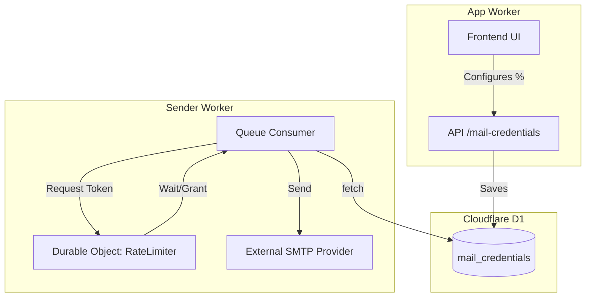
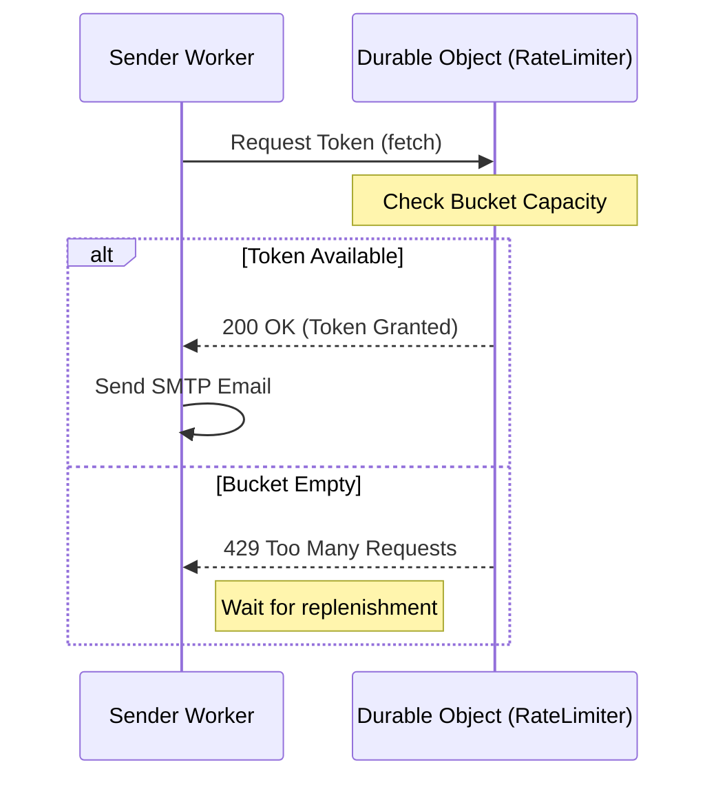

<details>
<summary>Relevant source files</summary>

The following files were used as context for generating this wiki page:

- [sender/src/rate-limiter.ts](sender/src/rate-limiter.ts)
- [shared/provider-rates.ts](shared/provider-rates.ts)
- [README.md](README.md)
- [TODO.md](TODO.md)
- [infra/schema.sql](infra/schema.sql)
- [app/public/app.js](app/public/app.js)
</details>

# Rate Limiting & Durable Objects

The rate limiting system in the politician-webapp is designed to ensure that outgoing emails sent via users' personal mail accounts (Gmail, Outlook, iCloud, etc.) do not exceed the specific delivery limits imposed by those providers. This is critical because exceeding these limits can result in the temporary blocking or flagging of the user's personal email account.

The architecture utilizes Cloudflare **Durable Objects** to maintain a centralized state for each mail connection. This allows multiple parallel sending processes—such as concurrent queue consumers—to share a single "token bucket" for a specific account, ensuring the sending pace is globally synchronized across the Cloudflare network.

Sources: [README.md:27-30](README.md#L27-L30), [TODO.md:65-67](TODO.md#L65-L67)

## Architecture and Components

The system is split between frontend configuration, database tracking, and the execution logic within the `sender` Worker.

### Token Bucket Logic
The core of the rate limiter is a **Token Bucket** algorithm implemented within a Durable Object. Each mail credential associated with a user account has its own Durable Object instance. When the `sender` Worker needs to dispatch an email, it requests a token from the corresponding Durable Object. If no tokens are available, the worker waits (non-blocking) until a token is replenished.

Sources: [sender/src/rate-limiter.ts](sender/src/rate-limiter.ts), [README.md:27-30](README.md#L27-L30)

### Component Relationship Diagram
This diagram shows how the system interacts with user credentials to enforce limits across the distributed infrastructure.



Sources: [app/public/app.js:189-210](app/public/app.js#L189-L210), [infra/schema.sql:41-55](infra/schema.sql#L41-L55), [README.md:27-30](README.md#L27-L30)

## Provider Ceilings and User Customization

The system maintains a list of known daily limits for various email providers. Users are allowed to set a `user_cap_pct`, which determines what percentage of that provider's daily limit the webapp is allowed to consume. By default, the system enforces a "hard-coded safety ceiling" that is 10% below the provider's known limit to account for the user's manual activity on the same account.

### Mail Credentials Schema
The `mail_credentials` table stores the specific rate-limiting configuration for each account.

| Field | Type | Description |
| :--- | :--- | :--- |
| `id` | TEXT | Primary Key for the credential. |
| `provider` | TEXT | e.g., gmail, outlook, icloud, yahoo, generic. |
| `daily_cap` | INTEGER | Calculated limit: `floor(provider_limit * user_cap_pct / 100)`. |
| `user_cap_pct` | INTEGER | User-defined percentage of the limit (default 100). |

Sources: [infra/schema.sql:41-55](infra/schema.sql#L41-L55), [shared/provider-rates.ts](shared/provider-rates.ts)

### Frontend Rate Preview
The user interface provides a live preview of the calculated limits before the user connects their account.

```javascript
async function updateCapPreview() {
  const provider = document.getElementById("provider-select").value;
  const ceilings = await loadProviderCeilings();
  const info = ceilings[provider];
  const preview = document.getElementById("cap-pct-preview");
  if (!info || info.ceiling === null) {
    preview.textContent = t("msg_cap_preview_unknown");
    return;
  }
  const pct = resolveCapPctChoice();
  const cap = Math.max(1, Math.floor(info.ceiling * (pct / 100)));
  preview.textContent = t("msg_cap_preview", { ceiling: info.ceiling, limit: info.providerDailyLimit, pct, cap });
}
```

Sources: [app/public/app.js:189-204](app/public/app.js#L189-L204)

## Execution Flow

When an email is queued for sending, the `sender` Worker executes the following sequence to respect the rate limit:

1.  **Identity Retrieval**: The worker retrieves the `mail_credential_id` from the queue message.
2.  **Durable Object Mapping**: It creates a unique ID for the Durable Object based on the credential ID to ensure all workers sending for this specific email address hit the same rate limiter.
3.  **Token Acquisition**: The worker makes a fetch request to the Durable Object.
4.  **Wait Logic**: If the bucket is empty, the Durable Object calculates the time until the next token is available and returns a "retry-after" delay, or the worker waits until the response is returned.



Sources: [sender/src/rate-limiter.ts](sender/src/rate-limiter.ts), [README.md:27-30](README.md#L27-L30)

## Conclusion

By leveraging Durable Objects, the politician-webapp achieves high-precision rate limiting that is synchronized across Cloudflare's global edge. This protection prevents users from accidentally triggering spam filters or account suspensions with their personal email providers while allowing the system to scale its delivery across multiple worker instances.

Sources: [README.md:27-30](README.md#L27-L30), [TODO.md:65-67](TODO.md#L65-L67)
