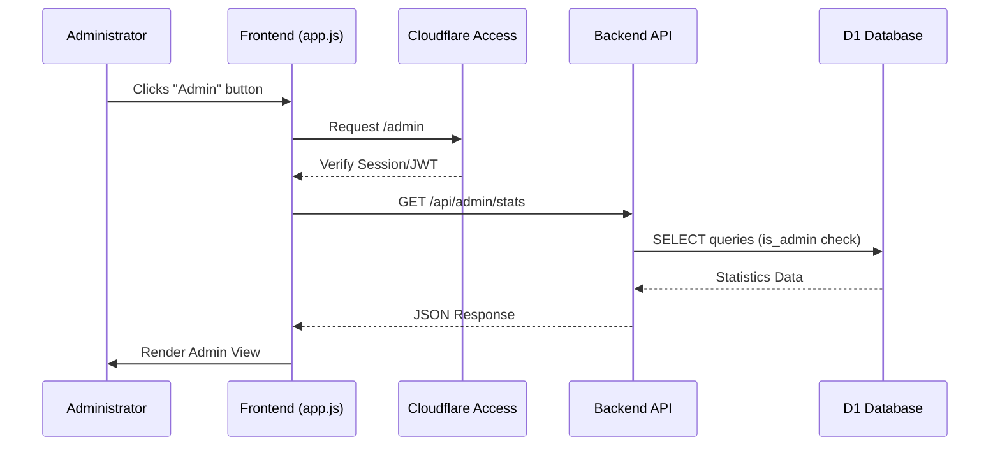
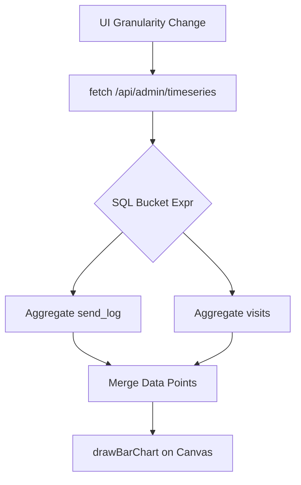

<details>
<summary>Relevant source files</summary>

The following files were used as context for generating this wiki page:

- [app/src/admin-stats.ts](app/src/admin-stats.ts)
- [app/public/app.js](app/public/app.js)
- [app/public/index.html](app/public/index.html)
- [README.md](README.md)
- [infra/setup.sh](infra/setup.sh)
- [app/public/style.css](app/public/style.css)
</details>

# Admin Panel & Statistics

The Admin Panel & Statistics module provides administrators with a centralized interface to manage user accounts, review feedback, and monitor platform performance through real-time metrics. It is designed as a restricted section of the web application, requiring specific administrative privileges (`is_admin = 1`) to access sensitive data and management functions.

The system aggregates data from various sources, including user accounts, send logs, and visitor tracking tables. It offers visual representations of trends, such as visitor counts and email delivery success, while providing export capabilities for auditing and data analysis.

Sources: [app/public/app.js:1034](app/public/app.js#L1034), [README.md:38-40](README.md#L38-L40), [app/src/admin-stats.ts:16-24](app/src/admin-stats.ts#L16-L24)

## Architecture and Access Control

The administration interface is integrated into the main Single Page Application (SPA) but remains hidden from standard users. Access is guarded by Cloudflare Access (Zero Trust) and backend checks that verify the user's `isAdmin` status.

### Access Flow
The following diagram illustrates the sequence for accessing administrative data:



Sources: [app/public/app.js:1230-1237](app/public/app.js#L1230-L1237), [README.md:144-148](README.md#L144-L148)

## Account Management

The "Accounts" tab allows administrators to view all registered users, manage their status, and perform security actions. The system displays account details such as verification status and daily sending caps.

### Key Management Actions
*  **Toggle Account Status:** Enable or disable accounts to prevent unauthorized use.
*  **Reset Passwords:** Trigger password reset emails for users.
*  **Delete Accounts:** Permanently remove user data from the system.
*  **Verification Tracking:** Visual badges indicate if an email is verified or if the user has administrative rights.

Sources: [app/public/app.js:847-915](app/public/app.js#L847-L915), [app/src/admin-stats.ts:107-110](app/src/admin-stats.ts#L107-L110)

## Statistics and Analytics

The statistics engine tracks platform usage across several dimensions. Data is retrieved using the `getAdminStats` and `getTimeSeries` functions, which query the D1 database for aggregated totals and time-bucketed points.

### Metric Categories

| Metric | Description | Source Table |
| :--- | :--- | :--- |
| **Total Accounts** | Total number of registered users. | `accounts` |
| **Total Letters** | Total letters composed in the system. | `letters` |
| **Sent/Bounced** | Success and failure rates of email jobs. | `send_log` |
| **Unique Visitors** | Distinct visitor hashes recorded over time. | `visits` |
| **Leaderboard** | Top 50 accounts by successful send volume. | `accounts` & `send_log` |

Sources: [app/src/admin-stats.ts:16-65](app/src/admin-stats.ts#L16-L65), [app/public/app.js:933-946](app/public/app.js#L933-L946)

### Data Visualization
The frontend uses a custom `drawBarChart` function to render statistics without external dependencies. It supports multiple granularities for time-series data:

*  **Granularity Levels:** Minute, Hour, Day, Week, Month, Quarter, Half-year, Year.
*  **Visitor Tracking:** Uses `COUNT(DISTINCT visitor_hash)` to ensure unique visitor counts per time bucket.
*  **Geographic Data:** Displays unique visitors per country using ISO-2 codes and flag emojis.



Sources: [app/src/admin-stats.ts:72-101](app/src/admin-stats.ts#L72-L101), [app/public/app.js:1001-1031](app/public/app.js#L1001-L1031)

## Data Export Capabilities

The system provides robust export tools to extract data in CSV or JSON formats. This is handled by the `exportAdminData` function.

### Export Sections
1.  **Accounts:** ID, email, verification status, and send caps.
2.  **Feedback:** User messages and linked GitHub issue URLs.
3.  **Politicians:** Public service contact list (name, email, area, type).
4.  **Stats:** Daily series data or full aggregate JSON.

Sources: [app/src/admin-stats.ts:121-163](app/src/admin-stats.ts#L121-L163), [app/public/app.js:1046-1051](app/public/app.js#L1046-L1051)

### Implementation Detail: CSV Conversion

```typescript
function toCsv(rows: Record<string, unknown>[]): string {
  if (rows.length === 0) return "";
  const headers = Object.keys(rows[0]);
  const escape = (v: unknown) => {
    const s = v === null || v === undefined ? "" : String(v);
    return /[",\n]/.test(s) ? `"${s.replace(/"/g, '""')}"` : s;
  };
  const lines = [headers.join(",")];
  for (const row of rows) lines.push(headers.map((h) => escape(row[h])).join(","));
  return lines.join("\n");
}
```

Sources: [app/src/admin-stats.ts:107-119](app/src/admin-stats.ts#L107-L119)

## Feedback and Error Reporting

Administrators monitor user feedback through a dedicated tab. Feedback can include general comments or bug reports.
*  **Contextual Data:** Reports include the user's URL, UserAgent, current step in the wizard, and a ring-buffer of the `recentApiCalls` for troubleshooting.
*  **GitHub Integration:** The system can automatically create GitHub issues for client-side errors reported via `autoReportError()`.

Sources: [app/public/app.js:46-64](app/public/app.js#L46-L64), [app/public/app.js:1062-1084](app/public/app.js#L1062-L1084)

## Summary

The Admin Panel & Statistics module is a critical infrastructure component that ensures platform stability and user accountability. By combining direct database management with automated metric aggregation and visualization, it provides administrators with the tools necessary to oversee the application's lifecycle, from user support to performance scaling.
