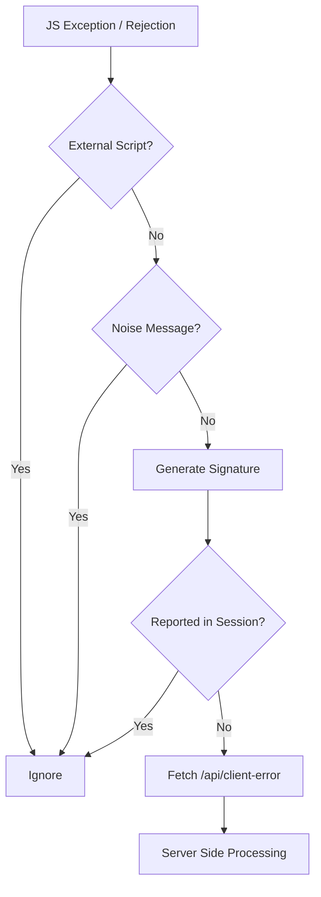
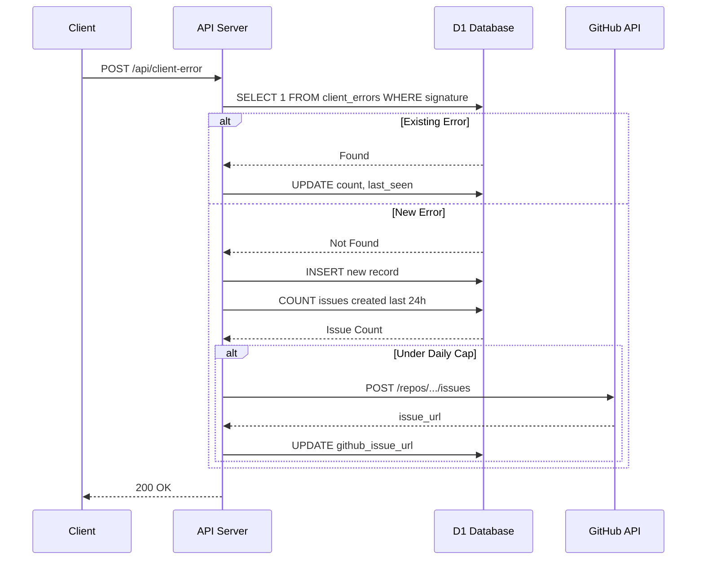

Relevant source files

The following files were used as context for generating this wiki page:

- [app/src/feedback.ts](app/src/feedback.ts)
- [app/public/app.js](app/public/app.js)
- [infra/migrations/003_client_errors.sql](infra/migrations/003_client_errors.sql)
- [infra/schema.sql](infra/schema.sql)
- [TODO.md](TODO.md)
- [app/public/index.html](app/public/index.html)

# Client Error Reporting & Feedback

The Client Error Reporting and Feedback system in the Politiker-webapp project is a multi-layered mechanism designed to capture, deduplicate, and report both automated JavaScript exceptions and manual user feedback. It utilizes a combination of client-side event listeners, a backend API, a SQLite (D1) database for persistence, and integration with the GitHub Issues API for developer alerting.

This system ensures that unexpected production bugs are tracked automatically while providing users with direct communication channels for bugs and general contact. Automated reports are throttled and deduplicated to prevent spamming the developer's GitHub repository. Sources: [app/public/app.js:45-56](app/public/app.js#L45-L56), [app/src/feedback.ts:13-17](app/src/feedback.ts#L13-L17), [TODO.md:28-32](TODO.md#L28-L32)

## Automated Error Reporting

The application captures unhandled JavaScript exceptions and promise rejections globally. These errors are filtered to exclude "noise" from external browser extensions or common network failures before being sent to the server. Sources: [app/public/app.js:77-104](app/public/app.js#L77-L104)

### Client-Side Detection Logic
The client uses two primary event listeners to catch errors:
1.  **`window.addEventListener("error")`**: Catches standard runtime exceptions.
2.  **`window.addEventListener("unhandledrejection")`**: Catches rejected Promises that lack a `.catch()` block.

To prevent reporting issues caused by the user's environment rather than the application code, the system utilizes the `looksLikeExternalScript` function. This function checks the stack trace for markers such as `extension://`, `webkit-masked-url`, and `safari-web-extension`. Additionally, a `NOISE_MESSAGES` array filters out generic network errors like "Script error." or "Load failed". Sources: [app/public/app.js:84-104](app/public/app.js#L84-L104)

### Reporting and Deduplication
Once an error is validated, the `autoReportError` function is invoked. It performs session-level deduplication using a `Set` of error signatures to prevent redundant network requests for the same exception. Validated errors are dispatched via a `POST` request to `/api/client-error` using the `fetch` API with `keepalive: true` to ensure delivery even if the page is closing. Sources: [app/public/app.js:58-75](app/public/app.js#L58-L75)

The client-side flow for error capture and initial filtering. Sources: [app/public/app.js:58-104](app/public/app.js#L58-L104)

## Server-Side Processing & GitHub Integration

The backend handles incoming error reports by persisting them in the `client_errors` table and conditionally creating GitHub Issues.

### Database Persistence
The system uses a dedicated table to track errors. When an error is reported, the server checks if the signature (a hash of the message and file/line information) already exists. If it does, the `count` is incremented and the `last_seen` timestamp is updated. If new, a new record is created. Sources: [app/src/feedback.ts:25-39](app/src/feedback.ts#L25-L39), [infra/migrations/003_client_errors.sql](infra/migrations/003_client_errors.sql)

### GitHub Issue Throttling
To avoid hitting GitHub API limits or overwhelming developers, the system implements a daily ceiling. A maximum of 20 new GitHub issues can be created per 24-hour period. If this limit is reached, errors are still logged to the local database but no external issue is opened. Sources: [app/src/feedback.ts:16-17](app/src/feedback.ts#L16-L17), [app/src/feedback.ts:41-47](app/src/feedback.ts#L41-L47)

### Server Error Data Flow

The sequence of events for server-side error handling and deduplication. Sources: [app/src/feedback.ts:19-70](app/src/feedback.ts#L19-L70)

## User Feedback and Contact System

The project provides a manual feedback mechanism via a dialog in the UI. This system distinguishes between "bug reports" and "contact requests." Sources: [app/public/index.html:268-280](app/public/index.html#L268-L280), [app/src/feedback.ts:88-92](app/src/feedback.ts#L88-L92)

### Contextual Metadata
When a user submits feedback, the client collects significant contextual information to assist in debugging:
*  Current URL and User Agent.
*  Browser language settings.
*  The current step in the sending wizard.
*  A "ring-buffer" of the 15 most recent API calls (`recentApiCalls`), excluding sensitive request bodies. Sources: [app/public/app.js:107-118](app/public/app.js#L107-L118), [app/public/app.js:590-598](app/public/app.js#L590-L598)

### Feedback Processing
Manual feedback is processed as follows:
1.  **Database Storage**: Every submission is stored in the `feedback` table. Sources: [app/src/feedback.ts:140-144](app/src/feedback.ts#L140-L144)
2.  **GitHub Issues**: Submissions marked as `type: "bug"` (but not general contact) trigger the creation of a GitHub issue labeled with `feedback` and `user-reported`. Sources: [app/src/feedback.ts:110-138](app/src/feedback.ts#L110-L138)
3.  **Email Notification**: The system sends a notification email to the address defined in `FEEDBACK_NOTIFY_EMAIL`. Sources: [app/src/feedback.ts:151-158](app/src/feedback.ts#L151-L158)
4.  **Triage Integration**: If the account is logged in, the system retrieves the last 48 hours of server-side `worker_errors` for that specific `account_id` and includes them in the report context. Sources: [app/src/feedback.ts:98-105](app/src/feedback.ts#L98-L105)

## Data Models

### Client Errors Table
Tracks automated client-side exceptions.
| Field | Type | Description |
| :--- | :--- | :--- |
| `signature` | TEXT (PK) | Unique hash of message + stack frame (file:line). |
| `message` | TEXT | The error message string. |
| `count` | INTEGER | Number of times this error has occurred. |
| `first_seen` | INTEGER | Timestamp of first occurrence. |
| `last_seen` | INTEGER | Timestamp of most recent occurrence. |
| `github_issue_url`| TEXT | Link to the created GitHub issue, if any. |

Sources: [infra/migrations/003_client_errors.sql](infra/migrations/003_client_errors.sql), [infra/schema.sql:194-202](infra/schema.sql#L194-L202)

### Feedback Table
Tracks manual user submissions.
| Field | Type | Description |
| :--- | :--- | :--- |
| `id` | TEXT (PK) | Unique identifier for the feedback entry. |
| `account_id` | TEXT | ID of the user (nullable if not logged in). |
| `message` | TEXT | The user's typed message. |
| `github_issue_url`| TEXT | Link to the created GitHub issue. |
| `created_at` | INTEGER | Submission timestamp. |

Sources: [infra/schema.sql:159-165](infra/schema.sql#L159-L165)

## Admin Interface

Administrators can view and export feedback via the Admin Panel. The interface provides a dedicated tab for feedback that lists messages and their creation dates. Admins can also export this data to CSV for external analysis. Sources: [app/public/app.js:500-508](app/public/app.js#L500-L508), [app/public/app.js:577-581](app/public/app.js#L577-L581)

The Client Error Reporting & Feedback system provides a robust loop for maintaining application quality. By combining automated exception tracking with manual user input and enriching both with technical context (API logs, server errors), the system enables rapid bug identification and resolution while maintaining low overhead through deduplication and API throttling.
