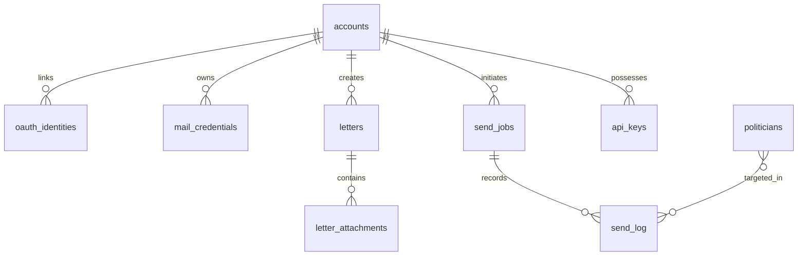
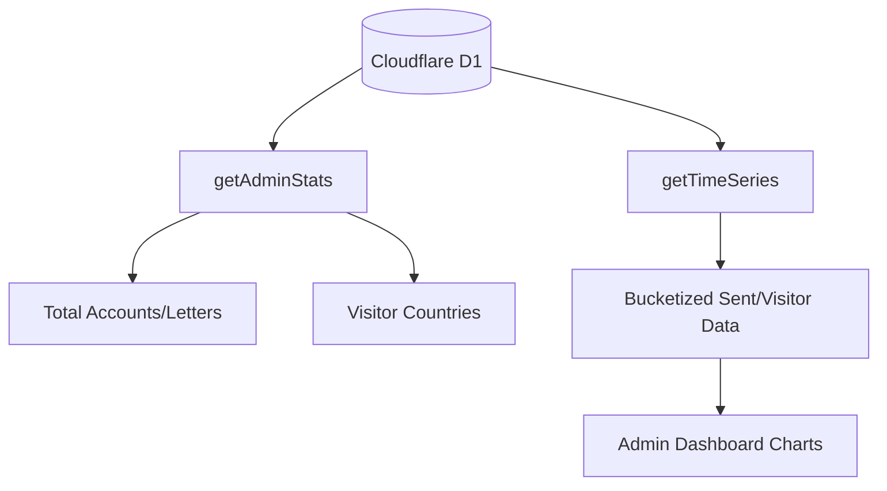

<details>
<summary>Relevant source files</summary>

The following files were used as context for generating this wiki page:

- [infra/schema.sql](infra/schema.sql)
- [app/src/db.ts](app/src/db.ts)
- [infra/migrations/001_visits.sql](infra/migrations/001_visits.sql)
- [app/src/admin-stats.ts](app/src/admin-stats.ts)
- [infra/setup.sh](infra/setup.sh)
- [AGENTS.md](AGENTS.md)
</details>

# Database Schema & D1

Database management in the Politiker-webapp project relies on **Cloudflare D1**, a serverless SQL database based on SQLite. It serves as the primary relational storage for user accounts, politician contact data, email credentials, and delivery logs. The system is designed for high isolation, where most queries are filtered by `account_id` to ensure data privacy between users.

The infrastructure setup is automated via scripts that provision the D1 instance, apply the initial schema, and handle subsequent migrations. The database resides within the Cloudflare ecosystem, allowing Workers to perform low-latency SQL operations.

Sources: [AGENTS.md](AGENTS.md), [infra/setup.sh:100-112](infra/setup.sh#L100-L112)

## Core Data Models

The schema is divided into several logical areas: Identity & Access, Mail Infrastructure, Politician Data, and Logging/Analytics.

### Entity Relationship Diagram
The following diagram illustrates the relationships between the primary tables in the D1 database, centered around the `accounts` table.



Sources: [infra/schema.sql:3-125](infra/schema.sql#L3-L125)

### Identity and Access Management
User accounts support both traditional email/password authentication and OAuth providers (Google, GitHub, Microsoft, Apple). The `accounts` table stores PBKDF2 hashed passwords and TOTP secrets for 2FA.

| Field | Type | Description |
| :--- | :--- | :--- |
| `id` | TEXT | Primary Key (UUID) |
| `email` | TEXT | Unique user email |
| `password_hash` | TEXT | PBKDF2 hashed password |
| `is_admin` | INTEGER | Boolean flag for administrative access |
| `totp_enabled` | INTEGER | Boolean flag for 2FA status |

Sources: [infra/schema.sql:3-19](infra/schema.sql#L3-L19)

## Mail Infrastructure & Credentials

The `mail_credentials` table manages how the application connects to external mail providers. It supports two main authentication methods:
1.  **SMTP**: Used for Gmail, Outlook, iCloud, Yahoo, and generic providers. Passwords are encrypted using **AES-GCM** with a key stored as a Cloudflare Worker secret (`MAIL_CRED_KEY`).
2.  **OAuth/Graph**: Specifically for Microsoft Graph, storing encrypted access and refresh tokens.

The system also implements a `daily_cap` to prevent users from exceeding provider-imposed rate limits, calculated based on a `user_cap_pct`.

Sources: [infra/schema.sql:38-56](infra/schema.sql#L38-L56), [AGENTS.md](AGENTS.md)

## Politician & Communication Logs

The `politicians` table acts as a directory of public officials, including their area (municipality, region, parliament), party, and role. Communication tracking is handled by `send_jobs` and `send_log`.

```sql
CREATE TABLE politicians (
  id TEXT PRIMARY KEY,
  name TEXT NOT NULL,
  email TEXT NOT NULL,
  area_name TEXT NOT NULL,
  area_type TEXT NOT NULL,
  party TEXT,
  role TEXT,
  last_scraped_at INTEGER NOT NULL,
  verification_status TEXT NOT NULL DEFAULT 'unknown',
  UNIQUE(email, area_name)
);
```

Sources: [infra/schema.sql:58-71](infra/schema.sql#L58-L71)

### Send Tracking
*  **send_jobs**: Summarizes a batch of emails, tracking `sent_count`, `bounce_count`, and overall status (`pending`, `sending`, `done`, `aborted`).
*  **send_log**: Records individual delivery attempts to specific recipients, including success status or error messages.

Sources: [infra/schema.sql:89-109](infra/schema.sql#L89-L109)

## Analytics and Statistics

The system tracks anonymous visitor data and application usage through the `visits` and `send_log` tables. 

### Analytics Data Flow
The `admin-stats.ts` module aggregates data across multiple tables to provide administrative insights.



Uniques are tracked in the `visits` table using a `visitor_hash` (SHA-256 hash of IP + User Agent + Salt) to comply with privacy standards while allowing `COUNT(DISTINCT visitor_hash)` operations.

Sources: [infra/schema.sql:140-146](infra/schema.sql#L140-L146), [app/src/admin-stats.ts:71-103](app/src/admin-stats.ts#L71-L103), [infra/migrations/001_visits.sql](infra/migrations/001_visits.sql)

## Deployment and Migrations

D1 resources are provisioned via `infra/setup.sh`, which uses the Wrangler CLI to create the database if it doesn't exist. Initial schemas and migrations are applied using the `wrangler d1 execute` command.

```bash
# Provisioning logic in setup.sh
DB_ID="$($WR d1 list --json | jq -r ".[] | select(.name==\"$DB_NAME\") | .id")"
if [ -z "$DB_ID" ]; then
  $WR d1 create "$DB_NAME"
fi
( cd "app" && $WR d1 execute "$DB_NAME" --remote --file "../infra/schema.sql" )
```

Sources: [infra/setup.sh:100-112](infra/setup.sh#L100-L112), [infra/migrations/001_visits.sql:1-6](infra/migrations/001_visits.sql#L1-L6)

## Conclusion

The D1 database schema provides a robust foundation for the Politiker-webapp, balancing strict account isolation with comprehensive logging for administrative oversight. By utilizing SQLite-compatible types and Cloudflare's serverless infrastructure, the system achieves low-maintenance persistence with strong security features like AES-GCM credential encryption and anonymous visit tracking.
