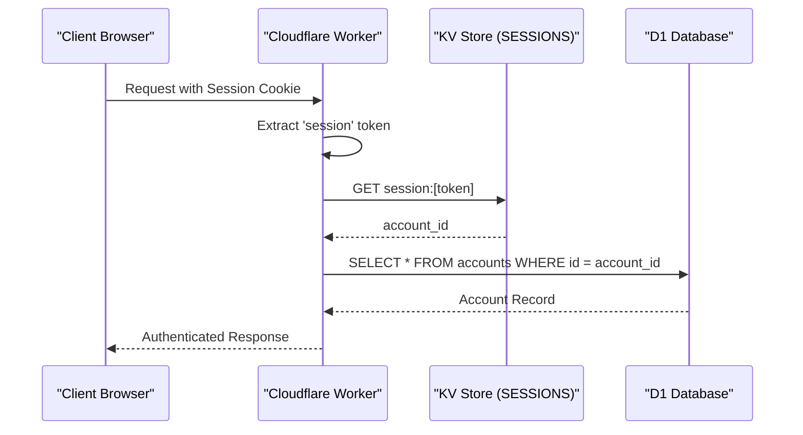
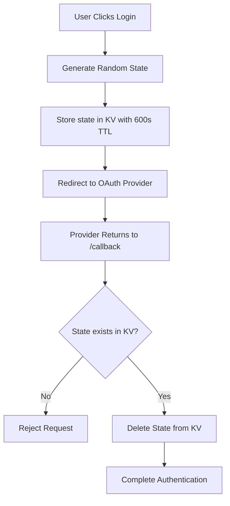

<details>
<summary>Relevant source files</summary>

The following files were used as context for generating this wiki page:

- [app/src/index.ts](app/src/index.ts)
- [app/src/auth.ts](app/src/auth.ts)
- [infra/setup.sh](infra/setup.sh)
- [app/public/app.js](app/public/app.js)
- [README.md](README.md)
- [infra/schema.sql](infra/schema.sql)
</details>

# Session Management with KV

## Introduction
The Politiker-webapp utilizes Cloudflare KV (Key-Value) storage as its primary mechanism for managing user sessions and temporary authentication states. By leveraging KV, the system achieves a scalable, distributed session store that is accessible across Cloudflare's global edge network. This ensures that session validation is performant and consistent regardless of the user's geographical location.

The session management system handles various types of transient data, including active user login sessions, OAuth flow states, and rate-limiting counters for specific features. It integrates closely with the Cloudflare D1 SQL database, which stores persistent user account information, creating a hybrid architecture where KV handles high-frequency, time-limited data while D1 maintains the authoritative user records.

## Architecture and Components

### KV Namespace Configuration
The infrastructure is provisioned with a specific KV namespace titled `politiker_webapp_sessions`. This namespace is mapped to the `SESSIONS` binding within the Cloudflare Worker environment.
Sources: [infra/setup.sh:84-93](infra/setup.sh#L84-L93), [app/src/index.ts:161](app/src/index.ts#L161)

### Key Data Structures
The system uses prefixed keys within KV to distinguish between different types of session-related data:

| Key Prefix | Purpose | TTL / Expiration |
| :--- | :--- | :--- |
| `session:` | Stores the mapping of a session token to an `account_id`. | 30 Days |
| `oauthstate:` | Temporary state for validating OAuth login callbacks. | 600 Seconds |
| `oauthlinkstate:` | State for linking additional providers to an existing account. | 600 Seconds |
| `oauthmailstate:` | State specifically for Microsoft Graph mail authentication. | 600 Seconds |
| `draft-rate:` | Tracks AI-assisted letter draft usage per account. | 24 Hours |

Sources: [app/src/index.ts:161-164](app/src/index.ts#L161-L164), [app/src/index.ts:334-340](app/src/index.ts#L334-L340), [app/src/index.ts:404-406](app/src/index.ts#L404-L406), [app/src/index.ts:252-263](app/src/index.ts#L252-L263)

### Logical Data Flow
When a user interacts with the application, the session management follows a standardized flow to authenticate requests.



The diagram shows the lifecycle of a request from the initial cookie extraction to the database lookup based on KV data.
Sources: [app/src/index.ts:38-42](app/src/index.ts#L38-L42), [app/src/index.ts:438-445](app/src/index.ts#L438-L445), [app/src/auth.ts:89-98](app/src/auth.ts#L89-L98)

## Authentication Lifecycle

### Session Creation (Login)
Upon successful credential validation (email/password or OAuth), a new session is created. The system generates a cryptographically secure random token (concatenating two `randomId()` calls) and stores it in KV.

```typescript
const sessionToken = randomId() + randomId();
await env.SESSIONS.put(`session:${sessionToken}`, accountId, { expirationTtl: 60 * 60 * 24 * 30 });
```

Sources: [app/src/index.ts:358-359](app/src/index.ts#L358-L359), [app/src/index.ts:468-472](app/src/index.ts#L468-L472)

### Session Destruction (Logout)
Logout is handled by deleting the session key from KV and instructing the browser to clear the session cookie via a `Max-Age=0` header.

```typescript
if (sessionToken) await env.SESSIONS.delete(`session:${sessionToken}`);
const resp = json({ ok: true });
resp.headers.set("Set-Cookie", "session=; HttpOnly; Secure; SameSite=Lax; Path=/; Max-Age=0");
```

Sources: [app/src/index.ts:474-478](app/src/index.ts#L474-L478)

### OAuth State Management
To prevent Cross-Site Request Forgery (CSRF) during OAuth flows, the system stores a temporary `state` parameter in KV before redirecting the user to the provider.



The flow ensures that OAuth callbacks are only processed if they correspond to an locally initiated request.
Sources: [app/src/index.ts:334-345](app/src/index.ts#L334-L345), [app/src/index.ts:404-411](app/src/index.ts#L404-L411)

## Feature-Specific Session Logic

### AI Draft Rate Limiting
KV is utilized for "best-effort" rate limiting of the AI letter draft feature. This prevents cost overruns associated with LLM and web search API calls.

- **Storage Key**: `draft-rate:[accountId]:[YYYY-MM-DD]`
- **Limit**: 10 drafts per day.
- **Expiration**: 24 hours.

If the count in KV exceeds the `DAILY_DRAFT_LIMIT`, the API returns a 429 status code.
Sources: [app/src/index.ts:251-263](app/src/index.ts#L251-L263)

### Account Deletion
When a user deletes their own account, the system must perform a synchronized cleanup of persistent records in D1 and transient session data in KV. This prevents "orphaned" sessions from remaining active for a deleted user.
Sources: [app/src/index.ts:182-188](app/src/index.ts#L182-L188), [infra/schema.sql:1-17](infra/schema.sql#L1-L17)

## Implementation Details

### Security Headers
Session cookies are configured with strict security attributes to prevent interception and cross-site attacks:
- `HttpOnly`: Prevents client-side scripts from accessing the token.
- `Secure`: Ensures the cookie is only sent over HTTPS.
- `SameSite=Lax`: Provides protection against CSRF while allowing top-level navigation.
- `Path=/`: Ensures the session is valid for the entire application.

Sources: [app/src/index.ts:45](app/src/index.ts#L45), [app/src/index.ts:471](app/src/index.ts#L471)

### Admin Overrides
Admin functionality relies on the `is_admin` flag stored in the account record (D1). While the session is verified via KV, the authorization for `/api/admin/*` endpoints requires an additional check of the database record retrieved during session resolution.
Sources: [app/src/index.ts:167](app/src/index.ts#L167), [app/src/index.ts:544-548](app/src/index.ts#L544-L548)

## Summary
Session Management with KV provides a robust, low-latency foundation for user authentication in the Politiker-webapp. By separating session state (KV) from persistent user data (D1), the application maintains high performance for authenticated requests while ensuring secure handling of OAuth flows and feature-specific usage limits.
