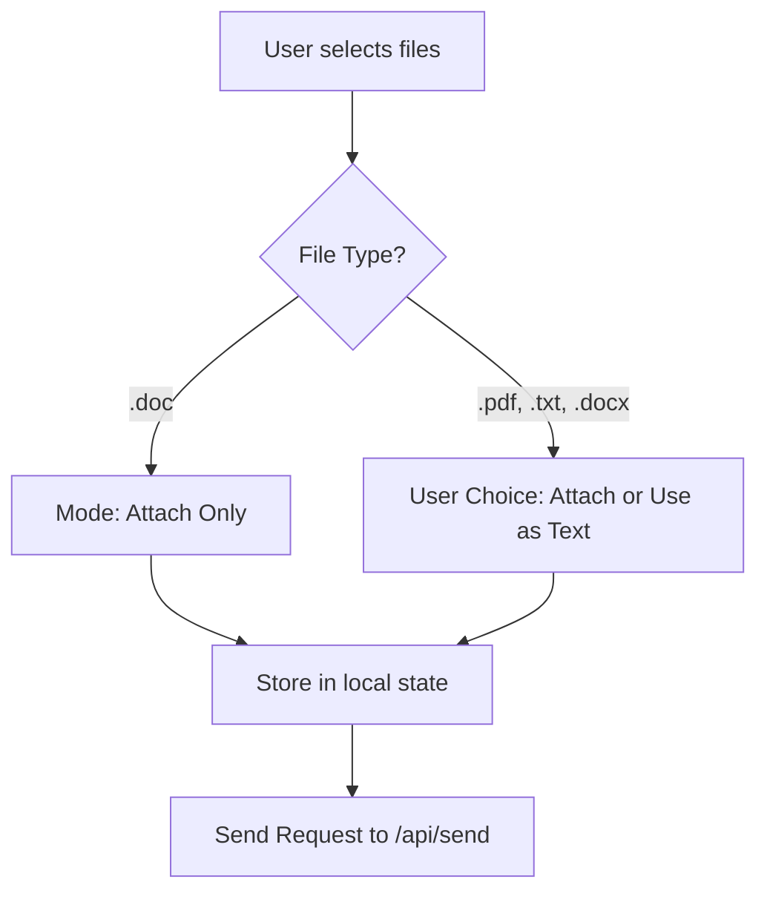
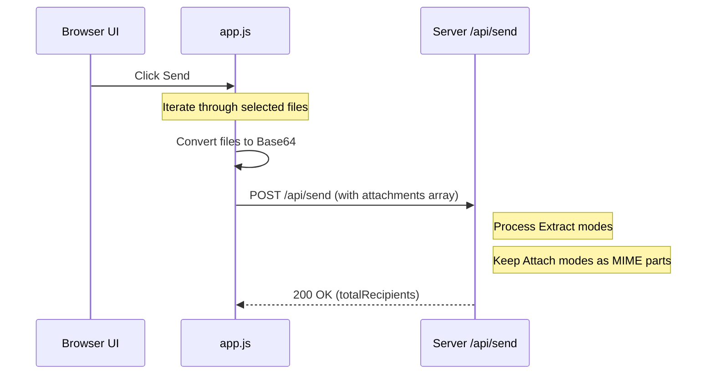

<details>
<summary>Relevant source files</summary>

The following files were used as context for generating this wiki page:

- [app/src/document-parsing.ts](app/src/document-parsing.ts)
- [app/src/attachments.ts](app/src/attachments.ts)
- [shared/html.ts](shared/html.ts)
- [app/public/app.js](app/public/app.js)
- [app/package.json](app/package.json)
- [app/public/components/step-compose.js](app/public/components/step-compose.js)
- [README.md](README.md)
</details>

# Document & Attachment Parsing

The Document & Attachment Parsing system allows users to upload various file formats to be included in letters sent to politicians. The system supports two primary modes: direct attachment of files to the outgoing email and extraction of text from documents to be used as the body of the letter. This feature is integrated into the 3-step wizard and supports formats such as PDF, TXT, DOC, and DOCX.

Sources: [README.md:27](README.md#L27), [app/public/app.js:582-595](app/public/app.js#L582-L595), [app/public/components/step-compose.js:1-12](app/public/components/step-compose.js#L1-L12)

## File Handling Architecture

The system handles file processing in a multi-stage flow within the client-side application before transmitting data to the server for final delivery.

### Supported Formats and Constraints
The application supports specific file types with a size limit of 10 MB per file. Some formats have limited functionality regarding text extraction.

| File Extension | Direct Attachment | Text Extraction | Notes |
| :--- | :--- | :--- | :--- |
| .pdf | Supported | Supported | Automatic conversion to letter text available. |
| .txt | Supported | Supported | Simple text extraction. |
| .docx | Supported | Supported | Handled via conversion libraries. |
| .doc | Supported | Not Supported | Only possible to attach, cannot extract text. |

Sources: [README.md:27](README.md#L27), [app/public/index.html:150-153](app/public/index.html#L150-L153), [app/public/components/step-compose.js:13-17](app/public/components/step-compose.js#L13-L17)

### Attachment Selection Workflow
When a user selects files in the "Compose" step of the wizard, the system generates a list where users must choose a handling mode for each file.



The logic for rendering this selection interface is encapsulated in the `renderFileModeList` function, which determines if the "Use as text" (extract) option should be disabled based on the file extension.

Sources: [app/public/components/step-compose.js:13-33](app/public/components/step-compose.js#L13-L33), [app/public/app.js:582-586](app/public/app.js#L582-L586)

## Client-Side Processing

Before a letter is sent, the client prepares the file data. Files are converted to Base64 strings to be included in the JSON payload sent to the `/api/send` endpoint.

### Base64 Conversion
The system uses the `FileReader` API to read file contents and convert them to Base64. This ensures that binary data can be transmitted safely within a JSON object.

```javascript
function fileToBase64(file) {
  return new Promise((resolve, reject) => {
    const reader = new FileReader();
    reader.onload = () => resolve(reader.result.split(",")[1]);
    reader.onerror = reject;
    reader.readAsDataURL(file);
  });
}
```

Sources: [app/public/app.js:588-595](app/public/app.js#L588-L595)

### Data Structure for API Transmission
The attachments are packaged into an array of objects containing the filename, MIME type, chosen mode, and the Base64 encoded data.

| Field | Type | Description |
| :--- | :--- | :--- |
| `filename` | string | The original name of the file. |
| `contentType` | string | The MIME type (defaults to `application/octet-stream` if unknown). |
| `mode` | string | Either `"attach"` or `"extract"`. |
| `base64Data` | string | The encoded file content. |

Sources: [app/public/app.js:632-638](app/public/app.js#L632-L638)

## Server-Side Parsing and Extraction

The backend (Cloudflare Worker) handles the actual parsing of files when the `extract` mode is selected. It utilizes specific libraries for different file formats.

### PDF Parsing
PDF extraction is handled using the `unpdf` library. The system extracts text content to be injected into the letter body.

### Word Document (DOCX) Parsing
DOCX files are processed using the `mammoth` library, which converts Word documents into HTML or plain text suitable for email bodies.

Sources: [app/package.json:23-24](app/package.json#L23-L24), [README.md:27](README.md#L27)

### Sequence of File Processing during Send
The following diagram illustrates how files are handled during the final "Send" action:



Sources: [app/public/app.js:621-654](app/public/app.js#L621-L654)

## Security and Integrity
- **Escaping:** The system uses `escapeHtml` to prevent injection when rendering preview data or processing letter bodies.
- **Size Limits:** A hard limit of 10 MB per file is enforced to ensure compatibility with various SMTP providers.
- **MIME Safety:** Files without a detected MIME type are defaulted to `application/octet-stream` to prevent transmission errors.

Sources: [app/public/app.js:93-96](app/public/app.js#L93-L96), [app/public/index.html:150-151](app/public/index.html#L150-L151), [app/public/app.js:637](app/public/app.js#L637)

## Summary
The Document & Attachment Parsing module provides a flexible way for users to provide content for their letters. By supporting both direct attachments and text extraction, the system accommodates users who have pre-written their messages in external editors like Microsoft Word or as PDFs. The architecture relies on client-side encoding and server-side library-based extraction to manage these transitions seamlessly.

Sources: [README.md:27](README.md#L27), [app/public/components/step-compose.js:1-12](app/public/components/step-compose.js#L1-L12)
