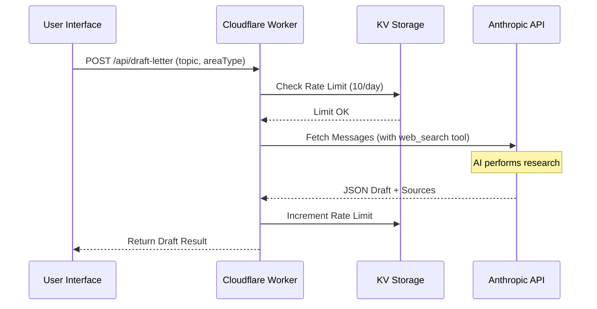
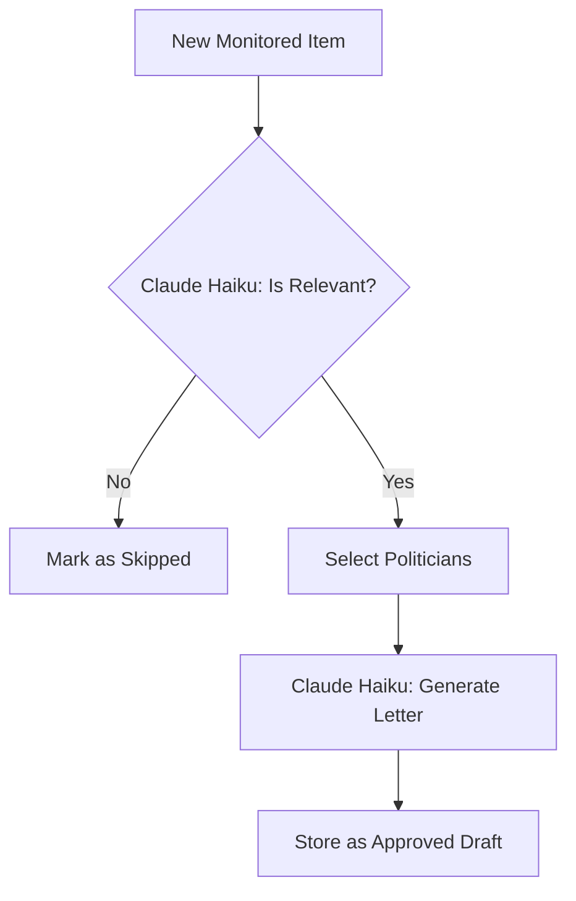

<details>
<summary>Relevant source files</summary>

The following files were used as context for generating this wiki page:

- [app/src/draft-letter.ts](app/src/draft-letter.ts)
- [shared/anthropic.ts](shared/anthropic.ts)
- [app/src/index.ts](app/src/index.ts)
- [app/public/app.js](app/public/app.js)
- [README.md](README.md)
- [campaign/src/letter-generator.ts](campaign/src/letter-generator.ts)
</details>

# AI Letter Drafting with Claude

The AI Letter Drafting system is an optional feature within the Politiker-webapp that assists logged-in users in researching social topics and drafting respectful, factual letters to elected officials. Utilizing Anthropic's Claude models, the system can perform real-time web searches to gather current information before proposing a draft in the first person. This feature is strictly distinguished from autonomous campaigns as it requires a human sender to review, edit, and send the letter under their own identity.

Sources: [app/src/draft-letter.ts:4-10](app/src/draft-letter.ts#L4-L10), [README.md:27-30](README.md#L27-L30)

## Architecture and Integration

The drafting system is integrated into the 3-step wizard workflow of the main application. It bridges the frontend interface with the Anthropic API via a secure backend route.

### Components and Data Flow

1.  **Frontend Interface**: Users interact with the drafting tool in Step 2 of the wizard. They can provide an optional topic or leave it blank for the AI to select a trending issue.
2.  **API Gateway**: The request is routed through `/api/draft-letter`, where rate limiting and authentication are enforced.
3.  **Drafting Logic**: The `draftLetter` function constructs a complex prompt, including system instructions, user-defined topics, and recipient hints (e.g., whether the letter is for a local municipality or the EU).
4.  **AI Provider**: The system communicates with Anthropic's Messages API, specifically utilizing tools like `web_search` for real-time information retrieval.

The following sequence diagram illustrates the flow from a user request to receiving an AI-generated draft:



Sources: [app/src/index.ts:205-224](app/src/index.ts#L205-L224), [app/src/draft-letter.ts:16-55](app/src/draft-letter.ts#L16-L55), [app/public/app.js:520-545](app/public/app.js#L520-L545)

## Backend Implementation

The core logic resides in `app/src/draft-letter.ts`. It manages the prompt engineering, API interaction, and response parsing.

### Configuration and Constants
The system uses the `claude-sonnet-4-6` model for user-initiated drafts, whereas the autonomous `campaign` worker often uses `claude-haiku-4-5-20251001` for lower-cost processing.

| Variable | Value / Purpose |
| :--- | :--- |
| `MODEL` | `claude-sonnet-4-6` |
| `MAX_TOKENS` | 2048 |
| `TIMEOUT` | 25,000ms (to prevent Worker wall-time issues during web search) |
| `TOOL` | `web_search_20250305` |

Sources: [app/src/draft-letter.ts:12](app/src/draft-letter.ts#L12), [app/src/draft-letter.ts:66](app/src/draft-letter.ts#L66), [shared/anthropic.ts:8](shared/anthropic.ts#L8)

### Prompt Construction
The system prompt is designed to ensure the letter is "concrete, factual, and respectful" (not aggressive or pleading). It forces the AI to output exactly one JSON object containing the subject and HTML body. A specific instruction includes the placeholder `[förnamn]` (first name) exactly once, which is later replaced automatically per recipient during the sending phase.

Sources: [app/src/draft-letter.ts:34-45](app/src/draft-letter.ts#L34-L45), [app/public/app.js:512-515](app/public/app.js#L512-L515)

### Response Processing
Because the `web_search` tool can result in multiple content blocks (text blocks, tool usage blocks, and tool result blocks), the parser iterates through the response in reverse. It searches for the last valid JSON object within the text blocks to extract the final draft. It also extracts all URLs from `web_search_tool_result` blocks to provide the user with the AI's research sources.

```typescript
// app/src/draft-letter.ts:98-103
const sources: string[] = [];
for (const block of data.content) {
  if (block.type === "web_search_tool_result") {
    for (const item of block.content) {
      if (item.url) sources.push(item.url);
    }
  }
}
```

Sources: [app/src/draft-letter.ts:89-115](app/src/draft-letter.ts#L89-L115)

## Usage and Rate Limiting

To manage costs and prevent abuse, the system implements a rate limit using Cloudflare KV storage.

### Rate Limiting Logic
User accounts are restricted to 10 AI drafts per 24-hour period. This is enforced in the main API router by checking a KV key formatted as `draft-rate:${accountId}:${ISO_DATE}`.

| Limit Type | Threshold | Storage |
| :--- | :--- | :--- |
| Daily Limit | 10 drafts | Cloudflare KV |
| Scope | Per Account | N/A |

Sources: [app/src/index.ts:205-214](app/src/index.ts#L205-L214)

### Frontend Integration
The frontend in `app/public/app.js` triggers the draft generation and populates the subject and body fields upon success. It also guesses the `areaType` (e.g., "kommun", "eu") based on the user's current recipient selection to help the AI adapt the tone of the letter.

Sources: [app/public/app.js:520-538](app/public/app.js#L520-L538)

## Autonomous Campaign Drafting
While the primary focus is user-initiated drafting, the `campaign` module uses a similar mechanism via `shared/anthropic.ts` to generate letters automatically based on monitored news items.

### Relevance Filtering
Before generating a letter, the `campaign` worker uses Claude Haiku to determine if a news item is socially relevant (e.g., healthcare, education, or housing) and skips purely technical or environmental topics without social connections.



Sources: [campaign/src/letter-generator.ts:16-35](campaign/src/letter-generator.ts#L16-L35), [campaign/src/letter-generator.ts:43-62](campaign/src/letter-generator.ts#L43-L62)

## Summary
The AI Letter Drafting system provides a sophisticated tool for meditated civic engagement. By combining real-time web research via Claude Sonnet with a controlled user-review process, the system ensures that AI-generated content remains grounded in fact and is ultimately owned by the citizen sender. Technical safeguards like timeouts and KV-based rate limiting ensure the stability and economic viability of the feature.
