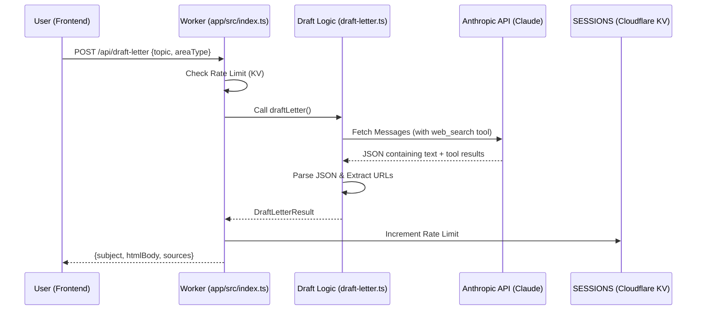

<details>
<summary>Relevant source files</summary>

The following files were used as context for generating this wiki page:

- [app/src/draft-letter.ts](app/src/draft-letter.ts)
- [shared/anthropic.ts](shared/anthropic.ts)
- [app/public/app.js](app/public/app.js)
- [app/src/index.ts](app/src/index.ts)
- [README.md](README.md)
- [AGENTS.md](AGENTS.md)
</details>

# AI Letter Drafting with Claude

The AI Letter Drafting feature provides logged-in users with a tool to research social issues and generate professional letter drafts to elected officials. Utilizing the Anthropic Claude model (specifically `claude-sonnet-4-6`), the system performs real-time web searches to ensure drafts are grounded in current events and factual information. This feature is designed as a collaborative tool; the AI proposes a draft, which the user must review, edit, and manually send via their own linked email account.

Sources: [app/src/draft-letter.ts:5-10](app/src/draft-letter.ts#L5-L10), [README.md:27-30](README.md#L27-L30), [AGENTS.md:3-6](AGENTS.md#L3-L6)

## Architecture and Data Flow

The drafting process is initiated from the frontend wizard, processed by the primary Cloudflare Worker, and mediated through the Anthropic API.

### High-Level Drafting Flow

The following diagram illustrates the sequence from a user providing a topic to receiving a formatted draft with sources.



Sources: [app/src/draft-letter.ts:40-100](app/src/draft-letter.ts#L40-L100), [app/src/index.ts:187-200](app/src/index.ts#L187-L200), [app/public/app.js:630-650](app/public/app.js#L630-L650)

## Core Components

### 1. The `draftLetter` Function
This is the central execution point for AI generation. It constructs a system prompt based on user input (topic and recipient type) and invokes Claude with web search capabilities enabled.

*  **Model**: `claude-sonnet-4-6`
*  **Tools**: `web_search_20250305` (max 5 uses)
*  **Timeout**: 25,000ms (to prevent Worker wall-time expiration during intense web searches)

Sources: [app/src/draft-letter.ts:12-65](app/src/draft-letter.ts#L12-L65)

### 2. Prompt Engineering
The system prompt instructs the AI to write in the first person, remain respectful, and include a specific placeholder `[förnamn]` for automatic replacement during the actual sending phase. It enforces a strict JSON response format.

| Input Type | Logic |
| :--- | :--- |
| **Topic** | Uses user input if provided; otherwise instructs AI to find a specific, current news topic. |
| **Recipient Hint** | Adapts tone based on `areaType` (e.g., EU, Riksdag, Region). |
| **Response Format** | Forced JSON: `{"subject": "...", "htmlBody": "..."}` |

Sources: [app/src/draft-letter.ts:28-38](app/src/draft-letter.ts#L28-L38)

### 3. Rate Limiting and Security
To manage costs associated with LLM usage and web searching, the system implements a per-user daily cap.

*  **Storage**: Cloudflare KV (`SESSIONS` binding).
*  **Limit**: 10 drafts per user per day.
*  **Key Format**: `draft-rate:<accountId>:<YYYY-MM-DD>`.
*  **Scope**: Only available to logged-in users.

Sources: [app/src/index.ts:187-195](app/src/index.ts#L187-L195), [app/src/draft-letter.ts:5-8](app/src/draft-letter.ts#L5-L8)

## Implementation Details

### API Endpoint: `POST /api/draft-letter`
This endpoint serves as the bridge between the UI and the generation logic.

| Parameter | Type | Description |
| :--- | :--- | :--- |
| `topic` | String (Optional) | The subject matter the user wants to address. |
| `areaType` | String (Optional) | The level of government being contacted (for tone adaptation). |

Sources: [app/src/index.ts:186-204](app/src/index.ts#L186-L204)

### Data Structure: `DraftLetterResult`
The backend returns a structured object to the frontend for display and editing.

```typescript
export interface DraftLetterResult {
  subject: string;
  htmlBody: string;
  sources: string[];
}
```

Sources: [app/src/draft-letter.ts:14-18](app/src/draft-letter.ts#L14-L18)

### Client-Side Integration
The frontend in `app.js` captures the `areaType` based on current user selections in the wizard and displays a loading status while the AI researches. Once received, the result is injected into the subject and body fields of the letter editor.

```javascript
// Example logic for determining areaType hint
const typeCounts = {};
for (const a of allAreas) {
  if (selectedAreas.has(a.area_name)) typeCounts[a.area_type] = (typeCounts[a.area_type] ?? 0) + 1;
}
const areaType = Object.keys(typeCounts).sort((a, b) => typeCounts[b] - typeCounts[a])[0];
```

Sources: [app/public/app.js:630-645](app/public/app.js#L630-L645)

## Comparison: AI Drafting vs. Autonomous Campaigning
The project distinguishes between user-driven AI drafting and the autonomous campaign worker.

| Feature | AI Letter Drafting | Autonomous Campaign (`campaign/`) |
| :--- | :--- | :--- |
| **Trigger** | User-initiated in UI | Cron-driven (Daily 05-09 UTC) |
| **Human Review** | Mandatory (Review/Edit/Send) | Fully autonomous |
| **Sender** | User's own mail account | Dedicated campaign accounts |
| **File Location** | `app/src/draft-letter.ts` | `campaign/src/letter-generator.ts` |

Sources: [app/src/draft-letter.ts:5-10](app/src/draft-letter.ts#L5-L10), [README.md:39-44](README.md#L39-L44)

## Summary
AI Letter Drafting with Claude leverages advanced LLM capabilities to lower the barrier for civic engagement. By providing researched, fact-checked starting points for correspondence, it enables citizens to communicate more effectively with their representatives while maintaining personal accountability through manual review and sending.
