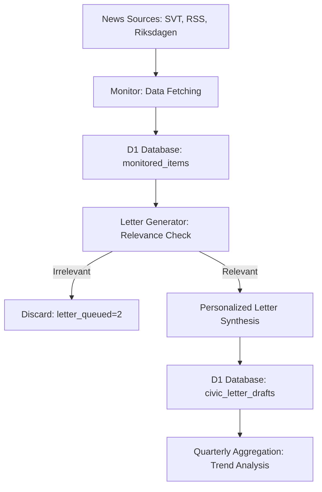
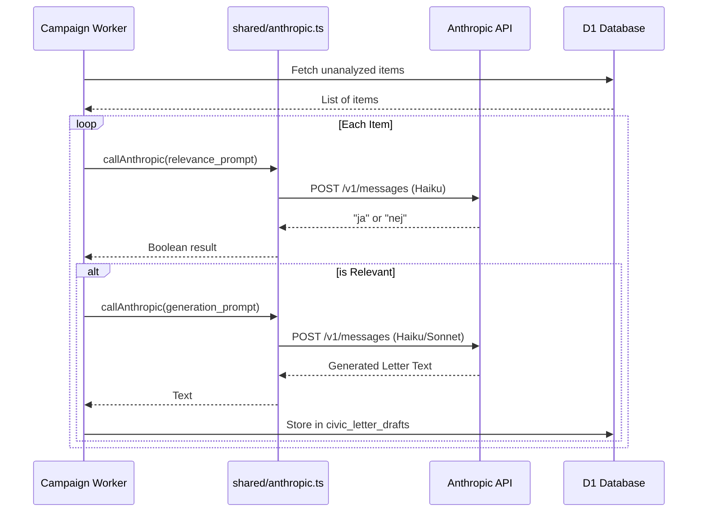

Relevant source files

The following files were used as context for generating this wiki page:

- [campaign/src/monitor.ts](campaign/src/monitor.ts)
- [campaign/src/letter-generator.ts](campaign/src/letter-generator.ts)
- [shared/anthropic.ts](shared/anthropic.ts)
- [campaign/src/quarterly-campaign.ts](campaign/src/quarterly-campaign.ts)
- [README.md](README.md)
- [app/src/draft-letter.ts](app/src/draft-letter.ts)

# Autonomous AI News Analysis

Autonomous AI News Analysis is a core subsystem of the `politiker-webapp` project, residing primarily within the `campaign/` worker. Its purpose is to autonomously monitor national and regional Swedish news sources, identify socially relevant political developments, and generate personalized advocacy content. This system operates as a cron-driven worker that executes daily between 05:00 and 09:00 UTC, bridging the gap between raw news consumption and active civic engagement.

Sources: [README.md:46-49](README.md#L46-L49), [campaign/src/monitor.ts:1-25](campaign/src/monitor.ts#L1-L25)

## System Architecture

The analysis pipeline follows a structured flow from raw data acquisition to intelligent filtering and final content synthesis.

The diagram shows the data flow from external news sources through the monitoring and filtering stages to the final draft generation and long-term trend analysis.

### Data Acquisition (The Monitor)
The `monitor.ts` component serves as the entry point for the analysis system. It scrapes multiple RSS feeds and official parliamentary data to populate the `monitored_items` table.
*  **National Sources**: Fetches data from SVT National, SVT Foreign News, Aftonbladet, and Expressen.
*  **Regional Sources**: Iterates through a comprehensive list of SVT regional slugs (e.g., Blekinge, Skåne, Västerbotten) to capture local issues.
*  **Parliamentary Data**: Specifically targets documents from the Swedish Riksdag, including motions, propositions, and committee reports.
*  **Deduplication**: Every item is assigned a unique ID derived from a SHA-256 hash of its URL to prevent duplicate analysis of the same news story.

Sources: [campaign/src/monitor.ts:11-25](campaign/src/monitor.ts#L11-L25), [campaign/src/monitor.ts:40-44](campaign/src/monitor.ts#L40-L44), [campaign/src/monitor.ts:88-140](campaign/src/monitor.ts#L88-L140)

## Intelligent Relevance Filtering

Once news items are stored, the system uses the `isRelevant` function to filter content. This function leverages the **Claude Haiku** model to determine if an item warrants a civic campaign.

### AI Decision Criteria
The AI is instructed to identify topics involving "social rights and welfare," "housing and urban planning," "economy," "education," "justice," and "foreign policy." It is explicitly programmed to skip technical details, procedural parliamentary notes, or environmental issues that lack a social connection.

Sources: [campaign/src/letter-generator.ts:16-32](campaign/src/letter-generator.ts#L16-L32), [shared/anthropic.ts:6](shared/anthropic.ts#L6)

| Category | Targeted Topics for Analysis |
| :--- | :--- |
| **Social Welfare** | Healthcare, elderly care, psychiatry, homelessness, child welfare. |
| **Economy** | Taxes, pensions, wages, inequality, poverty. |
| **Justice** | Crime, discrimination, civil rights. |
| **Education** | Schools, higher education, student support. |
| **Excluded** | Purely technical details, "Motion withdrawn" notices, non-social environmental news. |

Sources: [campaign/src/letter-generator.ts:17-26](campaign/src/letter-generator.ts#L17-L26)

## Content Synthesis and Research

Analysis extends beyond simple filtering; the system performs targeted research and synthesis to create actionable drafts.

### Personalized Synthesis
For every relevant news item, the `generateLetter` function analyzes the news summary alongside specific politician metadata (name, party, role, area). The AI is tasked with:
1.  Identifying a concrete problem within the news item.
2.  Correlating the problem with systemic failures.
3.  Incorporating factual citations from reputable organizations like SCB, OECD, WHO, or Transparency International.
4.  Holding the politician's specific party or role accountable for the issue.

Sources: [campaign/src/letter-generator.ts:35-55](campaign/src/letter-generator.ts#L35-L55)

### Long-term Trend Analysis (Quarterly Campaigns)
The `quarterly-campaign.ts` module performs a higher-level analysis. It retrieves a corpus of up to 40 "letter-queued" items from the preceding three months. The **Claude Sonnet** model analyzes this corpus to identify the 2–3 most significant societal problems of the quarter. This meta-analysis results in a comprehensive advocacy letter sent to all 17,000+ politicians in the database.

Sources: [campaign/src/quarterly-campaign.ts:32-45](campaign/src/quarterly-campaign.ts#L32-L45), [campaign/src/quarterly-campaign.ts:89-91](campaign/src/quarterly-campaign.ts#L89-L91)

## Technical Implementation Details

The system relies on a shared Anthropic client to ensure consistent error handling and retry logic across different analysis modules.

The sequence diagram illustrates the interaction between the campaign worker, the shared Anthropic module, and the external API during the relevance checking and content generation phases.

### AI Configuration
| Parameter | Default Value | Usage |
| :--- | :--- | :--- |
| **Model (Relevance)** | `claude-haiku-4-5` | Fast, cost-effective filtering of raw RSS feeds. |
| **Model (Research)** | `claude-sonnet-4-6` | High-quality synthesis for quarterly reports and user drafts. |
| **Max Tokens** | 5 (Filtering), 800 (Generation) | Optimized for binary decisions or medium-length letters. |
| **Timeout** | 25,000ms | Protective limit for web search and complex synthesis. |

Sources: [shared/anthropic.ts:6-7](shared/anthropic.ts#L6-L7), [campaign/src/letter-generator.ts:16](campaign/src/letter-generator.ts#L16), [app/src/draft-letter.ts:54-58](app/src/draft-letter.ts#L54-L58)

## Conclusion
Autonomous AI News Analysis in the `politiker-webapp` project transforms passive news consumption into active political oversight. By combining RSS monitoring with the linguistic and analytical capabilities of Claude models, the system ensures that significant societal issues are not only identified but also directly addressed to the relevant elected officials with data-backed arguments.
