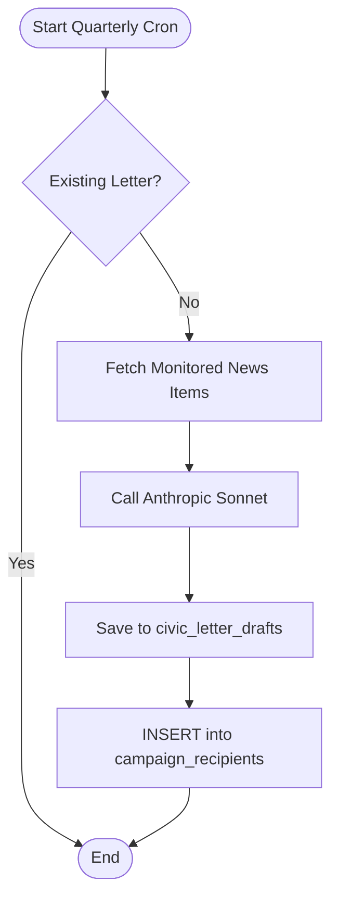
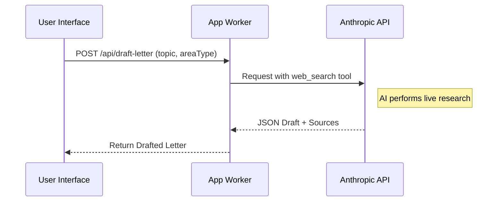

Relevant source files

The following files were used as context for generating this wiki page:

- [campaign/src/quarterly-campaign.ts](campaign/src/quarterly-campaign.ts)
- [app/src/draft-letter.ts](app/src/draft-letter.ts)
- [shared/anthropic.ts](shared/anthropic.ts)
- [app/src/civic-outreach.ts](app/src/civic-outreach.ts)
- [README.md](README.md)
- [infra/schema.sql](infra/schema.sql)

# Autonomous Campaign AI

The **Autonomous Campaign AI** is a specialized subsystem within the Politiker-webapp designed to independently manage outreach efforts. It automates the process of monitoring news sources, researching social issues, and generating personalized correspondence to politicians. The system operates primarily through a dedicated Cloudflare Worker (`campaign/`) and leverages Large Language Models (LLMs) to synthesize information and draft advocacy content.

This system serves two primary functions: providing AI-assisted drafting for individual users and executing automated "Quarterly Campaigns." While the individual drafting tool requires human review and manual sending, the Quarterly Campaign operates on a cron-driven schedule to reach thousands of elected officials across all levels of government (EU, Riksdagen, regional, and municipal).

Sources: [README.md:46-52](README.md#L46-L52), [campaign/src/quarterly-campaign.ts:1-13](campaign/src/quarterly-campaign.ts#L1-L13)

## Architecture and Core Components

The system architecture is built around an asynchronous, multi-stage pipeline that integrates external LLM services with the project's SQLite (D1) database.

### Core Workflow Logic
The AI's operations are divided into three distinct logic flows:
1.  **User-Initiated Drafting**: An authenticated user provides a topic, and the AI researches it via web search to provide a draft.
2.  **Quarterly Campaign Generation**: Once per quarter, the system researches monitored news items to write a single, high-impact letter.
3.  **Automated Distribution (Drain)**: A specialized routine that throttles the delivery of campaign letters to avoid rate limits and cost spikes.

### System Components Table

| Component | Responsibility | Relevant Files |
| :--- | :--- | :--- |
| **Anthropic API** | Provides LLM capabilities (Claude Sonnet/Haiku) for text generation and research. | [shared/anthropic.ts](shared/anthropic.ts), [app/src/draft-letter.ts](app/src/draft-letter.ts) |
| **Campaign Worker** | Cron-driven worker executing news monitoring and quarterly campaigns. | [README.md:58-61](README.md#L58-L61), [campaign/src/quarterly-campaign.ts](campaign/src/quarterly-campaign.ts) |
| **D1 Database** | Stores monitored news, letter drafts, and recipient queues. | [infra/schema.sql](infra/schema.sql), [campaign/src/quarterly-campaign.ts](campaign/src/quarterly-campaign.ts) |
| **Cloudflare Email** | Used specifically for high-volume quarterly campaign delivery. | [campaign/src/quarterly-campaign.ts:88-95](campaign/src/quarterly-campaign.ts#L88-L95) |

## Quarterly Campaign System

The Quarterly Campaign is an automated advocacy initiative that contacts all ~17,000 politicians in Sweden once every three months.

### Generation Logic
The process begins with `runQuarterlyCampaign`, which pulls up to 40 "monitored items" from the database that have been flagged for social relevance. These items form a "corpus" which is sent to the AI model. The model is instructed to act as a "critical and engaged Swedish citizen" to write a direct, fact-based demand for action.

The diagram above shows the idempotency check and the flow from news retrieval to recipient queuing.
Sources: [campaign/src/quarterly-campaign.ts:28-86](campaign/src/quarterly-campaign.ts#L28-L86)

### Distribution and Rate Limiting
To prevent hitting Gmail quotas or incurring excessive costs, quarterly letters are distributed via the `runQuarterlyDrain` function using Cloudflare Email Service. 

*  **Throttling**: The system sends 300 emails per run (4 runs/day), totaling roughly 1,200 per day.
*  **Cost Protection**: A hard limit of 25,000 emails per month (`MONTHLY_SEND_CAP`) is enforced to prevent runaway billing.
*  **Recipient Selection**: Recipients are deduplicated by email address and filtered to exclude "dead" or unverified addresses.

Sources: [campaign/src/quarterly-campaign.ts:98-115](campaign/src/quarterly-campaign.ts#L98-L115)

## AI-Assisted User Drafting

The AI Drafting tool allows individual users to generate professional correspondence within the web interface.

### Research and Tool Use
Unlike the automated campaigns, the user drafting tool (`draft-letter.ts`) utilizes the Anthropic `web_search` tool. This allows the AI to perform live research on a user-provided topic before generating a response.

### Implementation Details
*  **Model**: Utilizes `claude-sonnet-4-6`.
*  **Persona**: Instructed to write in the "First Person" as a regular citizen.
*  **Structure**: Returns a JSON object containing a `subject` and `htmlBody`.
*  **Placeholders**: Automatically includes `[förnamn]` (first name) for later personalization.

This sequence illustrates the live research capability utilized during user-initiated drafting.
Sources: [app/src/draft-letter.ts:18-50](app/src/draft-letter.ts#L18-L50), [app/src/draft-letter.ts:83-110](app/src/draft-letter.ts#L83-L110)

## Data Structures

The system relies on specific database tables to manage the lifecycle of an autonomous campaign.

### Relevant Schema Definitions

| Table | Purpose | Key Fields |
| :--- | :--- | :--- |
| `civic_letter_drafts` | Stores AI-generated drafts awaiting approval or distribution. | `id`, `status` (pending/approved), `approve_token`, `topic_source_url` |
| `campaign_recipients` | Queue of politicians to be contacted for a specific campaign. | `politician_email`, `status` (pending/sent/failed), `draft_id` |
| `monitored_items` | Repository of news and parliamentary items used as research context. | `title`, `summary`, `url`, `letter_queued` |

Sources: [infra/schema.sql:133-142](infra/schema.sql#L133-L142), [campaign/src/quarterly-campaign.ts:117-123](campaign/src/quarterly-campaign.ts#L117-L123)

## Safety and Review Mechanisms

The system includes several "human-in-the-loop" and safety features to prevent automated misuse:

1.  **Approval Workflow**: For "Civic Outreach" letters, a notification is sent to a human reviewer. The letter remains in `pending` status until a unique `approve_token` is used via a specific API link.
2.  **Redaction**: Tokens used for approval are redacted from public-facing API responses to prevent unauthorized status changes.
3.  **Timeout Handling**: The system uses `AbortSignal.timeout(25_000)` during AI calls to ensure the worker does not hang during long web searches.

Sources: [app/src/civic-outreach.ts:32-60](app/src/civic-outreach.ts#L32-L60), [app/src/draft-letter.ts:60-65](app/src/draft-letter.ts#L60-L65)

## Summary

The Autonomous Campaign AI provides a scalable infrastructure for civic engagement. By combining cron-driven monitoring, LLM-based research, and a throttled distribution system, it ensures that citizens' concerns are communicated effectively to elected officials. The architecture prioritizes safety through monthly send caps, human-in-the-loop approval processes for specific outreach types, and robust rate limiting to maintain the integrity of the underlying email providers.
