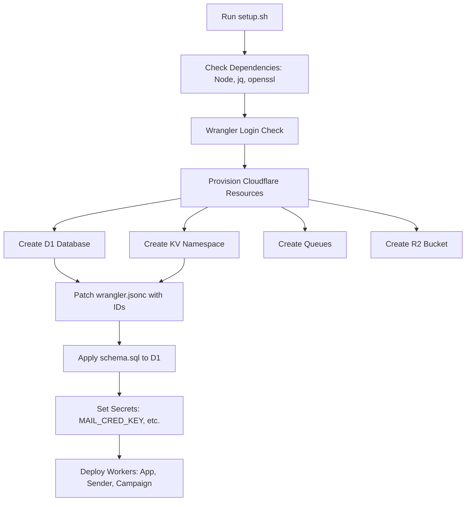
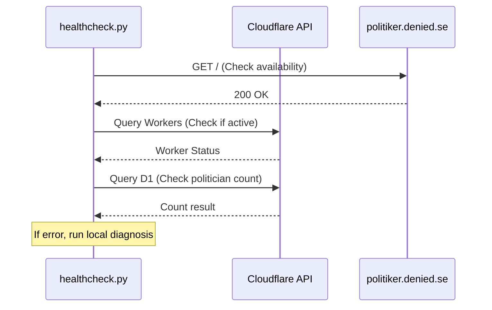

Relevant source files

The following files were used as context for generating this wiki page:

- [infra/setup.sh](infra/setup.sh)
- [README.md](README.md)
- [infra/schema.sql](infra/schema.sql)
- [AGENTS.md](AGENTS.md)
- [app/package.json](app/package.json)
- [infra/healthcheck.py](infra/healthcheck.py)

# Cloudflare Infrastructure Provisioning

Cloudflare Infrastructure Provisioning for the `politiker-webapp` project is a fully automated process designed to set up a complete serverless stack on the Cloudflare Workers platform. This system handles the creation and configuration of compute resources (Workers), relational databases (D1), key-value stores (KV), message queues (Queues), and object storage (R2).

The provisioning logic is encapsulated primarily in the `infra/setup.sh` script, which provides an idempotent one-command deployment path. This ensures that the environment—including database schemas, secrets, and custom domains—is consistently configured across different developer accounts or production environments.
Sources: [README.md:120-135](README.md#L120-L135), [infra/setup.sh:1-15](infra/setup.sh#L1-L15)

## Core Infrastructure Components

The project utilizes a variety of Cloudflare services to create a distributed, serverless architecture.

| Component | Cloudflare Service | Purpose |
| :--- | :--- | :--- |
| **Database** | D1 (SQLite) | Persistent storage for accounts, politicians, and send logs. |
| **Session Store** | KV | Storage for user sessions and temporary data. |
| **Async Jobs** | Queues | Handles asynchronous email sending tasks. |
| **File Storage** | R2 | Stores email attachments (PDF, DOCX, etc.). |
| **Rate Limiter** | Durable Objects | Coordinates sending rates across parallel worker instances. |
| **Compute** | Workers | Hosts the App, Sender, and Campaign modules. |

Sources: [README.md:105-115](README.md#L105-L115), [AGENTS.md:10-15](AGENTS.md#L10-L15), [infra/setup.sh:31-35](infra/setup.sh#L31-L35)

## Provisioning Workflow

The provisioning process follows a specific sequence to ensure dependencies are met before deploying code.

The diagram shows the logical flow of the `infra/setup.sh` script.
Sources: [infra/setup.sh:56-170](infra/setup.sh#L56-L170)

### Resource Initialization and Identification
The system first checks if resources like D1 or KV already exist by querying the Cloudflare API via `wrangler`. If they do not exist, it creates them and captures the unique IDs. These IDs are then dynamically patched into the `wrangler.jsonc` configuration files for each worker module (app, sender, and campaign) using `sed`.
Sources: [infra/setup.sh:100-140](infra/setup.sh#L100-L140)

### Database Schema Application
Upon the creation of a new D1 database, the system automatically applies the `infra/schema.sql` file. This initializes tables for `accounts`, `politicians`, `send_jobs`, and `mail_credentials`.
Sources: [infra/setup.sh:157-165](infra/setup.sh#L157-L165), [infra/schema.sql:1-5](infra/schema.sql#L1-L5)

## Security and Secret Management

Security is provisioned by injecting sensitive variables into the Cloudflare environment using `wrangler secret put`.

*  **MAIL_CRED_KEY**: A 32-byte AES key used for encrypting user SMTP passwords before they are stored in D1. This key must be identical across the `app` and `sender` workers.
*  **System Credentials**: Includes `SYSTEM_SMTP_PASSWORD` for verification emails and `GITHUB_FEEDBACK_TOKEN` for automated issue reporting.
*  **OAuth Secrets**: Client secrets for Google, GitHub, and Microsoft integrations are set during the provisioning phase.

Sources: [infra/setup.sh:75-95](infra/setup.sh#L75-L95), [infra/setup.sh:172-185](infra/setup.sh#L172-L185), [AGENTS.md:30-35](AGENTS.md#L30-L35), [SECURITY.md:15-20](SECURITY.md#L15-L20)

## Continuous Monitoring Infrastructure

The provisioning also extends to local and cloud-based health checks to ensure infrastructure availability.

### Healthcheck Logic
A Python-based health check script (`infra/healthcheck.py`) is used to verify the integrity of the provisioned environment.

The diagram shows how the health check script validates both the public endpoint and the Cloudflare backend resources.
Sources: [infra/healthcheck.py:45-85](infra/healthcheck.py#L45-L85)

### Automated Maintenance
The infrastructure includes a systemd-timer installation for a `bounce-processor` service on Linux environments. This service handles Gmail-specific bounce processing by interacting with the provisioned D1 database.
Sources: [infra/setup.sh:205-215](infra/setup.sh#L205-L215), [README.md:140-145](README.md#L140-L145)

## Summary

The Cloudflare Infrastructure Provisioning system for `politiker-webapp` automates the complex setup of a multi-resource serverless environment. By utilizing `infra/setup.sh` and `wrangler`, it manages resource IDs, patches configurations, applies database schemas, and secures the environment with encrypted secrets. This automation reduces manual configuration errors and facilitates rapid deployment of the App, Sender, and Campaign workers.
Sources: [infra/setup.sh:1-20](infra/setup.sh#L1-L20), [README.md:120-130](README.md#L120-L130)
